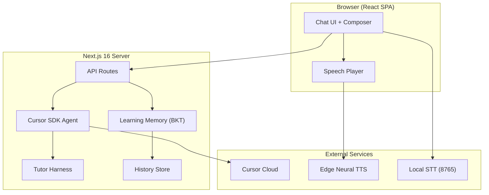
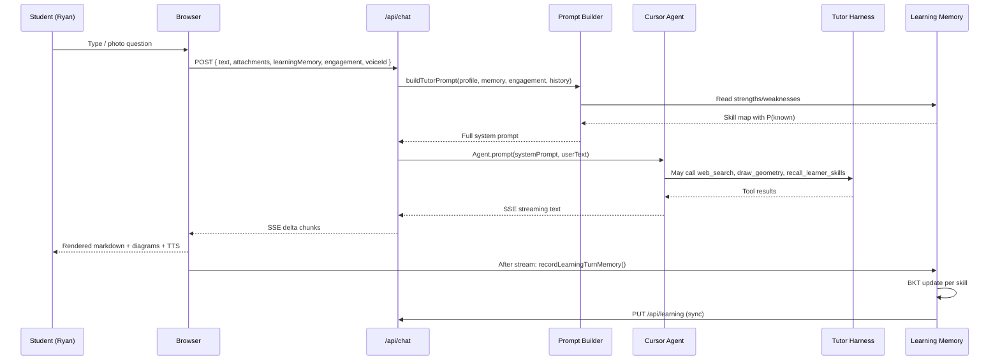
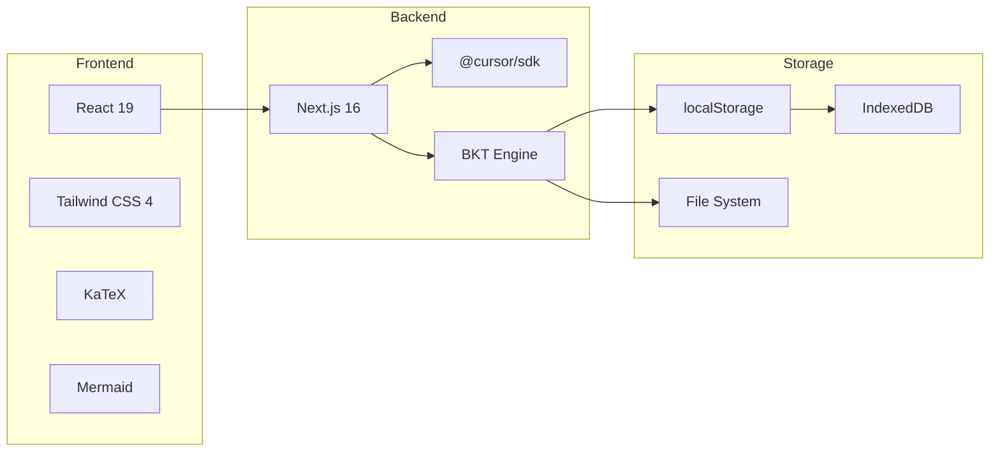

# Spark AI Tutor — System Design Overview

> Version 0.2.0 · August 2026  
> Repository: [github.com/zilinli/ryan_learning](https://github.com/zilinli/ryan_learning)

---

## Architecture at a Glance



## Document Map

| Document | Scope |
|----------|-------|
| **[DESIGN.md](DESIGN.md)** ← you are here | Overall architecture, data flow, deployment |
| **[subsystems/memory-bkt.md](subsystems/memory-bkt.md)** | 🧠 Learning Memory & BKT (most important) |
| **[subsystems/agent-prompt.md](subsystems/agent-prompt.md)** | Agent pipeline, prompt engineering, hint ladder |
| **[subsystems/geometry-diagrams.md](subsystems/geometry-diagrams.md)** | SVG/Mermaid rendering, geometry engine |
| **[subsystems/voice-tts-stt.md](subsystems/voice-tts-stt.md)** | Multi-language TTS/STT, speech player |
| **[subsystems/storage-sync.md](subsystems/storage-sync.md)** | History, conversations, cross-device sync |
| **[subsystems/security-sanitization.md](subsystems/security-sanitization.md)** | Threat model, input sanitization, tool sandboxing |
| **[synthesis.md](synthesis.md)** | Cross-cutting summary + design rationale |
| **[TODO.md](TODO.md)** | Downstream development task list |

## Request Flow



## Tech Stack



## Deployment

```
┌─────────────────────────────────────┐
│            Nginx (TLS)              │
│         proxy → localhost:3000      │
└─────────────┬───────────────────────┘
              │
    ┌─────────┴──────────┐
    │                    │
┌───▼──────────┐  ┌──────▼──────────┐
│ spark-tutor  │  │   spark-stt     │
│ Next.js :3000│  │ Whisper :8765   │
└──────────────┘  └─────────────────┘
```

## Key Design Decisions

| Decision | Rationale | Trade-offs |
|----------|-----------|------------|
| BKT over Elo | BKT models binary mastery (known/unknown) → maps to "understands/didn't" for a 9yo; Elo is better for ranked ability across multiple learners | BKT needs 4 params per skill; Elo is simpler (1 param) |
| BKT over Deep KT | Single learner, no training data; DKT needs thousands of logs | DKT captures richer dependencies but overfits on small N |
| Base64 SVG over inline | Mobile WebViews handle `` more reliably than `<svg>` DOM | Larger payloads; offset by gzip |
| Cantonese default | Ryan's family language; `detectSpeechLang` uses CJK + Yue signals | Must distinguish Yue from 普通话; 云希 voice forces 普通话 |
| Client-side BKT | Instant UI feedback, offline-capable | Server only gets snapshot on sync |
| TypeScript-only (no Python) | Single deploy artifact; no Python runtime dependency | pyBKT has more BKT variants; we implement the canonical 4-param model |

## Related Work & References

### Bayesian Knowledge Tracing

- Corbett, A.T. & Anderson, J.R. (1995). "Knowledge tracing: Modeling the acquisition of procedural knowledge." *User Modeling and User-Adapted Interaction*, 4(4), 253–278.
- Wikipedia: [Bayesian Knowledge Tracing](https://en.wikipedia.org/wiki/Bayesian_knowledge_tracing)
- [pyBKT](https://github.com/CAHLR/pyBKT) (UC Berkeley) — Python reference with C++ fitting core, forgetting/subskill variants
- [MasteryTrace](https://github.com/RudrenduPaul/MasteryTrace) — TypeScript BKT + IRT CLI/library, single-learner, Node-compatible
- [bkt.tyche.institute](https://bkt.tyche.institute/) — Interactive BKT study guide with TS reference implementation

### Elo Rating for Education

- Pelánek, R. (2016). "Applications of the Elo Rating System in Adaptive Educational Systems." *Computers & Education*, 98, 169–179.
- Vermeiren, H. et al. (2026). "Balancing stability and flexibility: investigating a dynamic K value approach for the Elo rating system." *UMUAI*, 36(1).
- Park, J.Y. et al. (2019). "A Multidimensional IRT Approach for Dynamically Monitoring Ability Growth." *Frontiers in Psychology*, 10, 620.

### Spaced Repetition & Forgetting

- Woźniak, P. (1987). SM-2 algorithm — [x1ee7/sm2-spaced-repetition](https://github.com/x1ee7/sm2-spaced-repetition) (TS zero-dep implementation)
- Reddy, S. et al. (2016). "Unbounded Human Learning: Optimal Scheduling for Spaced Repetition." *KDD 2016*.
- FSRS (Free Spaced Repetition Scheduler) — ML-based forgetting curve (Anki modern scheduler)
