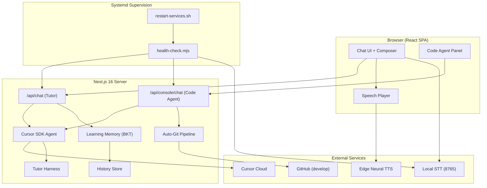
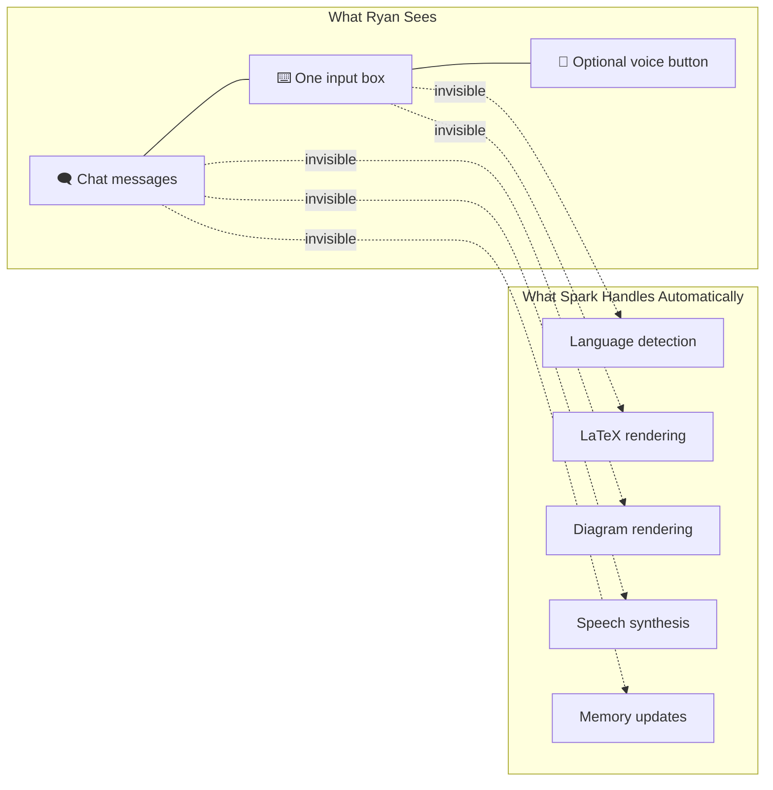
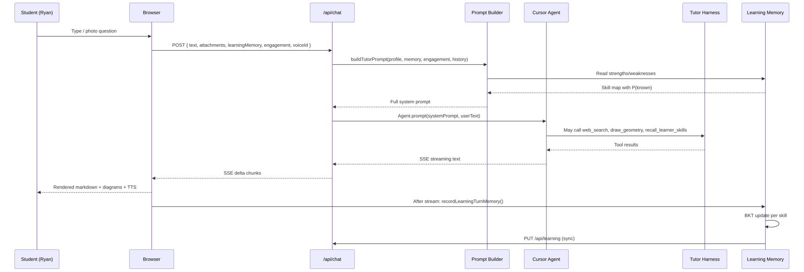
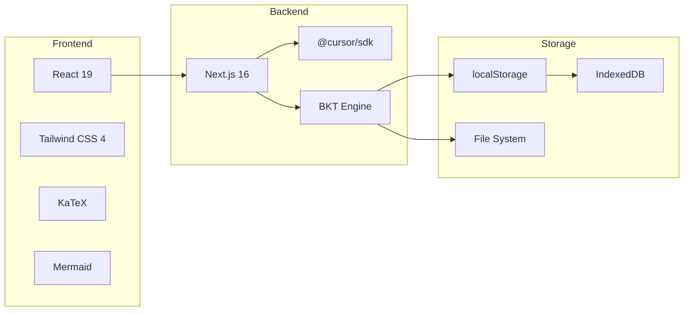

# Spark AI Tutor — System Design Overview

> Version 0.3.3 · August 2026  
> Repository: [github.com/zilinli/ryan_learning](https://github.com/zilinli/ryan_learning)

---

## Architecture at a Glance



## document map

| Document | Scope |
|----------|-------|
| **[DESIGN.md](DESIGN.md)** ← you are here | Overall architecture, curriculum, principles, deployment |
| **[subsystems/memory-bkt.md](subsystems/memory-bkt.md)** | 🧠 Learning Memory & BKT (most important) |
| **[subsystems/agent-prompt.md](subsystems/agent-prompt.md)** | Agent pipeline, prompt engineering, hint ladder |
| **[subsystems/geometry-diagrams.md](subsystems/geometry-diagrams.md)** | SVG/Mermaid rendering, geometry engine |
| **[subsystems/voice-tts-stt.md](subsystems/voice-tts-stt.md)** | Multi-language TTS/STT, speech player |
| **[subsystems/listen-voice-sync-stop.md](subsystems/listen-voice-sync-stop.md)** | Listen 按账号同步音色 + Stop abort/清 src |
| **[subsystems/ui-architecture.md](subsystems/ui-architecture.md)** | 🎨 Full-page UI — shell, chat, composer, sidebar, responsive, accessibility, animation |
| **[subsystems/ui-composer.md](subsystems/ui-composer.md)** | Composer input chrome spec (merged into ui-architecture §4) |
| **[subsystems/streaming-render-fix.md](subsystems/streaming-render-fix.md)** | ⚡ Streaming render stability — fix for screen flicker during model output |
| **[subsystems/v2-enhancements.md](subsystems/v2-enhancements.md)** | 📊 V2 analysis report enhancements — Learning Dashboard, cross-discipline, BKT+confidence |
| **[subsystems/competitive-feature-analysis.md](subsystems/competitive-feature-analysis.md)** | 📊 Competitive research + JTBD + v2 confirmed backlog |
| **[subsystems/competitive-product-plan-v2.md](subsystems/competitive-product-plan-v2.md)** | 📋 2026-08 product plan v2 (confirmed defaults) |
| **[subsystems/competitive-ui-design.md](subsystems/competitive-ui-design.md)** | 🎨 Competitive feature UI specs — wireframes, states, a11y, gap checklist |
| **[subsystems/ca-p0-system-design.md](subsystems/ca-p0-system-design.md)** | 📐 CA-P0 architecture — worksheet planner, practice loop, opener, barge-in |
| **[subsystems/ca-p0-acceptance-hardening.md](subsystems/ca-p0-acceptance-hardening.md)** | ✅ CA-P0 acceptance — A1.h cut eval, A2.h session-end hooks, R3 smoke M1–M5 |
| **[subsystems/ca-p1-system-design.md](subsystems/ca-p1-system-design.md)** | 📐 CA-P1 architecture — scratch vision, misconceptions, multi-rep, dynamic board |
| **[subsystems/ca-b3-voice-tolerance.md](subsystems/ca-b3-voice-tolerance.md)** | 🎤 B3 voice confirm-intent — confusable glossary + two-tap chips (no ASR confidence) |
| **[subsystems/storage-sync.md](subsystems/storage-sync.md)** | History, conversations, cross-device sync |
| **[subsystems/deletion-sync-and-themes.md](subsystems/deletion-sync-and-themes.md)** | Cross-device deletion sync (tombstones + PUT guard) + 4-theme system |
| **[subsystems/dialect-support-teochew-hakka.md](subsystems/dialect-support-teochew-hakka.md)** | Teochew & Hakka dialect support (Plan A — LLM prompting + dictionary) |
| **[subsystems/bailian-stt-tts.md](subsystems/bailian-stt-tts.md)** | Bailian Fun-ASR primary STT + CosyVoice TTS；讯飞可选备份；客家朗读 FormoSpeech |
| **[subsystems/dialect-cloud-tts-stt-correct.md](subsystems/dialect-cloud-tts-stt-correct.md)** | Dialect cloud STT/TTS + correction UX（历史设计；STT 主路径已迁百炼） |
| **[subsystems/dialect-cloud-tts-poc.md](subsystems/dialect-cloud-tts-poc.md)** | POC verification notes & homepage acceptance checklist |
| **[subsystems/teochew-stt-remediation.md](subsystems/teochew-stt-remediation.md)** | Teochew STT remediation — generic Minnan vs. local Chaoshan root cause, A/B eval, feedback enrichment |
| **[subsystems/malay-language-support.md](subsystems/malay-language-support.md)** | Malay (Bahasa Melayu) language support — edge-tts TTS, Bailian STT, es/fr-style prompt branches |
| **[subsystems/shanghainese-support.md](subsystems/shanghainese-support.md)** | Shanghainese (上海话) — Bailian STT + 千问 TTS `Jada`（禁粤语 edge） |
| **[subsystems/faq-feedback-panel.md](subsystems/faq-feedback-panel.md)** | Help & feedback panel — Ask AI + FAQ + GitHub Issues + feasibility → TODO |
| **[subsystems/ai-faq.md](subsystems/ai-faq.md)** | Ask AI — multilingual help grounded in docs/code (read-only agent) |
| **[subsystems/document-upload-parse.md](subsystems/document-upload-parse.md)** | Upload MD / Word / PPT / Excel / HTML — allowlist + server text extract |
| **[subsystems/report-v3-feasibility.md](subsystems/report-v3-feasibility.md)** | Third-party audit R1–R10 feasibility + W1–W3 landing notes |
| **[subsystems/parent-gate.md](subsystems/parent-gate.md)** | Parent PIN gate + `/family` Family controls (Khan-style) |
| **[subsystems/audit-2026-08-product-acceptance.md](subsystems/audit-2026-08-product-acceptance.md)** | 2026-08 external product audit — acceptance matrix (错题本/家长台/方言/导出) |
| **[subsystems/claude-report-2026-08-feasibility.md](subsystems/claude-report-2026-08-feasibility.md)** | 2026-08-11 Claude deep report — robots/noindex, API rate limit, Socratic integrity |
| **[subsystems/ux-competitor-report-2026-08-feasibility.md](subsystems/ux-competitor-report-2026-08-feasibility.md)** | 2026-08-11 UX竞品报告 — wait phases / step chips / persona; Ello ASR deferred |
| **[subsystems/report-v4-feasibility.md](subsystems/report-v4-feasibility.md)** | 2026-08-11 v4 深度分析 — Studio↔BKT outcome + printable Learning Portfolio (AUD.6b) |
| **[subsystems/product-audit-2026-08-roadmap.md](subsystems/product-audit-2026-08-roadmap.md)** | 2026-08 产品审计路线图 — Coach SM / parent / FSRS-lite / crop；**多语言+Code Agent 锁定保留** |
| **[subsystems/formospeech-hakka-tts.md](subsystems/formospeech-hakka-tts.md)** | FormoSpeech Hakka TTS (offline presynth cache; no Cantonese fallback) |
| **[subsystems/entertainments.md](subsystems/entertainments.md)** | Entertainments — board/arcade/puzzles + challenge AI (v0.6) |
| **[subsystems/ted-challenge-voice-input.md](subsystems/ted-challenge-voice-input.md)** | TED Challenge voice → text via MicTranscribeButton |
| **[subsystems/ted-challenge-prompt-listen.md](subsystems/ted-challenge-prompt-listen.md)** | TED Challenge prompt **Listen** (English TTS, Ryan hard-lock; Auto Listen) |
| **[subsystems/ted-challenge-adaptive-difficulty.md](subsystems/ted-challenge-adaptive-difficulty.md)** | TED Challenge difficulty from **grade number (G4 grain)** + English level |
| **[subsystems/ted-challenge-hybrid-mcq.md](subsystems/ted-challenge-hybrid-mcq.md)** | TED Challenge per-item **MCQ (single/multi) + essay** hybrid |
| **[subsystems/ted-challenge-inline-discuss.md](subsystems/ted-challenge-inline-discuss.md)** | TED Submit & discuss — **inline** Lab chat (no homepage hop) |
| **[subsystems/studio-creations-audio-mobile.md](subsystems/studio-creations-audio-mobile.md)** | Studio My Creations audio — prune protect + Range for mobile |
| **[subsystems/writing-studio-pad-p0.md](subsystems/writing-studio-pad-p0.md)** | ✍️ Writing Pad P0 — LanguageTool grammar, Feedback/Stage layout, writing type |
| **[subsystems/writing-studio-structure-adapt.md](subsystems/writing-studio-structure-adapt.md)** | Writing Pad → music/image/video — **adapt** language, don’t copy |
| **[subsystems/code-agent-deploy.md](subsystems/code-agent-deploy.md)** | Code Agent live deploy — deploy_live rebuilds .next + pm2 |
| **[subsystems/code-agent-pipeline.md](subsystems/code-agent-pipeline.md)** | Code Agent delivery pipeline — research → design → TODO → code → develop push → deploy |
| **[subsystems/code-agent-mobile-resume.md](subsystems/code-agent-mobile-resume.md)** | 📱 Code Agent mobile — disconnect must not kill run; reopen restores context |
| **[subsystems/conversation-digest.md](subsystems/conversation-digest.md)** | 📝 Session digest for long-term episodic memory |
| **[subsystems/agent-console-panel.md](subsystems/agent-console-panel.md)** | 🖥 Agent Chat Console (port 3001) embedded into Spark sidebar |
| **[subsystems/code-agent-mini-window.md](subsystems/code-agent-mini-window.md)** | 🪟 Code Agent mini window UX: vibe coding, diff/apply, close behavior |
| **[subsystems/grade-agnostic-adaptive.md](subsystems/grade-agnostic-adaptive.md)** | 📐 Grade-agnostic adaptive tutoring: K-12, auto-advance, age-aware language |
| **[subsystems/multi-tenant-isolation.md](subsystems/multi-tenant-isolation.md)** | 🔐 Multi-tenant account isolation: per-account data partitioning, namespace storage, server sync scoping |
| **[subsystems/image-lightbox-zoom.md](subsystems/image-lightbox-zoom.md)** | 🔍 Chat photo lightbox — portal stacking fix (above sidebar) + zoom in/out |
| **[subsystems/security-sanitization.md](subsystems/security-sanitization.md)** | Threat model, input sanitization, tool sandboxing |
| **[subsystems/testing.md](subsystems/testing.md)** | 🧪 Test strategy, gap analysis, regression catalog |
| **[subsystems/code-agent-robustness.md](subsystems/code-agent-robustness.md)** | 🔧 Agent session recovery, retry/timeout/error-handler, atomic file writes |
| **[subsystems/stt-service-reliability.md](subsystems/stt-service-reliability.md)** | 🎙️ STT/TTS service robustness, systemd supervision, crash recovery |
| **[code-agent-reliability-design.md](code-agent-reliability-design.md)** | 📐 Code agent reliability architecture design (literature-backed) |
| **[code-agent-test-design.md](code-agent-test-design.md)** | 🧪 Reliability test plan: unit, integration, chaos, E2E |
| **[code-agent-v3-enhancements.md](code-agent-v3-enhancements.md)** | 🚀 Code Agent v3 — multi-modal upload, zh/en voice, auto-git, service verification |
| **[synthesis.md](synthesis.md)** | Cross-cutting summary + design rationale |
| **[TODO.md](TODO.md)** | Downstream development task list |

---

## 🎯 Design Philosophy: Zero-Barrier for Elementary Students

> **最高原则：界面简单易用，小学生 0 基础上手。对话是重点，极简风格。**

### Three Pillars



### What We Removed (vs. Typical EdTech)

| Typical EdTech | Spark Decision | Why |
|---------------|---------------|-----|
| Dashboard with courses, progress bars, charts | None — just a chat | 9yo doesn't need a dashboard |
| Login / registration flow | URL-is-the-session (no auth) | 0-friction start |
| Settings panel | Voice selector only | Everything else infers automatically |
| Multi-level navigation (tabs, drawers) | Chat + collapsible sidebar | No mode-switching for a child |
| Onboarding wizard / tutorial | Placeholder text: "Ask me anything about your homework" | Self-discoverable |
| Feature notification badges | None | No cognitive noise |

### Physical Reference: A Tutor Sitting Next to You

When Ryan sits with a human tutor, there's no dashboard. No course catalog. No profile settings. It's just: **"What are you working on today?"**

Spark models this 1:1 physical tutoring session. Every UI decision is tested against: *"Would a physical tutor have this?"* If not, cut it.

### Conversation is the Core



**The student only sees conversation.** Everything else — language detection, math rendering, diagram repair, voice synthesis, memory tracking — happens invisibly.

### Product Inspirations

| Product | What We Learned |
|---------|----------------|
| **豆包爱学** (ByteDance) | "引导式解题而非直接给答案" — same Socratic philosophy; multi-modal input (photo/voice/text) with one unified chat interface; AI老师角色人格化 |
| **Khanmigo** (Khan Academy) | "Socratic tutoring with no direct answers" — validated the hint-ladder approach; frictionless onboarding (no separate download); clean layouts, big buttons, friendly colors; integrated into existing platform rather than standalone |
| **Khan Academy (classic)** | Large type for young readers, high-contrast CTAs, mastery-based progression badges — all without overwhelming the primary learning interface |

---

## 📚 Curriculum Alignment

Spark's skill catalog and tutoring prompts are aligned to Ryan's actual school curricula:

### BASIS International School (G4)

Ryan attends a BASIS International School. Key characteristics:

- **Accelerated math**: Grade 4 uses Envision Mathematics Grade 5 (`978-1-4188-4685-5`). Topics exceed Common Core G4.
- **Spiraled curriculum**: Concepts revisited with increasing depth through G4–G7 bridge years
- **Subject Expert Teachers**: Separate teachers for Math, English, History, Science — each subject has distinct expectations
- **50-minute periods**: Tutoring sessions should respect attention spans
- **Academic Enrichment period**: Built-in homework help time — Spark can be used during this block

**BASIS G4 Math topics** → skill-catalog alignment:

| BASIS G4 Topic | Spark Skill ID | Notes |
|---------------|----------------|-------|
| Multi-digit multiplication | `multiplication-facts` | Accelerated to G5 level (Envision G5) |
| Place value to millions | `place-value` | Includes decimals |
| Fractions — equivalence, operations | `fractions-concepts`, `equivalent-fractions` | G5 depth on equivalent fractions |
| Fraction word problems | `fraction-word-problems` | Multi-step bar models expected |
| Division with remainders | `division-basics` | Long division introduced mid-year |
| Geometry — angles, perimeter, area | `geometry-angles`, `geometry-measure` | Angle measurement + classification |
| Decimals — notation, comparison | `decimals` | Tied to place value and fractions |

### Singapore Math (Benchmark)

Singapore Primary 4 Mathematics provides the **Concrete-Pictorial-Abstract (CPA) framework** and world-leading word-problem pedagogy:

- **CPA progression**: When Spark generates diagrams, follow CPA — start with concrete visual (bar model), transition to abstract equation
- **Bar models**: The Singapore bar-model method for word problems is built into Spark's `draw_geometry` tool
- **Spiral approach**: Topics like fractions and measurement reintroduced with increasing complexity — Spark's BKT tracks mastery at each spiral level
- **Heuristics**: Singapore's problem-solving heuristics (draw a diagram, make a list, guess and check, work backwards) are embedded in the agent's hint ladder

### Common Core Grade 4 (US Baseline)

Many international schools (including BASIS) reference Common Core. Spark's skill catalog covers all 5 domains:

| CCSS Domain | Skills Covered |
|-------------|----------------|
| Operations & Algebraic Thinking | `multiplication-facts`, `division-basics` |
| Number & Operations in Base Ten | `place-value`, `decimals` |
| Number & Operations—Fractions | `fractions-concepts`, `equivalent-fractions`, `fraction-word-problems` |
| Measurement & Data | `geometry-measure` |
| Geometry | `geometry-angles` |

**Fractions denominators**: CCSS limits to `2,3,4,5,6,8,10,12,100` — Spark's agent is prompted to stay within these when generating practice problems.

### Practical Impact on Skill Catalog

- **Denominator selection**: `fractions-concepts` keyword patterns emphasize CCSS-allowed denominators
- **Bar model diagrams**: `draw_geometry` supports Singapore-style bar models for word problems
- **Depth progression**: BKT tracks when a skill was first seen vs. when it's being revisited at greater depth (BASIS spiral)
- **Multi-lingual word problems**: Both English and Chinese (简体/繁體) word-problem phrasing is supported per Ryan's bilingual BASIS environment

## Request Flow



## Tech Stack



## Deployment

```
┌─────────────────────────────────────────┐
│            Nginx (TLS)                  │
│         proxy → localhost:3000          │
└─────────────┬───────────────────────────┘
              │
    ┌─────────┴──────────┐
    │                    │
┌───▼──────────┐  ┌──────▼──────────┐  ┌──────▼──────────┐
│ spark-tutor  │  │   spark-stt     │  │   spark-acc     │
│ Next.js :3000│  │ Whisper :8765   │  │ Next.js :3001   │
└──────┬───────┘  └──────┬──────────┘  └──────┬──────────┘
       │                 │                    │
       └─────────┬───────┘────────────────────┘
                 │
     ┌───────────▼────────────┐
     │  Health Check Gate     │
     │  health-check.mjs      │
     │  restart-services.sh   │
     └────────────────────────┘
```

Three `systemd` units (`spark-tutor.service`, `spark-stt.service`, `spark-acc.service`) supervise each process. `restart-services.sh` performs ordered stop → start → health-verify cycles. Each service starts only after its dependency is verified healthy.

## Key Design Decisions

| Decision | Rationale | Trade-offs |
|----------|-----------|------------|
| BKT over Elo | BKT models binary mastery (known/unknown) → maps to "understands/didn't" for a 9yo; Elo is better for ranked ability across multiple learners | BKT needs 4 params per skill; Elo is simpler (1 param) |
| BKT over Deep KT | Single learner, no training data; DKT needs thousands of logs | DKT captures richer dependencies but overfits on small N |
| Base64 SVG over inline | Mobile WebViews handle `` more reliably than `<svg>` DOM | Larger payloads; offset by gzip |
| Cantonese default | Ryan's family language; `detectSpeechLang` uses CJK + Yue signals | Must distinguish Yue from 普通话; 云希 voice forces 普通话 |
| Client-side BKT | Instant UI feedback, offline-capable | Server only gets snapshot on sync |
| TypeScript-only (no Python) | Single deploy artifact; no Python runtime dependency | pyBKT has more BKT variants; we implement the canonical 4-param model |
| English UI chrome | Child-facing labels stay English across devices | Tutoring replies stay multilingual (Cantonese default) — [ui-composer.md](subsystems/ui-composer.md) |
| One responsive Composer | Same component for PC / iPad / iPhone / Huawei via width + pointer | Phone collapses voice picker so the toolbar never wraps |

## related work & References

### Curriculum & Pedagogy

- [BASIS International School Curriculum](https://basisinternational.com/academics/curriculum/) — Accelerated, spiraled K12 liberal arts; G4 uses Envision Math G5
- [BASIS Grades 4–7](https://enrollbasis.com/curriculum/grades-4-7-curriculum/) — Bridge years curriculum with Subject Expert Teachers
- [Singapore Primary Mathematics Syllabus (2021)](https://www.moe.gov.sg/primary/curriculum/syllabus) — CPA framework, bar-model word problems, spiral approach
- [Common Core G4 Math](https://www.thecorestandards.org/Math/Content/4/) — US baseline: 5 domains, fraction denominators 2–12 & 100
- [Savvas Envision Mathematics 2024](https://www.savvas.com/) — BASIS G4–G7 math textbook series

### Product Design References

| Product | Key Design Insight |
|---------|-------------------|
| [豆包爱学](https://apps.apple.com/cn/app/id6469102455) | 引导式解题 (Socratic, not answers); 多模态交互 with unified chat; AI 老师角色人格化; 拍照搜题 + 作业批改 = photo-first workflow |
| [Khanmigo](https://www.khanmigo.ai/) | "Clean layouts, big buttons, friendly colors"; frictionless onboarding — no separate dashboard; Socratic tutoring anchored to existing content; integrated into platform not standalone |
| [Khan Academy (classic)](https://www.khanacademy.org/) | Mastery-based progression; large type, high-contrast CTA; simple navigation that prioritizes "what's next" |

### Bayesian Knowledge Tracing

- Corbett, A.T. & Anderson, J.R. (1995). "Knowledge tracing: Modeling the acquisition of procedural knowledge." *User Modeling and User-Adapted Interaction*, 4(4), 253–278.
- Wikipedia: [Bayesian Knowledge Tracing](https://en.wikipedia.org/wiki/Bayesian_knowledge_tracing)
- [pyBKT](https://github.com/CAHLR/pyBKT) (UC Berkeley) — Python reference with C++ fitting core, forgetting/subskill variants
- [MasteryTrace](https://github.com/RudrenduPaul/MasteryTrace) — TypeScript BKT + IRT CLI/library, single-learner, Node-compatible
- [bkt.tyche.institute](https://bkt.tyche.institute/) — Interactive BKT study guide with TS reference implementation

### Elo Rating for Education

- Pelánek, R. (2016). "Applications of the Elo Rating System in Adaptive Educational Systems." *Computers & Education*, 98, 169–179.
- Vermeiren, H. et al. (2026). "Balancing stability and flexibility: investigating a dynamic K value approach for the Elo rating system." *UMUAI*, 36(1).
- Park, J.Y. et al. (2019). "A Multidimensional IRT Approach for Dynamically Monitoring Ability Growth." *Frontiers in Psychology*, 10, 620.

### Spaced Repetition & Forgetting

- Woźniak, P. (1987). SM-2 algorithm — [x1ee7/sm2-spaced-repetition](https://github.com/x1ee7/sm2-spaced-repetition) (TS zero-dep implementation)
- Reddy, S. et al. (2016). "Unbounded Human Learning: Optimal Scheduling for Spaced Repetition." *KDD 2016*.
- FSRS (Free Spaced Repetition Scheduler) — ML-based forgetting curve (Anki modern scheduler)
