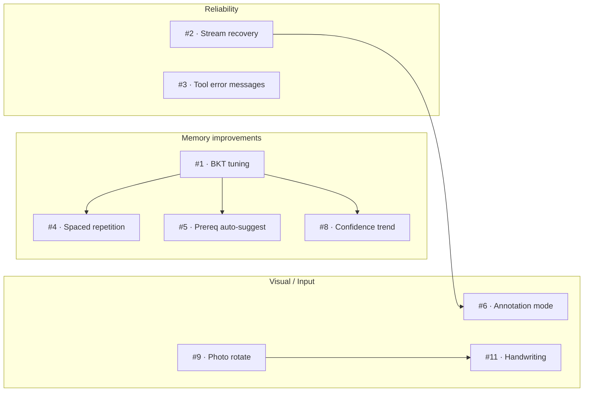

# Spark AI Tutor — Development TODO

> Source: [Design Overview](/docs/DESIGN.md)  
> Sprint foundation: 161 unit tests, full `verify:all` suite green.

---

## How to use this list

- **🔴 P0** = must-have before next release  
- **🟡 P1** = important quality / UX  
- **🟢 P2** = nice-to-have polish  

Numbers are priority, not sequence. Pick top-down.

---

## 🔴 P0 — Core Reliability

| # | Task | Subsystem | Detail |
|---|------|-----------|--------|
| 1 | **BKT parameter tuning from real data** | [Memory](subsystems/learning-memory.md) | Log P(L) trajectories over 50+ turns; adjust `pInit`/`pLearn`/`pSlip`/`pGuess` per skill from outcomes. Current values are G4-educated defaults. |
| 2 | **Stream abort recovery** | [Agent](subsystems/agent-prompt.md) | When SSE stream breaks mid-token (network blip), resume from last complete sentence instead of truncating. Current: reply saved as-is. |
| 3 | **Tool error → student-friendly message** | [Agent](subsystems/agent-prompt.md) | `web_search` / `draw_geometry` failures currently return raw error. Map error codes to friendly messages per language. |

---

## 🟡 P1 — Quality & UX

| # | Task | Subsystem | Detail |
|---|------|-----------|--------|
| 4 | **Spaced repetition for vocabulary** | [Memory](subsystems/learning-memory.md) | Add a vocab skill type with Ebbinghaus-like interval decay. Surface "review 3 words from last week" at session start. |
| 5 | **Skill prerequisite auto-suggest** | [Memory](subsystems/learning-memory.md) | When a skill is weak AND its prerequisite is also weak, prompt AI to review the prerequisite first. Current: hint in prompt text only; should be a structured suggestion. |
| 6 | **Diagram annotation mode** | [Diagrams](subsystems/geometry-diagrams.md) | Allow the student to tap/click on a diagram to ask "what's this part?" — the agent then highlights and explains that element. Current: static images only. |
| 7 | **TTS skip-long-reply button** | [Voice](subsystems/voice-tts.md) | Add a "stop speaking" button that aborts current TTS queue and leaves reply text visible. Current: only global speak-toggle. |
| 8 | **Confidence trend in SkillsPanel** | [Memory](subsystems/learning-memory.md) | Show an up/down arrow next to each skill mastery when confidence changed across the last N turns. Current: mastery value only. |
| 9 | **Photo rotate/crop before send** | [History](subsystems/history-storage.md) | Student photos of homework are often sideways. Add client-side rotate before upload. Current: raw photo sent. |

---

## 🟢 P2 — Polish & Extend

| # | Task | Subsystem | Detail |
|---|------|-----------|--------|
| 10 | **Parent dashboard** | [History](subsystems/history-storage.md) | A separate view (password-gated) showing: time spent, topics practiced, mastery trends, recent struggles. Read-only. |
| 11 | **Multi-modal input (handwriting)** | [Voice](subsystems/voice-tts.md) | Accept photo of handwritten math — send to STT with image → LaTeX conversion. Most G4 homework is handwritten. |
| 12 | **Export chat as PDF** | [History](subsystems/history-storage.md) | "Save this conversation" button → PDF with embedded diagrams. Useful for parent review or school sharing. |
| 13 | **Dark mode** | [Design Overview](DESIGN.md) | Toggle in settings; persist to `localStorage`. Current: light theme only (CSS custom properties ready). |
| 14 | **i18n UI strings** | [Voice](subsystems/voice-tts.md) | Translate UI chrome (buttons, labels, errors) to 粤语/普通话/Español based on selected voice. Current: English chrome only. |
| 15 | **Offline mode indicator** | [History](subsystems/history-storage.md) | Show a subtle banner when server sync fails ("Saved locally — sync when online"). Current: silent catch. |
| 16 | **A/B prompt experiments** | [Agent](subsystems/agent-prompt.md) | Log which prompt variant was used per turn; measure student engagement (turns/session, struggle frequency). |

---

## Documentation TODOs

| # | Task |
|---|------|
| D1 | Add inline code comments where complex (BKT update, SVG repair regexes) |
| D2 | Record a 3-minute demo video for the README |
| D3 | Create a "How to extend the skill catalog" guide |

---

## Test Gaps

| # | Task |
|---|------|
| T1 | Fuzz-test `sanitizeSvg` with random byte sequences |
| T2 | Performance test: 10 concurrent chat requests (simulated) |
| T3 | TTS voice quality regression: compare audio bytes before/after prompt changes |
| T4 | Memory stress: fill localStorage to quota, verify graceful degradation |

---

## Dependency Map (for sequencing)

Blocks are independent of each other. Within a block, top items unlock bottom items.

---

## Contribution Workflow

1. Branch from `main`: `feature/bkt-tuning` or `fix/stream-recovery`  
2. Implement + add/modify tests in `src/lib/*.test.ts`  
3. Run `npm test` (161 tests must pass)  
4. Run relevant `npm run verify:*` script  
5. Rebuild: `npm run build`  
6. Restart service: `systemctl restart spark-tutor`  
7. Smoke-test at `https://65.49.201.123/`  
8. PR with description + screenshot/screencap if UI changed  

---

*Last updated: 2026-08-03 · aligned with v0.2.0 design docs*
