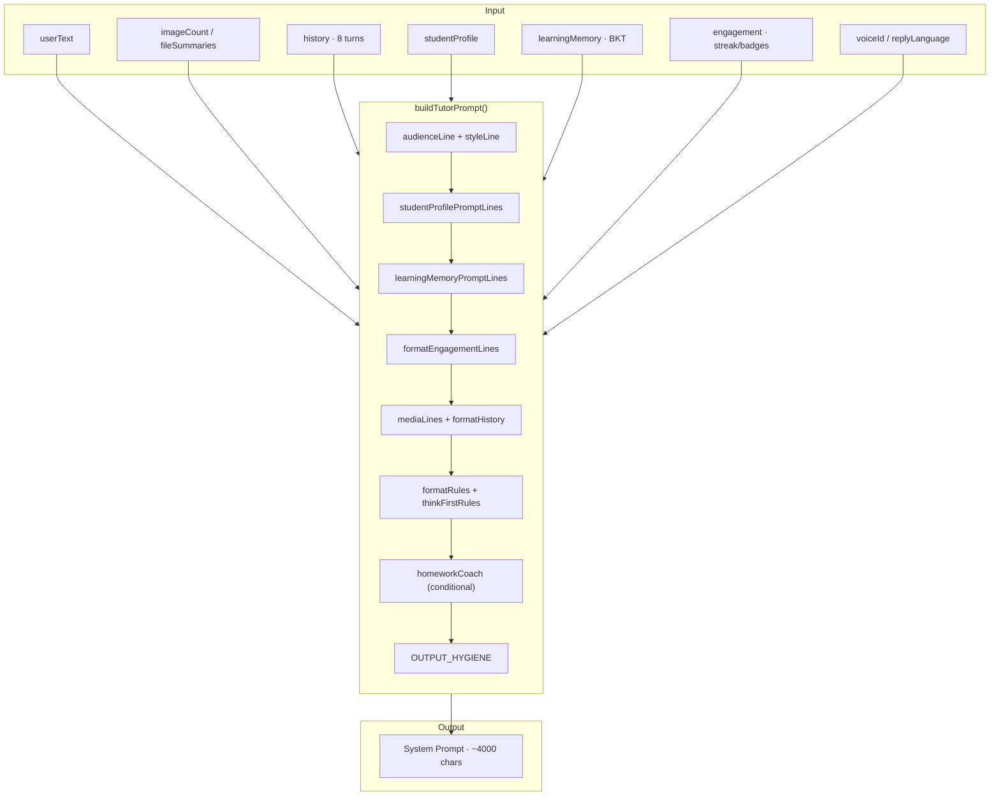
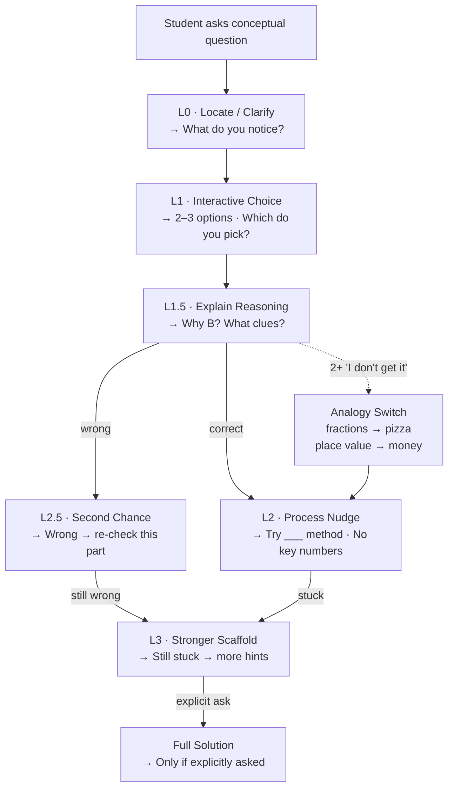
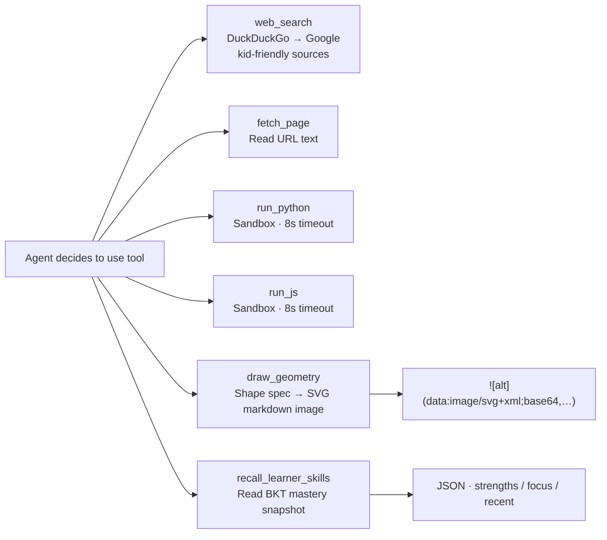

# Subsystem: Agent & Prompt Pipeline

> Parent: [Design Overview](/docs/DESIGN.md)

---

## 1. Responsibility

Convert raw user input + learner context into a structured prompt that drives the Cursor SDK agent, then stream the reply back to the browser.

---

## 2. Architecture

---

## 3. Prompt Layers

| # | Layer | Lines | Example |
|---|-------|-------|---------|
| 1 | Audience + Style | 2 | `Audience: international-school student … reply in 粤语` |
| 2 | Student Profile | 8 | `Name: Ryan (9). BASIS G4. Stronger: science curiosity.` |
| 3 | Learning Memory | 6–12 | `Skills: fractions ~76%, division ~32%. Focus on division.` |
| 4 | Engagement | 3 | `streak 3d · today 2 · total turns 12 · badge: 3-day streak` |
| 5 | Media + History | variable | Photo N descriptions, extracted PDF text, last 8 chat turns |
| 6 | Format Rules | 14 | Markdown, LaTeX, geometry diagrams, reading-comprehension cues |
| 7 | Think-First Coaching | 40+ | Hint ladder, anti-spoiler, interactive patterns, analogies, writing, science |
| 8 | Homework Coach | 11 (conditional) | Extra scaffolding when photos/files attached |

---

## 4. Hint Ladder

---

## 5. Tool Dispatch

**Tool narration filtering** (`tutor-text-filter.ts`): If the agent says "Let me use web_search…" that chatter is stripped before the student sees the reply.

---

## 6. Output Hygiene

Rules injected into every prompt:

- Never narrate tools (`draw_geometry`, `web_search`, …)
- Status / thinking stays off-screen — only teaching text + diagrams shown
- Reply format: Markdown + LaTeX + `draw_geometry` images

---

## 7. AGENTS.md

The companion file `tutor-workspace/AGENTS.md` mirrors the prompt in a format the agent can reference. It is the **source of truth** for teaching behavior. Edits to `prompts.ts` should be reflected there.

---

## 8. Edge Cases

| Case | Handling |
|------|----------|
| Pure recall (7×8) | Skip Socratic ladder; confirm + memory tip |
| Medium computation (256÷8) | One hint first; confirm after attempt |
| "I don't know" | Stay at L0–L1; do not leap to answer |
| "I give up" | Empathize, shrink task, offer easier choice |
| Bored / "what should I do?" | 5-minute brain teaser (riddle, puzzle) |
| Empty user text | `defaultStudentLine()` per language |
| No history | Omit `[Recent chat]` block |

---

## Next: [Learning Memory & BKT](learning-memory.md)
