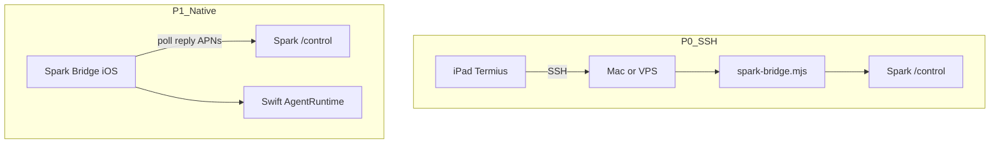

# iPad support — SSH easy deploy + native Bridge

> Updated 2026-08-20

Spark can be driven from an iPad in two tracks. **Do not confuse them.**

| Track | What you install on iPad | Where Bridge / agent runs | Deploy difficulty | Appears as Spark node |
|-------|--------------------------|---------------------------|-------------------|------------------------|
| **P0 SSH** | Termius / Blink / Prompt | Always-on **Mac or Linux VPS** | Low (paste one script) | `darwin` / `linux` |
| **P1 Native** | Spark Bridge iOS App | **On the iPad** (Swift AgentRuntime) | High (TestFlight / Apple Developer) | `platform: ios` |
| ~~iSH / a-Shell local Node~~ | Local Alpine / JSC shell | Would be iPad | Broken | **Rejected** |

---

## Why not iSH / a-Shell on-device?

- **iSH:** modern Node often exits with `Illegal instruction` (emulator gaps).
- **a-Shell:** JavaScriptCore only — no real `node` / `npm`.
- **Background:** iOS suspends the app; long-poll dies; `tmux` does not keep the process running.
- Product decision: **no** “curl spark-bridge inside iSH” path.

---

## P0 — SSH easy deploy (shipped)

### User flow (Termius install + one-tap)

1. Keep a Mac (default) or Linux VPS online.
2. On iPad open `/deploy` → **iPad / SSH** → generate pair code (host toggle defaults to **Mac (SSH)**).
3. Tap **Open one-tap installer** (Termius App Store + copy command live on that page).
4. Optional: Shortcuts / Blink on the same installer page.
5. Chat at `/control`.

Deploy UI currently hides the Native App tab; scaffold remains under `apps/spark-bridge-ios/`.

| Asset | Purpose |
|-------|---------|
| `/install/spark-deploy-ipad.html?code=&target=mac\|linux` | One-tap installer (default **mac**); includes Termius App Store |
| `termius://` | Open Termius after install (on installer page) |
| same + `&download=1` | Download `Spark-Deploy-<CODE>.html` |
| Shortcut `Spark Deploy` / Blink URL actions | Optional power-user paths |

### Installers

| Host | Script | Daemon | Watchdog |
|------|--------|--------|----------|
| macOS | [`public/install/macos.sh`](../../public/install/macos.sh) | LaunchAgent `org.spark.bridge` (`KeepAlive`, `gui/<uid>`) | `org.spark.bridge.watchdog` every 60s |
| Linux | [`public/install/linux.sh`](../../public/install/linux.sh) | `systemd --user` `spark-bridge.service` + **linger** | `spark-bridge-watchdog.timer` every 1m |

Bridge `restartSelf()` supports `systemctl --user restart spark-bridge` on Linux and `launchctl kickstart` on macOS.

**After install you can quit Termius.** The host daemon owns Bridge; iPad does not need to stay connected.

Linux linger: if the installer warns, run once `sudo loginctl enable-linger $USER`.

OpenClaw skills include `linux.md` / `ios.md` overlays so VPS nodes (common iPad SSH target) get CLI-first guidance; native iOS notes stay in `ios.md`.
---

## P1 — Native Spark Bridge iOS App

Path: [`apps/spark-bridge-ios/`](../../apps/spark-bridge-ios/)

| Piece | Role |
|-------|------|
| `BridgeClient` | `register` / `heartbeat` / `poll` / `reply` (HTTP, 45s poll abort) |
| `AgentRuntime` | OpenAI-compatible tool loop (DeepSeek / DashScope keys from Keychain or install-ticket) |
| Tools | Files (Documents), Photos, Camera, Clipboard, URL fetch |
| Push | Silent APNs (`content-available: 1`) when server enqueues chat for `platform: ios` |

### Server fields

`NodeRecord` may include:

- `apnsDeviceToken`
- `pushEnvironment` (`sandbox` | `production`)

`POST /api/nodes/heartbeat` accepts those fields. Enqueue chat for an iOS node triggers [`scripts/apns-push.mjs`](../../scripts/apns-push.mjs) when `APNS_*` env is set.

### Upgrade on iOS

Not tar + `install.mjs`. App reads `/install/ios-bridge-manifest.json` and prompts TestFlight / App Store update; may refresh remote prompt pack.

### Background (App Store compliant)

- Use **remote-notification** silent push — **not** PushKit/VoIP.
- Document latency: first command after long sleep may take 10–30s; open the app if push is dropped.

### Capability gap vs Mac/Win

| | Mac/Win | iPad native |
|--|---------|-------------|
| Spark `/control` node | Yes | Yes |
| OpenClaw skills / WeChat / workbench | Yes | No |
| Shell / desktop GUI | Yes | No |
| Camera / Photos / Files | Partial | First-class |

---

## Related docs

- [remote-openclaw-control.md](remote-openclaw-control.md)
- [assistant-ipad.md](assistant-ipad.md)
- [assistant/platforms/ios/README.md](../../assistant/platforms/ios/README.md)
- [apps/spark-bridge-ios/README.md](../../apps/spark-bridge-ios/README.md)
