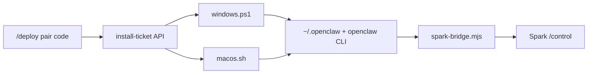

# Spark vs AI Assistant repos — reference, not integration

> Version 1.0 · 2026-08-20
> Related: `/deploy`, `/control`, `public/install/`

## Conclusion

**Reference (layout + install shape), not code integration.**

Spark (`ryan_learning`) does **not**:

- git submodule `zilinli/ai_assistant_mac` or `zilinli/ai_assistant_win`
- `git clone` those repos at install time
- vendor `openclaw-config/`, skills, Bolt Console, WeChat, or `~/openclaw-workbench`

Those two repos were read for paths, gateway, `.env`, and **Mac LaunchAgent vs Windows scheduled task**. Spark then shipped its own one-click pair installers.

## What actually runs

| Piece | Path |
|-------|------|
| Windows | `public/install/windows.ps1` |
| macOS | `public/install/macos.sh` |
| Bridge | `public/install/spark-bridge.mjs` |

Scripts: pull pair ticket → write `~/.openclaw/.env` → `npm i -g openclaw` → write a **simplified** `openclaw.json` → start gateway → install Spark Bridge (schtasks / LaunchAgent).

They **do not** run `ai_assistant_win/install.ps1`. The Mac repo has no matching `install.sh` (backup/USAGE + `~/.openclaw` config backup only).

## Capability gap

The assistant repos include a full workspace: skills, Bolt Console, Cursor driver, WeChat channel, `~/openclaw-workbench`. Spark’s installer only guarantees **pair + `/control` remote chat**.

## If we later want real integration

Pick one (do not mix accidentally):

1. **Keep reference** — current policy; Spark installers evolve independently
2. **Clone at install** — Mac/Win scripts `git clone` the matching repo, sync config, then attach Bridge (needs GitHub access on the PC)
3. **Vendor into Spark** — copy config/scripts into `ryan_learning` and maintain two trees
