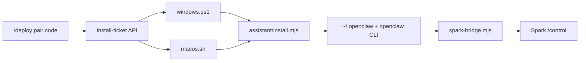

# Spark vs AI Assistant repos

> Updated 2026-08-20 · See also [remote-openclaw-control.md](remote-openclaw-control.md)

## Conclusion

**Integrated.** The unified module lives at [`assistant/`](../../assistant/) inside `ryan_learning`.

The former standalone repos are **archived**:

- [zilinli/ai_assistant_mac](https://github.com/zilinli/ai_assistant_mac)
- [zilinli/ai_assistant_win](https://github.com/zilinli/ai_assistant_win)

Spark `/deploy` installs the full assistant (skills, workbench, WeChat) plus Spark Bridge. Spark does **not** clone or submodule the old repos.

---

## Architecture



| Piece | Path |
|-------|------|
| Unified assistant | `assistant/` |
| Windows installer | `public/install/windows.ps1` |
| macOS installer | `public/install/macos.sh` |
| Bridge (canonical) | `public/install/spark-bridge.mjs` |
| Bridge (dev copy) | `bridge/index.mjs` — keep synced |
| Control plane | `bridge/control-server.mjs` :3010 |
| Control UI | `src/app/control/page.tsx` via Next :3000 |
| Deploy UI | `src/app/deploy/page.tsx` via Next :3000 |
| Node store | `src/lib/nodes/store.ts` + `data/nodes/` |

**Production routing:** nginx sends `/control` and `/deploy` to Next.js; `/api/nodes/*`, `/api/control/*`, and `/install/*` to `spark-control` on port 3010.

---

## Platform layout

```
assistant/
├── install.mjs              # cross-platform entry (Node 22+)
├── openclaw-config/         # base + darwin/win32 overlays
│   └── workspace/skills/    # 15 skills with optional darwin.md / win32.md
├── platforms/darwin/        # Mac extras (venv, LaunchAgent helpers)
├── platforms/win32/         # Windows extras
└── scripts/                 # merge-config, merge-skills
```

Skills include: `computer-use`, `cursor-code`, `workbench`, `office-docs`, `deep-research`, `memory-rag`, `media-gen`, `music-gen`, `data-analysis`, `cost-tracker`, `connectors-basic`, `command-correct`, `task-deliver`, `fun-mode`, `organize-messy-files-file-organizer`.

---

## Rebuild assistant bundle

After changing `assistant/` or `spark-bridge.mjs`:

```bash
cd codes/ryan_learning
tar czf public/install/assistant.tar.gz assistant
# bump SPARK_BRIDGE_VERSION + CURRENT_BRIDGE_VERSION if bridge changed
pm2 restart spark-control
```

Paired PCs pick up changes via **Upgrade from server** on `/deploy` (online nodes) or re-run the one-click installer.

---

## Archive old GitHub repos

See [`archive-old-assistant-repos.md`](archive-old-assistant-repos.md) for README text to paste into the archived repos.
