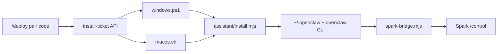

# Spark vs AI Assistant repos

> Updated 2026-08-20

## Conclusion

**Integrated.** The unified module lives at [`assistant/`](../../assistant/) inside `ryan_learning`.

The former standalone repos are **archived**:

- [zilinli/ai_assistant_mac](https://github.com/zilinli/ai_assistant_mac)
- [zilinli/ai_assistant_win](https://github.com/zilinli/ai_assistant_win)

Spark `/deploy` installs the full assistant (skills, workbench, WeChat) plus Spark Bridge.

## Architecture



| Piece | Path |
|-------|------|
| Unified assistant | `assistant/` |
| Windows installer | `public/install/windows.ps1` |
| macOS installer | `public/install/macos.sh` |
| Bridge | `public/install/spark-bridge.mjs` |
| Control UI (prod) | `bridge/ui/` via `bridge/control-server.mjs` :3010 |

## Platform layout

```
assistant/
├── openclaw-config/     # base + darwin/win32 overlays
├── platforms/darwin/    # Mac extras (venv, LaunchAgent helpers)
├── platforms/win32/     # Windows extras
└── install.mjs          # cross-platform entry
```

## Rebuild assistant bundle

After changing `assistant/`:

```bash
cd codes/ryan_learning
tar czf public/install/assistant.tar.gz assistant
pm2 restart spark-control
```

## Archive old GitHub repos

See [`archive-old-assistant-repos.md`](archive-old-assistant-repos.md) for README text to paste into the archived repos.
