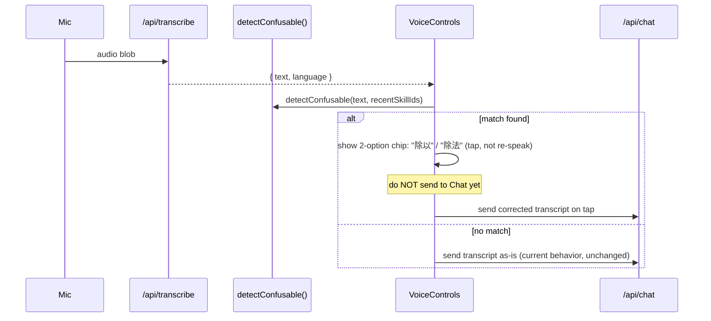

# B3 — Voice Tolerance / Confirm-Intent

> **Subsystem document** — part of [Spark Design Docs](../DESIGN.md)
> Status: **shipped on develop** · 2026-08-10  

> Upstream: [competitive-product-plan-v2.md](competitive-product-plan-v2.md) (ELSA-style low-confidence confirm) · [ca-p1-system-design.md](ca-p1-system-design.md)
> Prerequisite: Phase G Tier-1 + cloud dialect STT/TTS (shipped) — see [dialect-support-teochew-hakka.md](dialect-support-teochew-hakka.md)
> Downstream: [TODO.md § Competitive Analysis Backlog](../TODO.md)

---

## 1. Goal & non-goal

**Goal:** when the mic transcript is likely wrong or ambiguous — dialect mixed with Mandarin, a child mumbling, a domain term that sounds like another domain term — Ryan should behave like a real tutor and **confirm the guess in one short line** ("你是说'除以'还是'除法'？") instead of either (a) silently acting on a wrong transcript, or (b) flatly asking "please repeat."

**Non-goal:** this is not a general ASR-accuracy project. We are not retraining models or adding new STT engines. B3 is a **thin confirm-intent layer on top of the existing transcript**, because — important finding below — we don't have the acoustic signal an ELSA-style confidence bar would normally use.

---

## 2. Why this can't literally copy ELSA Speak (read from code first)

ELSA's pattern relies on **phoneme-level acoustic confidence** from the ASR engine. Checked the actual pipeline:

- `/api/transcribe` (`src/app/api/transcribe/route.ts`) calls Bailian Fun-ASR-Flash / Qwen3-ASR (`bailian-asr.ts`) with an iFlytek dialect fallback (`iflytek-asr.ts`).
- `extractBailianAsrText()` (`bailian-asr.ts:89-129`) only ever pulls out **`text` and `language`** from the provider response. No confidence/score field is parsed, and grepping the whole ASR stack (`bailian-asr.ts`, `iflytek-asr.ts`, `scripts/stt_server.py`) confirms **no confidence value exists anywhere in the current pipeline** — not "unused," genuinely absent.

So "low-confidence ASR" as a literal signal doesn't exist today. Two options:

| Option | Cost | Verdict |
|---|---|---|
| A. Check if Bailian/Qwen3-ASR responses actually contain a score field we're just not extracting | Cheap — one test call + read raw JSON | Do this first (§3), but don't block B3 on it |
| B. Build a **lexical confusable-pair layer**: a small glossary of G4-domain term pairs/triples that sound alike in Mandarin/dialect, matched against the transcript text itself, independent of any acoustic score | Small — mirrors the exact pattern already shipped for **CA-6 misconception tags** (`src/lib/misconceptions.ts`) | **Primary path** — doesn't depend on a provider ever adding confidence |

B3 ships on **Option B**. If §3's investigation finds a real confidence field, it becomes an *additional* trigger layered on top, not a replacement.

---

## 3. Quick spike (do first, ~30 min, not a blocker)

- [x] **B3.0** — Code-path spike (2026-08-10): `extractBailianAsrText` + Bailian/iFlytek/local STT stack expose **no** confidence/score/logprob field today. Proceed with Option B only; acoustic confidence remains §7 fast-follow if a future provider payload adds it.

---

## 4. Confusable-term glossary (Option B design)

### 4.1 Data shape — mirrors `misconceptions.ts` deliberately

```ts
// src/lib/voice-confusables.ts
export type ConfusablePair = {
  id: string;
  /** Transcript-side triggers — substrings/regex-safe tokens to watch for */
  heard: string[];          // e.g. ["除以"] as heard-candidate
  confusedWith: string[];   // e.g. ["除法"]
  /** Only fire when recent conversation context is in this domain (avoid false positives) */
  skillIds?: string[];      // e.g. ["division-concepts"]
  /** Confirm-question shown to child, both languages side by side */
  confirmLine: string;      // "你是说「除以」还是「除法」？"
};
```

### 4.2 Seed set (~20 pairs, G4-scoped, same discipline as CA-6's 25-tag seed)

Sourced from three places, not invented from scratch:

1. **Math homophones** (Mandarin): 除以/除法, 乘以/乘法, 公倍数/公约数, 分子/分母 (when mumbled fast), 减/加 (when audio is clipped at the start of a word)
2. **Dialect ↔ Mandarin term drift** (Teochew/Hakka households mixing languages mid-sentence): a family member's dialect word for a math term transcribed as an unrelated Mandarin homophone — seed from the existing `dialect-eval-set.md` corpus rather than guessing new ones
3. **English/Chinese code-switch** (BASIS-style bilingual household): "plus" heard as "破斯"-shaped garbage, "times" vs "twice"

This is a **starting seed**, expanded the same way CA-6 was — additive, stable IDs, no need to get all 20 right on day one.

### 4.3 Matching logic

Deliberately **not** a fuzzy-ASR-confidence model — a cheap, explainable token match:

```ts
export function detectConfusable(
  transcript: string,
  recentSkillIds: string[],
): ConfusablePair | null {
  for (const pair of CONFUSABLE_SEED) {
    if (pair.skillIds && !pair.skillIds.some(id => recentSkillIds.includes(id))) continue;
    if (pair.heard.some(h => transcript.includes(h))) return pair;
  }
  return null;
}
```

Runs **client-side, synchronously, on the transcript already returned from `/api/transcribe`** — no extra network round-trip, no latency added to the voice loop.

---

## 5. Confirm-intent flow

### 5.1 When it fires

Only on the **voice input path** (not typed text — a typed "除以" is unambiguous, the user chose those exact characters). Hook point: `VoiceControls` after `/api/transcribe` resolves, before the transcript is sent to `/api/chat`.



### 5.2 UI

Two-tap chips, not a re-record prompt — this is the key UX difference from a generic "please repeat":

> 🎤 *"...然后用 24 除以 3..."*
> Did you mean: **[除以]** or **[除法]** ?

- Tapping a chip **edits the transcript in place** and proceeds — no need to re-speak the whole sentence, matching the "real tutor" metaphor (a person would just ask "divide or division?", not "say that again").
- No response within ~4s → proceed with the original transcript (never block the conversation waiting on a confirm; fail open toward "keep talking" like a patient human tutor would).
- This reuses the existing barge-in chip visual language from CA-4 (`interruptHint` / mic status area) rather than introducing a new UI pattern.

### 5.3 Scope limit — G4 math only, on day one

`recentSkillIds` gating (§4.3) means this **only fires when context matches a seeded skill**, so it can't misfire on unrelated conversation (e.g. chatting about entertainment, or English homework) even with an imperfect glossary. This keeps the blast radius small while the seed list is thin.

---

## 6. Files

| File | Role |
|---|---|
| `src/lib/voice-confusables.ts` | `ConfusablePair` type, `CONFUSABLE_SEED`, `detectConfusable()` |
| `src/lib/voice-confusables.test.ts` | Unit tests VC1–VC6 (below) |
| `src/components/VoiceControls.tsx` | Wire post-transcribe hook + chip UI |
| `src/lib/prompts.ts` | *No change* — confirm-intent is resolved client-side before the message reaches the agent |

### 6.1 Test design

| Case | Assert |
|---|---|
| VC1 | Transcript contains a seeded `heard` token + matching skill context → returns the pair |
| VC2 | Transcript contains token but skill context doesn't match `skillIds` → returns `null` (no false-fire outside domain) |
| VC3 | No match → `null`, fast path unchanged |
| VC4 | Tapping a chip mutates outgoing message to the chosen term, original audio not re-sent |
| VC5 | No tap within timeout → original transcript sent unchanged (fail-open) |
| VC6 | Typed (non-voice) input never triggers confirm, even with a seeded token present |

---

## 7. Explicitly deferred

- **Acoustic confidence integration** — only if §3's spike finds a real field; separate follow-up, not blocking B3.
- **Auto-expanding the glossary from live misfires** — worth doing once there's usage data, but seeding it from guesses instead of real transcripts risks the same "over-engineered, unused" trap C5 was explicitly kept out of. Revisit after ~2 weeks of real usage logs.
- **Applying this to Cantonese/English paths** — seed set is G4-Mandarin/dialect-scoped; English confusables (e.g. "forty"/"fourteen") are a plausible fast-follow but a distinct glossary, not in scope here.

---

## 8. TODO.md wiring (paste into repo)

Replace the P1 line:

```md
- [ ] **B3** — Voice tolerance / confirm-intent (after Phase **G**, not inside G) — ELSA-style low-confidence confirm
```

with:

```md
- [ ] **B3.0** — Spike: check Bailian/Qwen3-ASR raw response for a confidence field (30min, non-blocking) — see [ca-b3-voice-tolerance.md](subsystems/ca-b3-voice-tolerance.md) §3
- [ ] **B3.1** — `voice-confusables.ts`: seed ~20 G4 confusable pairs (math homophones + dialect drift + code-switch) + `detectConfusable()`
- [ ] **B3.2** — Wire post-transcribe hook + two-tap confirm chip in `VoiceControls.tsx`
- [ ] **B3.3** — Unit tests VC1–VC6
```

And add this doc to `DESIGN.md`'s document map next to `ca-p1-system-design.md`.

---

## 9. Changelog

- **2026-08-10** — doc drafted; §3 spike: no confidence field in extractors → Option B.
- **2026-08-10** — B3.1–B3.3 shipped: `voice-confusables.ts`, VoiceControls/Composer chips, VC1–VC6 green.
