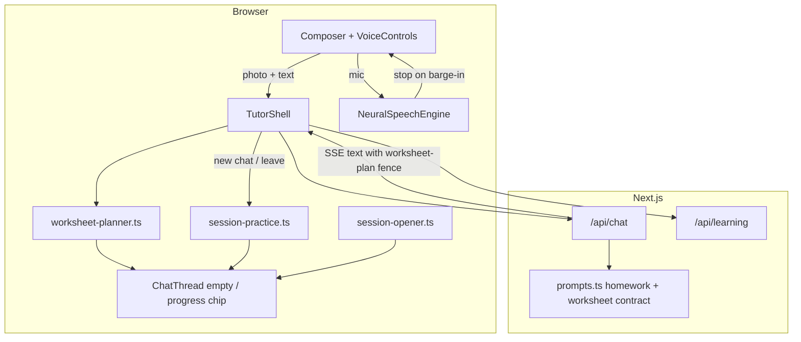

# CA-P0 System Design — Worksheet · Practice Loop · Opener · Barge-in

> **Subsystem document** — part of [Spark Design Docs](../DESIGN.md)  
> Status: **implementing** · August 2026  
> Research: [competitive-feature-analysis.md](competitive-feature-analysis.md)  
> Downstream: [TODO.md § Phase CA-P0](../TODO.md)

---

## 1. Goals & non-goals

Ship four P0 features that close the largest gaps vs 豆包爱学 / Socra / Synthesis / Buddy, while keeping **chat-first** and **zero child dashboard**.

| ID | Goal | Child-visible chrome |
|----|------|----------------------|
| **CA-1** | Multi-problem worksheet → Socratic one-at-a-time with "2/8" | Tiny progress chip only |
| **CA-2** | Leave a meaty session → offer 3 targeted drills | One empty-state offer line |
| **CA-3** | New chat → once/day ZPD or due-review offer | Empty-state chips (homework always wins) |
| **CA-4** | Mic during TTS → interrupt and listen (4.1a) | Status hint while speaking |

**Non-goals:** answer-dump solver, child skill radar, continuous full-duplex voice (4.1b), OCR microservice.

---

## 2. Architecture



**Principles**

1. Prefer **pure lib modules** + prompt contracts over new services.  
2. Persist planner in `ConversationRecord.worksheetPlan` (optional field; ignore if absent).  
3. Opener/practice once-gates in `localStorage` under account namespace.  
4. Never block send path on network for these features.

---

## 3. CA-1 Worksheet planner

### 3.1 Data model

```ts
type WorksheetItem = {
  id: number;          // 1-based
  label: string;       // "Q1", "1a", …
  status: "pending" | "active" | "done" | "skipped";
};

type WorksheetPlan = {
  total: number;
  current: number;     // 1-based active id
  items: WorksheetItem[];
  source: "agent";     // reserved for future OCR
  updatedAt: number;
};
```

### 3.2 Agent contract (prompt)

When homework photo/PDF looks like **≥2 numbered items**, assistant MUST emit (once, then update) a hidden fence:

````
~~~worksheet-plan
{"total":8,"current":1,"items":[{"id":1,"label":"Q1","status":"active"},{"id":2,"label":"Q2","status":"pending"}]}
~~~
````

Rules for the agent:

- Tutor **one item at a time**; do not solve the whole page.  
- After student finishes an item (or asks to skip), bump `current`, mark prior `done`/`skipped`, re-emit fence.  
- End of set: one short weak-skill summary + celebrate; no mega dump.

Client:

1. Parse fence from assistant stream/final text (`parseWorksheetPlanFence`).  
2. Strip fence from displayed markdown (`stripWorksheetPlanFence`).  
3. Merge into active conversation `worksheetPlan`.  
4. Show chip: `Question 2 of 8` (English chrome).

### 3.3 Files

| File | Role |
|------|------|
| `src/lib/worksheet-planner.ts` | parse/strip/merge/formatProgress |
| `src/lib/prompts.ts` | worksheet contract block |
| `src/lib/types.ts` | optional `worksheetPlan` on `ConversationRecord` |
| `src/components/TutorShell.tsx` | merge plan after turn |
| `src/components/ChatThread.tsx` or header chip | progress display |
| `src/lib/worksheet-planner.test.ts` | unit tests WP1–WP8 |

---

## 4. CA-2 Post-session practice loop

### 4.1 Trigger

On `startNewSession`, if previous conversation has `messages.length >= 4`:

1. Digest (existing).  
2. `pickPracticeTargets(mem, 3)` from `skillWeaknesses` ∪ low ZPD ∩ `needsReviewSkills`.  
3. If ≥1 target, write `PendingPracticeOffer` to `localStorage` (`spark.practiceOffer.{accountId}`).  
4. Empty-state in new chat reads offer and shows:  
   **Practice 3 quick ones?** · skill labels · buttons: **Let's practice** / **Tomorrow** / **Dismiss**

### 4.2 Actions

| Action | Behavior |
|--------|----------|
| Let's practice | Prefill/send user message: `Let's practice: {labels}. Give me 3 short questions one at a time — Socratic, no spoilers.` Clear offer. |
| Tomorrow | `deferPracticeTargets(ids)` — bump SM-2 `prevReview` / store defer until next day. Clear offer. |
| Dismiss | Clear offer only. |

### 4.3 Files

| File | Role |
|------|------|
| `src/lib/session-practice.ts` | pick/defer/load/save/clear + copy builders |
| `src/lib/learning-memory.ts` | optional tiny helper for defer (or keep in session-practice) |
| `TutorShell` / `ChatThread` | wire offer UI + send |
| `session-practice.test.ts` | SP1–SP7 |

---

## 5. CA-3 Session opener

### 5.1 Logic

```
buildSessionOpener(mem, accountId, now):
  if already shown today → null
  review = needsReviewSkills(mem, 1)
  zpd = zpdWarmUpSkills(mem, 1)
  skill = review[0] ?? zpd[0]
  if !skill → null
  return { skillId, label, kind: review ? "review" : "zpd",
           line: "Today fits {label} — or snap homework first?" }
```

Once accepted or dismissed → set `spark.opener.date.{accountId}=YYYY-MM-DD`.

Homework photo / "homework" typed message: never re-prompt that day.

### 5.2 UI

Empty `ChatThread`: if opener present, show chip row under welcome copy:

- **Try {label}** → sends practice kickoff for that skill  
- **Snap homework** → focuses camera / no message (Composer already primary)

### 5.3 Files

`session-opener.ts`, `ChatThread`, `TutorShell`, `session-opener.test.ts` (SO1–SO6). Also inject `needsReviewSkills` into `learningMemoryPromptLines`.

---

## 6. CA-4 TTS barge-in (4.1a)

### 6.1 Current behavior

`VoiceControls.startListening` already calls `stopSpeaking()` → `NeuralSpeechEngine.stop()`.

### 6.2 Product polish

1. While `engine.isBusy()`, mic tooltip/status: **Tap to interrupt**.  
2. Unit/contract test: barge-in helper documents stop-before-record.  
3. Dict/translate mic (`MicTranscribeButton`) optionally call shared stop — out of tutor P0 if unused on main chat.

**4.1b** (continuous half-duplex) deferred — separate design.

### 6.3 Files

`VoiceControls.tsx`, optional `speech-barge-in.ts` pure helper, `speech-barge-in.test.ts` (BI1–BI4).

---

## 7. Cross-cutting: privacy & accounts

All gates/offers use `accountId` namespaced keys (align with multi-tenant). No child dashboard. Parent weekly (CA-10) separate.

---

## 8. Test design (summary)

| Suite | Cases | Focus |
|-------|-------|-------|
| worksheet-planner | WP1–WP8 | parse valid/invalid, strip, advance, progress label, merge |
| session-practice | SP1–SP7 | pick targets, empty mem, persist, tomorrow defer, dismiss |
| session-opener | SO1–SO6 | once/day, prefer review, no skills, dismiss gate |
| speech-barge-in | BI1–BI4 | stop-before-listen contract, busy hint copy |
| prompts | extend | worksheet fence instructions present when homework |
| Manual smoke | M1–M5 | photo worksheet chip; leave chat → offer; new day opener; mic interrupts TTS |

Acceptance gate: `npm test` green for new suites; `npm run build`; manual M1–M4 on live after deploy.

---

## 9. Rollout

1. Libs + tests → 2. prompts → 3. UI wire → 4. build/deploy → 5. mark TODO CA-P0 checkboxes.
