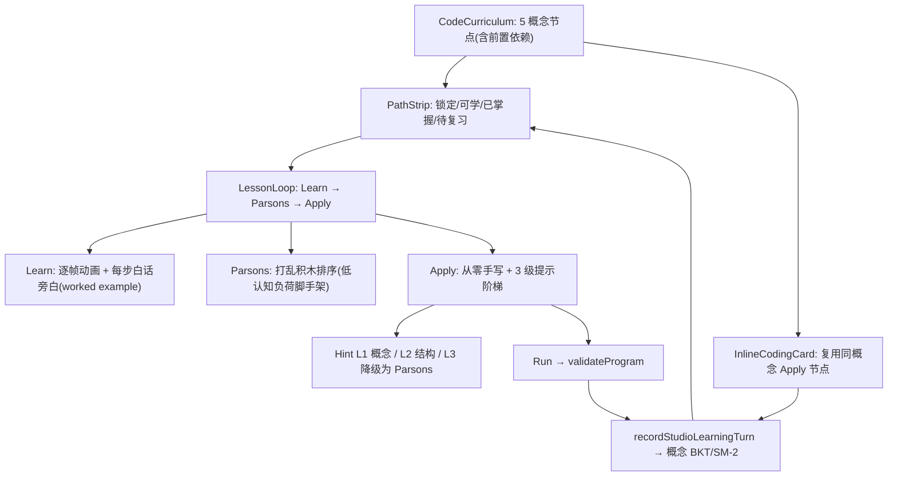

# Code Spark — 概念课程 + 掌握度路径 + 脚手架 + 提示阶梯（blocks-first + Python Bridge + Brilliant coaching）

> Date: 2026-08-16 · Status: shipping (v5 concept curriculum)  
> GameId: `code-spark` · First card in Learning Games on `/entertain`  
> Research seeds:
> - [知乎 · 5–14岁 8 个免费国外编程站](https://zhuanlan.zhihu.com/p/148424141)
> - [Brilliant · Learn Coding](https://brilliant.org/topics/coding/) / [CS path](https://brilliant.org/cs/)

## Problem

v2 已做到 Blocks-first + Python Bridge，但仍有偏差：

1. **反馈偏结果口令**（Bump / Stuck），缺少 Brilliant 式「用白话讲清概念错在哪」；
2. **技能轨道命名**偏 FCC（Foundations / Loops），未对齐 Brilliant「Thinking in Code → Algorithmic Thinking」心智模型；
3. **关卡提示偏操作**（Tap tiles），弱化「先像程序员一样想」；
4. **主对话触发词偏窄** — Brilliant 常见词（computational thinking / variables / functions / 计算思维 / 变量 / 函数）未必弹出 Code Spark。

## Research summary (P1)

### A. 少儿站阶梯（v2 已吸收）

| Site | Takeaway |
|------|----------|
| Code.org / Scratch / Blockly | 积木默认、一关一概念、即时 Run |
| CodeCombat | Python 为进阶轨，非默认 |
| MakeCode | Blocks ↔ 文本对照 |

### B. Brilliant coding / CS（v3 新增）

| Brilliant signal | Code Spark mapping |
|------------------|--------------------|
| Interactive lessons in **plain English (not syntax)** | `conceptFocus` + coach copy 先讲逻辑 |
| **Think like a programmer** before syntax | Mission prompt 改为「先想路径/条件」 |
| Custom **intelligent feedback** | `coachFeedback()` 按 bump/fuel/stuck + band 给概念提示 |
| Path: Thinking in Code → … → Algorithmic Thinking → Python | Track labels 重命名；Python Bridge 仍可选 |
| Personalized ramp | 保留 band × pKnown difficulty |

**产品约束（不变）：** 默认永远 Blocks；Python 保留为 Bridge。

## Approach (v3)

### A. Concept focus（每关一个白话概念）

| Band | Track label (UI) | `conceptFocus` |
|------|------------------|----------------|
| `early` | Thinking in Code | Sequence — order of steps |
| `elementary` | Loops & Patterns | Repeat without rewriting |
| `middle` | Algorithmic Thinking | Decide before you move |
| `advanced` | Python Bridge | Same idea, typed words |

### B. Intelligent coach feedback

- `coachFeedback(level, run, program)` → 成功时按星级夸概念；失败时按 reason + 可用 ops 给下一步（不用堆语法错误）。
- `validateProgram` 走 coach 文案。

### C. Chat trigger hardening

- `intent-fence` / `game-recommend` 扩展 Brilliant 词：variable(s), function(s), computational thinking, CS, for/while, 计算思维, 变量, 函数, 条件, 计算机…
- Coding 命中时 `detectIntentFromText` **直接带** `gameId: "code-spark"`，避免 fallback 随机游戏。
- `prompts.ts` 同步：编程/CS/Brilliant 式话题优先 fence `gameId: code-spark`。

## Key files

| File | Role |
|------|------|
| `src/lib/entertain/code-spark.ts` | conceptFocus、trackLabel、coachFeedback |
| `src/lib/entertain/code-spark.test.ts` | coach + track + trigger 回归 |
| `src/components/CodeSparkGame.tsx` | 概念芯片 + coach 结果区 |
| `src/lib/game-recommend.ts` / `intent-fence.ts` / `prompts.ts` | 主对话触发 |
| `src/components/EntertainPage.tsx` | 卡片文案 |

## Risks

- Coach 文案过长挤手机 → 单句 + 可选短 hint。
- 触发词过宽误开游戏（如「function of x」数学）→ 英文词用 `\\b`；中文保持编程域；数学「函数」可能误触，接受为可玩 coding 过渡。
- Scope creep（真 Brilliant 课表 / 变量关）→ v3 只做文案+反馈+触发，不新增长远 Python Lab。

## Test design

### Unit
- `trackLabel` Brilliant 命名
- `generateLevel` 含非空 `conceptFocus`
- `coachFeedback`：goal / bump / fuel / stuck 各有概念句
- `detectIntentFromText("computational thinking")` → `{ kind:"game", gameId:"code-spark" }`
- `suggestGame({ text: "学变量和函数" })` → code-spark

### Integration
- Vitest：`code-spark.test.ts`、`intent-fence.test.ts`、`game-recommend.test.ts`

### Manual
- 主页聊「我想学编程 / computational thinking / 变量」→ InlineGamePanel Code Spark
- 任意 band 打开 → 见 Thinking in Code 等轨道 + 概念芯片
- 故意撞墙 → coach 白话提示；通关 → 星级 + 概念表扬

---

## v4 — Conversational coding tiers (2026-08-16)

### Problem

主对话一命中编程词就 `gameId: code-spark` → 把整套 `CodeSparkGame`（60vh 编辑器 + 关卡）内嵌进聊天。三个偏差：

1. **全有或全无**：宽正则命中即弹整游戏，问「函数是什么」也被砸关卡 → 生硬。
2. **贴题错位**：`generateLevel(band, difficulty)` 按年龄段选关卡，与具体概念无关 → 离题。
3. **结果不回流**：`CodeResult` 只留在游戏内，下一轮助教无法据此继续 coach。

### Research conclusion

Code.org / Scratch / Blockly（一关一概念、即时 Run）、CodeCombat（Python 为进阶轨）、Brilliant（白话概念 + 智能反馈）的共同范式是「**一概念一微练习 + 短循环（拼→跑→看→改）+ 白话概念反馈**」，不是掉一个完整 IDE。据此改三级递进 + 双向反馈。

### Approach — three tiers + feedback loop

| Tier | Trigger | Surface | On-run |
|------|---------|---------|--------|
| 0 | 概念题（变量/循环/函数是什么） | 纯对话 Think-first，不弹面板 | — |
| 1 | 想动手「试试/练一练」 | `InlineCodingCard`（概念贴题微关卡） | `onResult` → `codingContextRef` |
| 2 | 明确「玩一关/上编程课」 | `GameRecommendCard` → `/entertain?game=code-spark` | — |

- **Concept 贴题映射**：`conceptFromText`（loop / conditional / sequence）→ `bandForConcept` → `generateMicroLevel`（4–5 格小网格、低 parSteps、prompt/conceptFocus 与概念对齐）。
- **双向反馈**：`InlineCodingCard` Run 后回调 `handleCodingResult` 写入 `codingContextRef`；下一轮 `handleSend` 将 `codingResultPromptNote` 注入 `coachNote`，助教据此继续 coach 同一概念。

### Key files (v4)

| File | Role |
|------|------|
| `src/lib/entertain/code-spark.ts` | `CodeConcept` / `conceptFromText` / `bandForConcept` / `generateMicroLevel` / `codingResultPromptNote` |
| `src/lib/intent-fence.ts` | `coding` kind + `concept`/`scope`；三级兜底 |
| `src/lib/prompts.ts` | 编程 fence 指引 Tier 0/1/2 |
| `src/components/tutor/InlineCodingCard.tsx` | Tier 1 微挑战卡（onResult） |
| `src/components/tutor/GameRecommendCard.tsx` | Tier 2 整课推荐卡 |
| `src/components/ChatThread.tsx` / `TutorShell.tsx` / `useTutorSession.ts` | 分支渲染 + onCodingResult 透传 + coachNote 注入 |

### Risks

- 微挑战卡在手机上仍可能偏长 → 网格限 220px、无 Python 编辑、仅预览。
- `概念题误触微挑战`（「for」数学）→ 概念正则限定编程域，`sequence` 兜底不强制。

### Test design (v4)

- `code-spark.test.ts`：`conceptFromText` 中英映射、`bandForConcept`、`generateMicroLevel` 概念对齐、`codingResultPromptNote`。
- `intent-fence.test.ts`：micro / full 兜底、概念映射、`coding` fence parse。
- `game-recommend.test.ts`：`suggestCodeSparkFull` 整课文案。

---

## v5 — Concept curriculum + lesson loop + mastery gating (2026-08-16)

### Problem

v4 的「三级卡片」只是交互层，游戏本体仍是「随机迷宫生成器 + 积木调色板」：`generateLevel(band, difficulty)` 按年龄出随机关，与学生问题无关；没有课程、没有 worked example、没有提示阶梯、没有掌握度门控；BKT 目录里零编程技能（跑关都落到 `general-practice`）。所以「和之前没区别」。

### Research conclusion

对齐成熟产品的共同范式：编程学习 = **「一个概念一门微课」+「Learn（看例）→ Parsons（排序）→ Apply（手写）」+「提示阶梯」+「掌握度门控 + 间隔复习」**，不是掉进一个随机迷宫。

| Product | Signal | Mapping |
|---------|--------|---------|
| Code.org | 一关一概念、积木限制做脚手架、卡住时两次尝试一次提示 | 每节点一个概念 + `availableOps(band)` 限制积木 + 3 级提示阶梯 |
| Scratch (Resnick) | 低门槛 / 高天花板 / 宽墙 | 保留 Blocks 默认；Create 沙盒列为 follow-up |
| CodeCombat | 每关一个语法点 + 提示/样例代码 | Apply 关每关一个 conceptFocus + hint |
| Brilliant | Learning Paths：有序概念 + checkpoint | 5 节点课程图 + 前置依赖 + Learn worked example |
| Duolingo | 掌握度门控线性路径 + 间隔复习内置进路径 | BKT P(known) + SM-2 门控路径，待复习节点带 ↻ 徽标 |
| Parsons problems | 打乱积木排序 = 与手写同等有效但认知负荷更低 | Learn→**Parsons**→Apply 中间脚手架 |

### Target architecture



### Data model

`src/lib/entertain/code-spark-curriculum.ts`：

```ts
export type CodeConcept = "sequence" | "loop" | "conditional" | "compose" | "python";
export type CodeLessonPhase = "learn" | "parsons" | "apply" | "done";
export type StepNarration = { op: CodeOp; line: string };

export type CurriculumNode = {
  id: string;              // cs-sequence 等，对应 BKT skill id
  concept: CodeConcept;
  label: string;           // Order / Repeat / Decide / Combine / Translate
  trackLabel: string;
  prereqs: string[];
  learn: { title; explanation; level: CodeLevel; worked: CodeOp[]; narration: StepNarration[] };
  parsons: { level: CodeLevel; solution: CodeOp[] };
  apply: CodeLevel[];      // 1..3 递增难度手写关
};

export function getCurriculum(): CurriculumNode[];
export function nodeForConcept(c: CodeConcept): CurriculumNode;
export function generateMicroLevel(concept, difficulty): CodeLevel; // 取课程 Apply 关
export function hintLadder(node, phase, attempt): string;            // L1 概念 / L2 结构 / L3 降级 Parsons
export function narrateStep(op, snapshot): string;                  // 跑关每步白话
export function conceptSkillSeed(concept): string;                  // 锁 cs-* 技能
```

课程图（`prereqs` 复用 `requires` / `prerequisitesSatisfied`）：

- `cs-sequence` (Order) — 无前置
- `cs-loop` (Repeat) — 前置 `cs-sequence`
- `cs-conditional` (Decide) — 前置 `cs-sequence`
- `cs-compose` (Combine: repeat + ifClear) — 前置 `cs-loop` + `cs-conditional`
- `cs-python` (Translate: blocks→Python) — 前置 `cs-loop` + `cs-conditional`

### Skill catalog (BKT)

- `SkillDef.subject` 增 `"cs"`；新增 5 条 `cs-*`（`topicId: "coding"`）。
- `requires` 与课程前置一一对应；`re` 匹配概念关键词（`loop|repeat|for range|循环|重复` → `cs-loop`；`conditional|if clear|branch|条件|判断` → `cs-conditional`），刻意避免裸 `\bif\b`（英语太常见，会污染无关文本）。
- 跑关用 `recordStudioLearningTurn({ skillSeed: conceptSkillSeed(concept) })` 写概念级 BKT/SM-2；路径条据 `prerequisitesSatisfied` + `needsReviewSkills` 刷新。

### Lesson loop (UI)

`CodeSparkGame.tsx` 从「随机关 + Next mission」改为：

1. **路径条**（Duolingo 式）：5 节点，锁定（🔒）/ 可学 / 已掌握（✓）/ 待复习（↻ 徽标）。
2. **Learn**：`runProgram(learn.level, learn.worked)` 逐帧动画 + `narrateStep` 每步白话 + 「为什么」旁白列表；「Got it → Practice」。
3. **Parsons**：打乱积木块池 + 排序槽，Run 校验；通关（或跳过）→ Apply。
4. **Apply**：现有积木/ Python Bridge 编辑器 + 3 级提示阶梯按钮（L3 降级 Parsons）；Run → `validateProgram` → `recordStudioLearningTurn` → 路径条刷新。

`InlineCodingCard.tsx`（主对话微挑战）改为调用同一 `generateMicroLevel` / `conceptSkillSeed`，与整课同源同进度。

### Key files (v5)

| File | Role |
|------|------|
| `src/lib/entertain/code-spark-curriculum.ts` | 课程图 + `hintLadder` / `narrateStep` / `conceptSkillSeed` / `generateMicroLevel` |
| `src/lib/entertain/code-spark.ts` | `CodeConcept` 5 值；`bandForConcept`；引擎 `runProgram`/`validateProgram`（`generateMicroLevel` 迁出） |
| `src/lib/skill-catalog.ts` | `subject: "cs"` + 5 条 `cs-*` SkillDef |
| `src/components/CodeSparkGame.tsx` | 路径条 + Learn→Parsons→Apply 状态机 + 提示阶梯 + BKT 记录 |
| `src/components/tutor/InlineCodingCard.tsx` | 复用课程节点；`onResult` 双向反馈不变 |

### Test design (v5)

- `code-spark-curriculum.test.ts`：图完整性（5 节点、前置存在且无环、旁白非空）；每节点 Learn/Parsons `runProgram` 通关；错误 Parsons 顺序不通关；`hintLadder` 三级递进；`narrateStep` 白话；`conceptSkillSeed` 锁 `cs-*`；`generateMicroLevel` 课程化 + 难度 clamp。
- `skill-catalog.test.ts`：`cs-*` 门控（`requires` 链）、裸 `if` 不误触、显式关键词命中。
- `code-spark.test.ts`：`bandForConcept` 扩展 compose/python。

### Risks

- 课程内容（worked/parsons/apply）为纯数据，若某关不可解会由「Learn/Parsons 通关」单测兜住。
- 掌握度门控阈值沿用 `PREREQ_THRESHOLD = 0.6` / `MASTER = 0.8`（learning-memory 已有常量），新账号从 `cs-sequence` 起步。
- Create 自由创作 / debug 修复关 / 变量函数进阶列为 follow-up（见 `docs/TODO.md` CS.v5 follow-up）。
