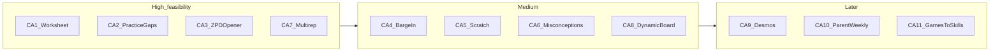

# Competitive Feature Analysis — 竞品功能调研 (2026-08)

> **Subsystem document** — part of [Spark Design Docs](../DESIGN.md)  
> Status: **research + P0 design landed** · August 2026  
> Downstream tasks: [TODO.md § Competitive Analysis Backlog](../TODO.md) · [ca-p0-system-design.md](ca-p0-system-design.md) · [ca-p1-system-design.md](ca-p1-system-design.md)

---

## 1. Purpose

Deep-dive similar AI tutors (2025–2026) and filter features that are **interesting and important** for Spark — without violating the design pillars in [DESIGN.md](../DESIGN.md):

1. Zero-barrier for elementary students  
2. Conversation is the core (no child-facing course dashboard)  
3. Physical-tutor metaphor: if a human tutor next to Ryan wouldn't have it, cut it  

This document is the research home. Confirmed items land as checkboxes in `docs/TODO.md`. Implementation design docs should be spun out per feature when work starts (same pattern as [v2-enhancements.md](v2-enhancements.md)).

---

## 1b. Broader user-needs research (2025–2026)

Synthesized from Common Sense Media *Generation AI* (Mar 2026), Pew teens+AI (Feb 2026), College Board GenAI brief, KidsOutAndAbout parent AI literacy survey (Dec 2025), PNAS peer-pressure WTP study (2026), plus product UX patterns (XSolve multi-question scan, iMasterly Socratic photo tutor, arXiv LLM scaffolding papers).

### Parent jobs-to-be-done

| Need | Evidence | Spark response |
|------|----------|----------------|
| Help with homework **without cheating** | ~60% parents OK with schoolwork AI; majority reject emotional companion AI; fear of answer-copying | Keep Socratic anti-spoiler; never default to solver mode |
| Visibility without nagging child | Parent dashboards on Synthesis/ShowYourWork; parents feel unprepared to guide AI (52%+) | **CA-10** PIN weekly digest — not a kid-facing radar |
| Don't fall behind peers | WTP for AI homework tools rises with peer adoption | Fast worksheet path (**CA-1**) so homework nights feel covered |
| Responsible use / bias awareness | Top literacy ask: spot misinformation + responsible school use | Curriculum-aligned prompts; BASIS/Singapore methods; no out-of-syllabus shortcuts |

### Student jobs-to-be-done (esp. elementary / G4)

| Need | Evidence | Spark response |
|------|----------|----------------|
| Scan **whole worksheet** once | XSolve / Photomath multi-Q; re-scan kills focus | **CA-1** planner |
| Low typing cost / voice | Magic Homework Buddy; Buddy.ai; arXiv "follow-up dock" | Photo + mic; **CA-4** barge-in |
| Private second question (no embarrassment) | Formative interviews in reasoning-facilitator paper | Chat continuity + soft openers (**CA-3**) |
| Practice what I missed | Socra gaps; 豆包错题本; students value practice (College Board) | **CA-2** 3-drill offer |
| Multiple explanations when stuck | Synthesis multi-rep; classroom pilots show reframe > repeat | **CA-7** (P1) |
| See *where* work broke | Zanaya / ShowYourWork / MATHia step diagnosis | **CA-5** (P1) |

### Product implication ranking

1. Homework completion flow (CA-1) + anti-cheat pedagogy (already strong)  
2. Retention loop: opener + post-session drills (CA-3, CA-2)  
3. Voice interruptibility (CA-4)  
4. Deeper diagnosis / representations (P1)  
5. Parent digest (P2) — important trust, lower daily child impact  

---

## 2. Spark baseline (what we already have)

| Strength | Notes |
|----------|--------|
| Socratic hint ladder (L0–L3 + L1.5 / L2.5) | Stronger pedagogy than typical answer apps |
| BKT + SM-2 + ZPD | Cognitive memory already ahead of most chatbots |
| Photo / voice / multilingual + dialect (Teochew/Hakka) | Unique family moat vs Western products |
| Entertainments hub + Code Agent | Broader than pure tutors |
| Chat-first UI | Explicitly rejects EdTech dashboard clutter |

**Already in TODO (not re-invented here):** worksheet planning (2.2), reasoning-chain capture (2.4), Desmos (3.3), voice-only (4.1), parent radar (1.7), dialect STT/TTS Phase G.

---

## 3. Competitor map

| Product | Core differentiation | Takeaway for Spark |
|---------|---------------------|-------------------|
| **Khanmigo** | Socratic + huge content library; teacher tools win more than student chat | Validates hint ladder; do **not** rebuild a course catalog |
| **Synthesis Tutor** | Gamified adaptive math, multi-representation reteach, parent progress | "Want to practice" comes from short game loops + multi-rep, not more chrome |
| **豆包爱学 2.0** | Guided explanation, dynamic board, barge-in Q&A, error book, homework grading | Biggest product gap: explanation form + post-session practice loop |
| **Socra** | Photo Socratic + post-session knowledge gaps + targeted drills | Session-end artifacts plug cleanly into BKT |
| **Zanaya / MATHia** | Step-level diagnosis, fine-grained KCs, JIT misconception feedback | Move from right/wrong → which step / which misconception |
| **ShowYourWork / CalcGPT** | Scratch-work vision + embedded Desmos | Scratch paper + graphs as a toolkit next to chat |
| **Buddy.ai** | Voice-first, barge-in, kid ASR, COPPA | Voice-only must be real turn-taking, not TTS-then-record |
| **Photomath / Gauth** | Worksheet OCR + step solutions (often answer-forward) | Steal multi-problem page flow; keep Socratic (no spoilers by default) |

---

## 4. Recommended features (confirmed for analysis TODO)

Filter: high learning value × feasible on current stack (Next.js tutor + Cursor agent + local/cloud STT/TTS + 4GB host) × chat-first UX.

### P0 — High value, high feasibility

| ID | Feature | Sources | What to build | Feasibility | Brainstorm / constraints |
|----|---------|---------|---------------|-------------|--------------------------|
| **CA-1** | Whole-page worksheet planner | Photomath, Gauth, 豆包拍题, Socra | Vision splits Q1→Qn → Socratic per item → minimal progress ("2/8") → end-of-set weak-skill summary | **High** — photo+agent exist; need task state machine | Collapsible checklist; default UI shows only current item. **Strengthens TODO 2.2** |
| **CA-2** | Post-session gaps → 3 targeted drills | 豆包错题本, Socra Knowledge Gaps | On session end, BKT/miscue → offer 3 drills; optional "tomorrow" → SM-2 | **High** — BKT+generation exist; need end hook + storage | Child sees one line: "要不要再练 3 道？" — not an error-book app |
| **CA-3** | Proactive ZPD / due-review opener | Duolingo/Khanmigo agents, Zanaya spaced practice | New chat opens with one offer: "今天适合练 X，还是先拍作业？" | **High** — `zpdWarmUpSkills` / `needsReviewSkills` exist | At most once/day; homework always wins if child says so |
| **CA-4** | TTS barge-in + voice turns | 豆包可打断, Buddy barge-in | Tap mic during TTS → stop + listen; later continuous half-duplex | **Med-High** — STT/TTS ready; true &lt;300ms WebSocket hard | Split Phase 4.1 → **4.1a barge-in** then **4.1b** continuous voice |

### P1 — Teaching depth

| ID | Feature | Sources | What to build | Feasibility | Brainstorm / constraints |
|----|---------|---------|---------------|-------------|--------------------------|
| **CA-5** | Scratch-work vision | ShowYourWork, Zanaya, MATHia | Photo of work / light canvas → locate bad step → feed L2.5 | **Medium** — multimodal yes; structured step parse needs prompt+eval | Photo first, canvas later; links to TODO **2.4** |
| **CA-6** | Misconception tag library (JIT) | MATHia JIT / Skillometer | Seed G4 tags (e.g. add fractions w/o common denom) → memory + targeted prompts | **Med-High** — schema + seeds; cold-start curated | Start 20–30 tags: fractions + place value |
| **CA-7** | Multi-representation auto-switch | Synthesis blocks→number line→word problem | After repeated "还是不懂", force bar model / number line / story; remember what worked | **High** — analogy switch exists; need enum + memory field | Deepens existing analogy mechanism |
| **CA-8** | Dynamic board / step animation | 豆包板书, Photomath Animated Steps | Geometry SVG updates labels with dialogue; optional step highlight | **Medium** — static SVG exists; timed sync is design work | Continues v2 §6.6 + Phase 3 geometry |

### P2 — Tools & parent (chat-first preserved)

| ID | Feature | Sources | What to build | Feasibility | Brainstorm / constraints |
|----|---------|---------|---------------|-------------|--------------------------|
| **CA-9** | Embedded Desmos / graphs | CalcGPT, ScholarOS | In-chat algebra graph tool, not a new nav page | **Medium** — already Phase **3.3** | Reframe as session-embedded tool |
| **CA-10** | Parent weekly digest (PIN) | Synthesis, ShowYourWork, StudySpaces | Narrow TODO **1.7**: weekly summary in PIN sidebar / PDF — **not** a child radar wall | **Medium** | Child UI unchanged |
| **CA-11** | Entertainments → skill soft link | Synthesis game loop | Optional post-game "想练相关数学吗？" → skill | **Medium** | Easy to distract; keep opt-in and rare |
| **CA-12** | Dialect speech quality | (Spark-unique vs Western tutors) | Keep Phase **G** as engineering P0; analysis only tracks priority | **In progress** | Moat, not a new product idea |

---

## 5. Explicit non-goals (anti-patterns)

Write these down so future suggestions get rejected quickly:

| Anti-pattern | Why reject |
|--------------|------------|
| Child home with course catalog / badge wall / multi-tab learning center | Violates DESIGN three pillars |
| Default "instant answer" solver mode | Conflicts with Socratic core |
| Full COPPA productization | Home private deploy; only if public app store |
| Heavy Manim / 3Blue1Brown live render on host | 4GB machine unsuitable; far future only |
| **Answer-check mode without PIN** | If ever added: **PIN-gated only** ("核对模式" for parents). Not in active backlog unless separately approved |

---

## 6. Feasibility flow

---

## 7. Mapping to existing TODO phases

| Analysis ID | Existing hook | Suggested next design doc when implementing |
|-------------|----------------|---------------------------------------------|
| CA-1 | Phase 2 · **2.2** | `subsystems/worksheet-planner.md` |
| CA-2 | BKT / engagement; new | `subsystems/session-practice-loop.md` |
| CA-3 | `zpdWarmUpSkills`, SkillsPanel | Prompt + soft opener in `agent-prompt.md` |
| CA-4 | Phase 4 · **4.1** | Extend `voice-tts-stt.md` |
| CA-5 | Phase 2 · **2.4** | `subsystems/scratch-work-vision.md` |
| CA-6 | `learning-memory` / prompts | `subsystems/misconception-tags.md` |
| CA-7 | Analogy in `prompts.ts` | Patch `agent-prompt.md` |
| CA-8 | Phase 3 + v2 §6.6 | Extend `geometry-diagrams.md` |
| CA-9 | Phase 3 · **3.3** | Extend `geometry-diagrams.md` |
| CA-10 | Nice-to-have **1.7** | Narrow parent digest spec |
| CA-11 | `entertainments.md` | Optional section in entertainments |
| CA-12 | Phase **G** dialect speech | Already: `dialect-speech-optimization-stt-tts.md` |

---

## 8. Sources (sampled 2026-08)

- Khanmigo / Khan Academy tutor positioning; post-Khanmigo market notes (teacher-facing wins, student chat still open)  
- Synthesis Tutor (adaptive math, multi-rep, gamified short sessions)  
- 豆包爱学 2.0 (讲知识、动态板书、可打断、错题本、作业批改)  
- Socra Homework Tutoring (gaps + targeted practice)  
- Zanaya / Carnegie MATHia (step diagnosis, JIT misconceptions, BKT at KC grain)  
- ShowYourWork / CalcGPT (scratch + Desmos)  
- Buddy.ai (voice-native kids, barge-in / COPPA lessons)  
- Photomath / Gauth (worksheet OCR flow)

---

*Analysis only — no runtime code changes required by this document.*
