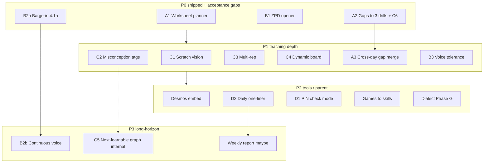

# Spark 竞品对标产品规划 v2（已确认）

> **Subsystem document** — part of [Spark Design Docs](../DESIGN.md)  
> Status: **confirmed 2026-08-09** · defaults accepted by product owner  
> Upstream draft: chat plan “Spark 竞品对标产品规划 v2”  
> Research home: [competitive-feature-analysis.md](competitive-feature-analysis.md)  
> Downstream: [TODO.md § Competitive Analysis Backlog v2](../TODO.md)

---

## Confirmed decisions (2026-08-09)

| # | Topic | Decision |
|---|--------|----------|
| 1 | Adoption set | **P0 all** (A1/A2/B1/B2a) + acceptance gaps on shipped CA-1…4; **P1** A3 + B3 + C1–C4; **P2** D1 + D2 + Desmos + games↔skills + dialect; **C6** folded into A2 (not a separate ID) |
| 2 | Parent touchpoint | **D2 daily one-line digest first**; full weekly report → **P3** (may be replaced by D2) |
| 3 | Check mode (D1) | **In analysis TODO (P2)** with acceptance: PIN exit must force return to Socratic |
| 4 | Docs | TODO + `competitive-feature-analysis.md` + this plan doc |
| 5 | C5 knowledge-space “next learnable” | **P3 idea only** — internal reasoning layer; **never** expose knowledge-map UI |
| 6 | B3 voice tolerance | **After Phase G**, separate follow-on — do not merge into G acceptance |
| 7 | Gamification boundary | **No leaderboards / streaks** (anti-pattern); no parent-visible streak exception |

---

## North-star filter

1. Socratic first  
2. Zero child dashboard / chat-first  
3. Physical-tutor metaphor  

Anything that turns Spark into a course platform, error-book app, or Duolingo-style grind is rejected.

---

## Extended competitor map (additions)

| Product | Takeaway for Spark |
|---------|-------------------|
| **ALEKS** | “What can be learned now” (knowledge space) → ammo for B1; keep internal |
| **松鼠 AI / Squirrel AI** | Fine KC methodology; child UI stays non-graph |
| **IXL** | Practice-as-diagnosis → fold into A2 (C6) |
| **Duolingo Max** | Roleplay + explain-my-answer → barge-in resume copy for 4.1b |
| **ELSA Speak** | Phoneme / kid ASR forgiveness → B3 after Phase G |
| **豆包爱学 / 学而思类“打断续讲”** | Interrupt + resume-at-breakpoint for B2b |

Original seven (Khanmigo, Synthesis, 豆包爱学, Socra, Zanaya/MATHia, ShowYourWork/CalcGPT, Buddy.ai) remain primary — see analysis doc.

---

## Roadmap (confirmed)

---

## Feature briefs (confirmed IDs)

### P0 — acceptance / hardening (code already on `develop`)

| ID | Story | Acceptance gaps still open |
|----|-------|----------------------------|
| **A1** / CA-1 | Whole-page worksheet → one-at-a-time Socratic + “2/8” | G4 cut accuracy ≥90% sampled; no cross-question context bleed; exit mid-set keeps done state |
| **A2** / CA-2 (+ **C6**) | End session → offer 3 ZPD drills; practice updates BKT by default | Refuse once = no nag; end-hook definition; practice-as-diagnosis is default impl detail |
| **B1** / CA-3 | Once/day ZPD or review opener | Homework intent always yields; no second interrupt same day |
| **B2a** / CA-4 | Mic stops TTS and listens | Manual M4; resume-copy deferred to B2b |

### P1

| ID | Story | Notes |
|----|-------|-------|
| **A3** | Cross-day gap merge → opener cites recurring weak skill | Needs decay/expiry so we don’t nag forever |
| **B3** | Low-confidence ASR → confirm intent (“除以还是除法？”) | After Phase G |
| **C1–C4** | Scratch / misconceptions / multi-rep / dynamic board | See [ca-p1-system-design.md](ca-p1-system-design.md) |

### P2

| ID | Story | Notes |
|----|-------|-------|
| **D2** | Parent daily natural-language one-liner (PIN) | Preferred over weekly charts |
| **D1** | PIN check mode shows full steps; exit → Socratic | Must not train “whine for answers” |
| **CA-9** | Embedded Desmos | Not a new nav page |
| **CA-11** | Rare games→skill soft link | Opt-in |
| **CA-12** | Dialect speech | Phase G engineering P0 |

### P3 (ideas / deferred)

| ID | Note |
|----|------|
| **B2b** | Continuous half-duplex + interrupt-resume |
| **C5** | ALEKS-style next-learnable set — **internal only**, no map UI |
| **Weekly report** | Only if D2 proves insufficient |

---

## Explicit non-goals (v2)

- Child course catalog / badge wall / multi-tab learning center  
- Default instant-answer solver (except PIN **D1**)  
- Full COPPA productization (private home deploy)  
- Heavy Manim / 3B1B on 4GB host  
- **Exposed knowledge-map / skill-tree UI** (internal graph OK)  
- **Leaderboards / learning streaks** (Duolingo-style)

---

## Success metrics (home / single-child)

- **Socratic depth:** share of turns where child explains / asks (not only listens)  
- **Gap-loop close rate:** A2 offers accepted and finished  
- **Opener tolerance:** B1 accept vs yield ratio  
- **Parent touchpoint:** D2 open/reply rate (not dashboard dwell time)

---

*Analysis / planning only — no runtime requirement from this file alone.*
