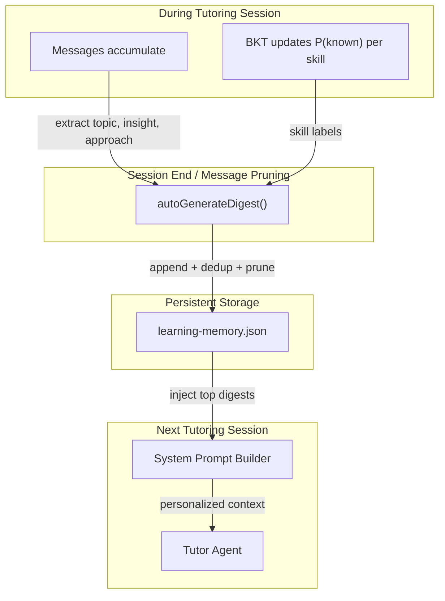

# 📝 Conversation Digest — Session-Level Episodic Memory for Spark

> **Subsystem document** — part of [Spark Design Docs](../DESIGN.md)  
> **Version**: v0.1.0 | **Date**: 2026-08-04  
> **Status**: Design Phase

---

## 1. Problem Statement

Spark currently has two memory systems:

| System | What it tracks | Limitation |
|--------|---------------|------------|
| **Raw messages** | Full conversation history | Pruned to 1,000 messages total; oldest get dropped |
| **BKT skills** | P(known) per math/reading skill | Only tracks mastery scores — no narrative context |

**The gap**: When old messages are pruned, the Agent loses *why* a teaching approach worked. Example:

> "Ryan struggled with fraction addition for 3 sessions, then the number-line method clicked."

BKT only remembers `fractions: 72%`. The pedagogical insight is gone.

---

## 2. Industry Reference

### 2.1 Mem0 (48K GitHub stars, industry leader)

Mem0's core insight:

> *Raw logs are a retrieval problem disguised as a storage solution. Storing "User said: I don't get base cases" gives you a timestamp and a quote. It tells you nothing about what the student currently knows, how that knowledge has changed, or what to do next session.*

Pattern: **Search → Generate → Save**
1. Before each LLM call, search memory for relevant facts
2. Inject into system prompt
3. After response, extract and store new semantic facts

### 2.2 Tiered Memory Architecture (industry consensus)

```
┌─────────────────────────────────────────────┐
│  Working Memory (active context window)      │
│  Recent ~10 turns verbatim                   │
├─────────────────────────────────────────────┤
│  Episodic Memory (session summaries)         │  ← NEW: this design
│  Compressed digests per completed session    │
├─────────────────────────────────────────────┤
│  Semantic Memory (extracted facts)           │
│  BKT skill scores, student profile, badges   │
└─────────────────────────────────────────────┘
```

Sources: Graphlit 2026 survey, tRPC-Agent Session Summarizer, Anthropic Claude Code compaction.

### 2.3 Session Summarization Best Practices

From tRPC-Agent and Honcho (production-tested):

1. **Keep recent N turns verbatim** (e.g., 10–15)
2. **Auto-trigger summarization** when context exceeds threshold
3. **Recursive compression** — each new summary merges with prior
4. **Structured schema** — capture intent, decisions, next steps

### 2.4 Educational AI: Session-to-Session Dynamics

HiTSKT (Hierarchical Transformer for Session-Aware Knowledge Tracing, 2023):

> *The time intervals and intensity of practice sessions significantly affect memory retention via consolidation and forgetting mechanisms. Session-level encoding that models consolidation and power-law-decay attention achieves state-of-the-art results.*

Key finding: **BKT alone fails to capture cross-session narrative patterns**. Adding session-level summaries bridges this gap.

---

## 3. Design

### 3.1 `SessionDigest` — Dense, queryable session memory

```typescript
type SessionDigest = {
  date: string;           // "2026-08-03" — for chronological ordering
  topic: string;          // "分数通分 — 数轴法"
  insight: string;        // "Ryan 用画图法理解更快，数轴法还需要加强"
  bestApproach: string;   // "先画图再转数字，配合颜色标注"
};
```

Design rationale:
- **4 fields, ~200 chars each** — dense enough to be useful, small enough to store 10 in a prompt
- **Natural language** — no schema to learn, directly injectable into LLM prompt
- **Explicit bestApproach** — the most actionable field; tells the Agent *how* to teach next time

### 3.2 Storage

Extends `LearningMemory` (same file, same persistence):

```typescript
type LearningMemory = {
  // ...existing fields...
  sessionDigests: SessionDigest[];  // NEW — max 10
};
```

- Stored in `localStorage` (`spark.learningMemory` key)
- Synced to server via existing `/api/learning` endpoint
- Coexists with BKT skills — no new storage, no new API

### 3.3 Generation Strategy

**When**: After a session ends (user starts new chat), or when messages are about to be pruned.

**How**: Rule-based extraction from the conversation — **no LLM call required**:

```typescript
function autoGenerateDigest(messages: ChatMessage[], prevDigests: SessionDigest[]): SessionDigest {
  // 1. Extract topic from inferred skills
  const topic = inferSkillsFromText(allText)[0]?.label || "general practice";

  // 2. Extract insight from struggle/win patterns
  const insight = extractInsight(messages);  // pattern-matched

  // 3. Extract best approach from agent's successful scaffolding
  const bestApproach = extractApproach(messages);  // pattern-matched

  return { date: today(), topic, insight, bestApproach };
}
```

**Why rule-based, not LLM**:
- Zero token cost
- Instant (< 1ms vs 2–5s for LLM call)
- Deterministic (same input → same digest)
- Mem0's core engine is also rule-based extraction; only the vector search uses embeddings

### 3.4 Retention Policy

| Rule | Value |
|------|-------|
| Max digests | 10 |
| Dedup | Same topic within 7 days → merge, not duplicate |
| Eviction | Oldest first (FIFO by date) |
| Decay | Newest digests listed first in prompt |

### 3.5 Prompt Injection

Injected into System Prompt via `learningMemoryPromptLines()`:

```markdown
## Session History (recent tutoring sessions)
- 08/03 — 分数通分 (数轴法): Ryan用画图法理解更快, 先画图再转数字配合颜色标注
- 08/01 — 小数比较: Ryan容易混淆位数, 用格子法一行行对齐后明显改善
- 07/28 — 周长计算: 用操场跑道类比效果很好, 但公式记忆仍需巩固

When teaching: prefer approaches that worked before. If a student returns to a topic,
acknowledge the prior session's insight.
```

---

## 4. Architecture Diagram



---

## 5. Comparison: Before vs After

| Scenario | Before (BKT only) | After (BKT + Digests) |
|----------|-------------------|----------------------|
| Ryan returns to fractions after 2 weeks | Agent sees `fractions: 72%`, treats as generic student | Agent knows *how* Ryan learned it last time → starts with drawing approach |
| Ryan struggled in last session | Agent has no record of the struggle | Agent remembers "needed help with long division last time, use smaller steps" |
| Best teaching approach | Trial and error each session | Agent recalls "color-coded number line worked best" |

---

## 6. Implementation Plan

| Step | File | Change |
|------|------|--------|
| 1 | `types.ts` | Add `SessionDigest` type |
| 2 | `learning-memory.ts` | Add `sessionDigests` to `LearningMemory`, `MAX_DIGESTS=10` |
| 3 | `learning-memory.ts` | Implement `autoGenerateDigest()` — rule-based extraction |
| 4 | `learning-memory.ts` | Update `normalizeMemory()` / `mergeLearningMemory()` / `serializeLearningMemoryForChat()` |
| 5 | `learning-memory.ts` | Inject digests into `learningMemoryPromptLines()` |
| 6 | `TutorShell.tsx` | Call `autoGenerateDigest()` on session end |
| 7 | `storage.ts` | Call `autoGenerateDigest()` before message pruning |

**Risk**: Zero. No new dependencies, no API changes, additive only. Fails gracefully (empty digests = no injection).

---

> **References**:
> - Mem0: [Build a Personalized AI Tutor with Persistent Memory](https://mem0.ai/blog/build-a-personalized-ai-tutor-with-persistent-memory)
> - Graphlit: [AI Agent Memory Frameworks in 2026](https://www.graphlit.com/blog/survey-of-ai-agent-memory-frameworks)
> - tRPC-Agent: [Session Summarizer](https://github.com/trpc-group/trpc-agent-python/blob/main/docs/mkdocs/en/session_summary.md)
> - HiTSKT: [Hierarchical Transformer for Session-Aware Knowledge Tracing](https://arxiv.org/abs/2212.12139)
