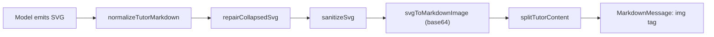

# 📐 Geometry & Diagram Rendering

> **Subsystem document** — part of [Spark Design Docs](../DESIGN.md)

---

## Rendering Pipeline



### Streaming Repair

Models sometimes emit space-collapsed SVG such as `svg<svgxmlns=...viewBox="00320240..."`. The `repairCollapsedSvg` function fixes:

- Glued tag names (`svg<svg` → `<svg`)  
- Missing spaces (`<svgxmlns=` → `<svg xmlns=`)  
- Collapsed viewBox (`"00320240"` → `"0 0 320 240"`)  
- Lost opening `<` before child elements (`>rectwidth=` → `><rect width=`)  
- Broken `xmlns` values  

### Sanitization

`sanitizeSvg` strips: `<script>`, `<foreignObject>`, `on*` handlers, `javascript:` URIs, `data:text/html`.

### Rendering Strategy

Base64-encoded SVG data URIs rendered as `` elements **outside** react-markdown. Long percent-encoded data URIs frequently fail inside markdown parsers. `splitTutorContent` extracts all `` patterns and renders them as native `` tags while the remaining text goes through react-markdown for formatting.

### Mermaid Support

Code blocks with the `mermaid` language tag are rendered via dynamic import of the Mermaid library.

### draw_geometry Tool

```typescript
{
  title: "Triangle ABC",
  shapes: [
    { kind: "triangle", points: [[70,190],[250,190],[70,55]] },
    { kind: "right_angle", at: [70,190], size: 13 },
    { kind: "text", at: [58,42], text: "A" },
  ]
}
```

Returns a markdown image (``).

### Files

| File | Role |
|------|------|
| `src/lib/geometry-svg.ts` | SVG sanitize, repair, encode, split |
| `src/lib/geometry-svg.test.ts` | Collapsed SVG, base64, rendering tests |
| `src/components/DiagramBlock.tsx` | SVG / Mermaid block renderer |
| `src/components/MarkdownMessage.tsx` | Main markdown + image renderer |
