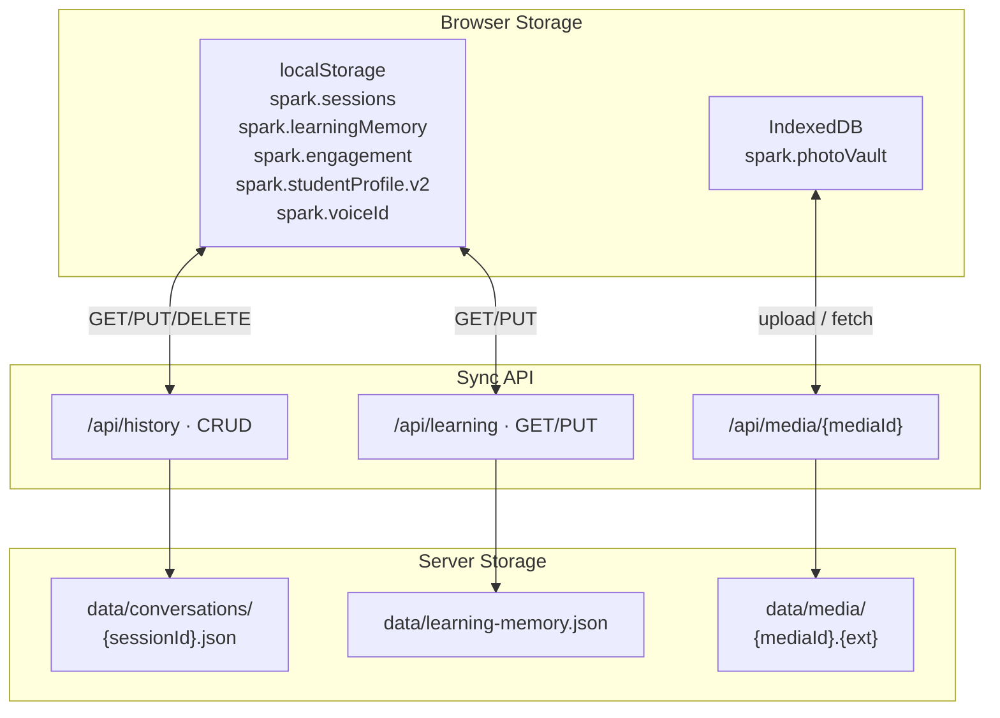
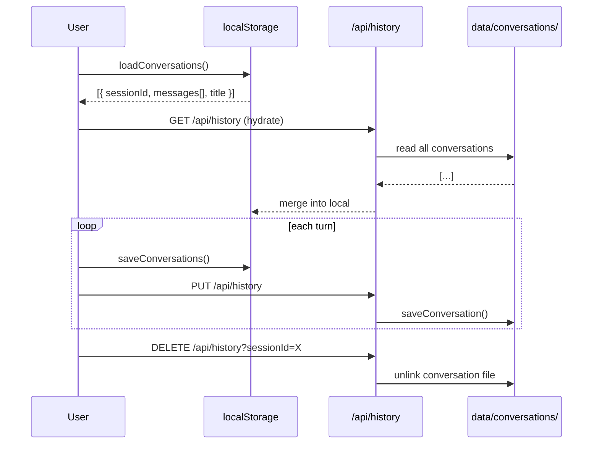
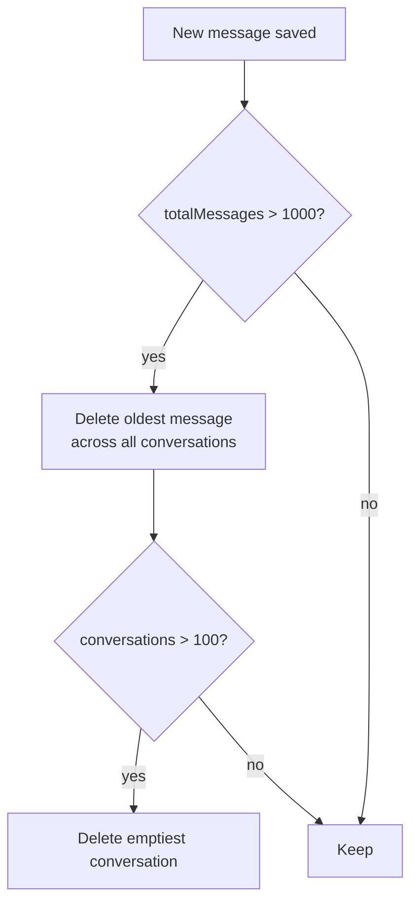
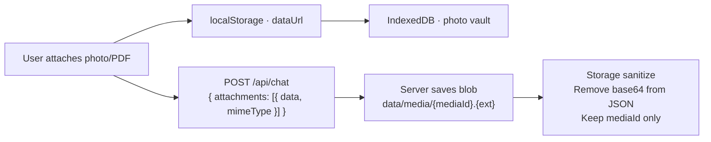
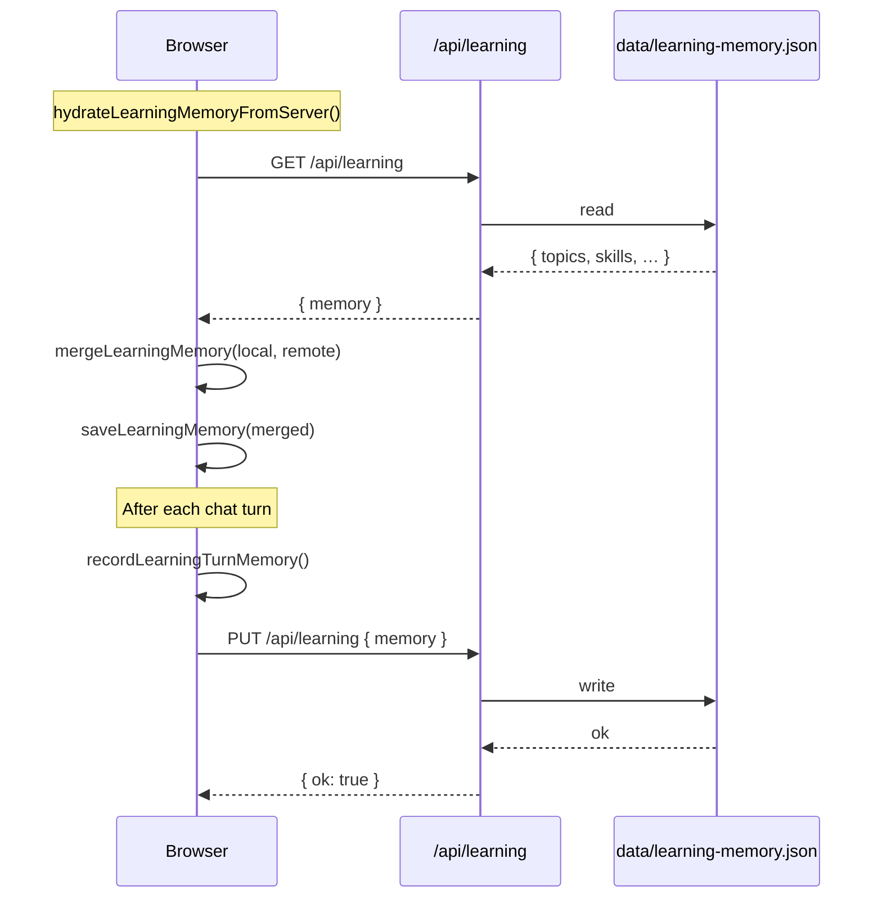
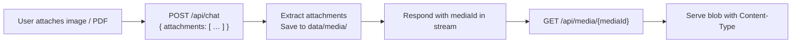

# Subsystem: History & Storage

> Parent: [Design Overview](/docs/DESIGN.md)

---

## 1. Responsibility

Persist conversations, media attachments, learning memory, and engagement across page reloads and devices.

---

## 2. Storage Architecture

---

## 3. Conversation Lifecycle

---

## 4. Retention Policy

| Limit | Value |
|-------|-------|
| Max messages total | 1000 |
| Max conversations | 100 |
| Max messages per chat | 200 |
| Max message chars in history prompt | 500 |
| Max history turns in prompt | 8 |

---

## 5. Photo Vault

Photos survive server JSON round-trips: the raw base64 is stripped for wire transfer but restored from the IndexedDB vault on load.

---

## 6. Memory Sync

---

## 7. Media Blob Store

---

## 8. Sanitization for Server Sync

`serializeForServer()` strips:

- Base64 data URLs from attachments (keeps `mediaId`)
- BKT `pKnown` is rounded to 3 decimal places
- Topic labels truncated to 48 chars
- Skill labels truncated to 56 chars
- Notes truncated to 4 items per list

---

## 9. Edge Cases

| Case | Handling |
|------|----------|
| localStorage quota exceeded | `catch` + ignore; oldest conversations trimmed |
| Server offline | Local-only; sync on next hydrate |
| IndexedDB unavailable | Photo only in memory (lost on reload) |
| Corrupted JSON | `emptyLearningMemory()` / `emptyConversation()` |
| Merged server+client | `mergeLearningMemory` keeps max mastery/attempts/lastSeen |
| New device (empty client) | Hydrate from server; start fresh if server also empty |

---

## Next: [Security & Sanitization](security.md)
