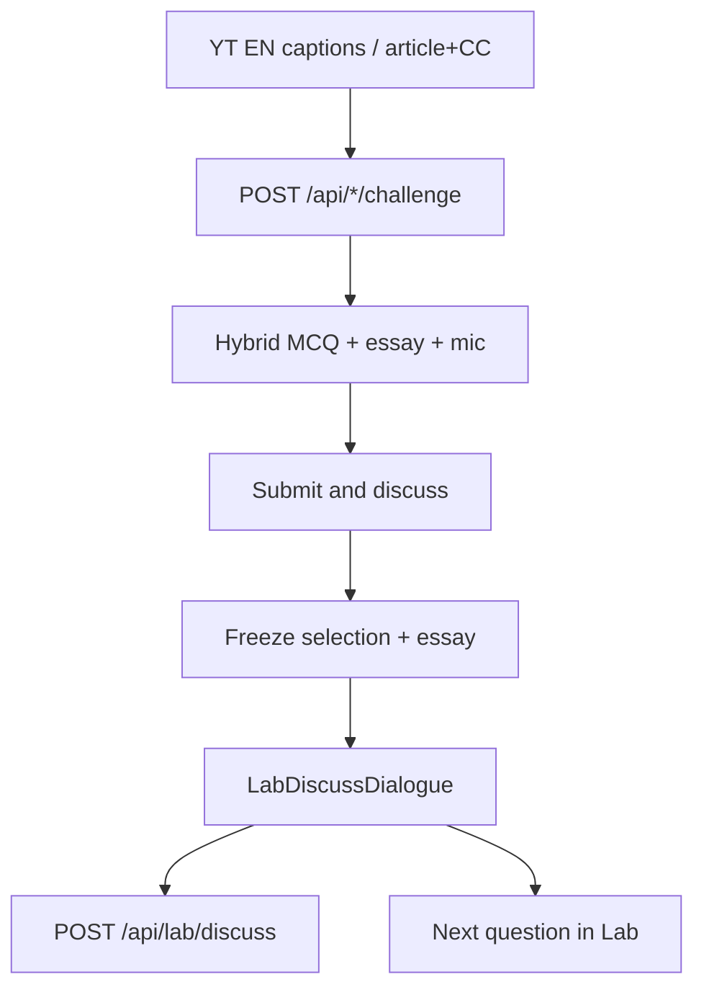

# BBC · NatGeo · RSA Challenge — TED parity

> **Subsystem document** — part of [Spark Design Docs](../DESIGN.md)  
> Status: **active** · 2026-08-12  
> Benchmark: TED Lab ([ted-challenge-inline-discuss.md](ted-challenge-inline-discuss.md) · [ted-challenge-voice-input.md](ted-challenge-voice-input.md))

---

## Goal

BBC Doc Lab, NatGeo Lab, and RSA Lab match TED on three Challenge actions:

1. **Caption-first questions** — Prefer English YouTube CC (manual or auto) before blurbs/article-only generation.
2. **Voice essay** — 论述 / essay answers accept mic STT via `appendVoiceTranscript` (same as TED).
3. **Interactive discuss** — After option + essay submit, open inline Socratic coaching (not one-shot “Submit & Next” / unused evaluate dump).

## Flow



## Caption policy

| Lab | Prefer |
|-----|--------|
| BBC / RSA | `fetchYouTubeTranscript` before LLM/fallback; live search **gates** on usable EN captions (`filterVideosWithCaptions`); challenge accepts live clip metadata (not catalog-only). |
| NatGeo | Article body +, when `videoId` present, **English CC first** then article as secondary context. |

## Discuss API

`POST /api/lab/discuss`

```json
{
  "lab": "bbc" | "rsa" | "natgeo",
  "action": "open" | "reply",
  "context": { "talkTitle", "speaker", "kind", "prompt", "choices", "selected", "essay" },
  "studentReply?": "...",
  "history?": [{ "role": "coach"|"you", "text": "..." }]
}
```

Local Socratic fallback if agent fails (same pattern as TED).

## Key files

| File | Role |
|------|------|
| `src/lib/entertain/lab-discuss.ts` | Lab-branded discuss prompts + local fallback |
| `src/app/api/lab/discuss/route.ts` | Shared discuss endpoint |
| `src/components/LabDiscussDialogue.tsx` | Inline chat UI |
| `src/components/MediaLabChallengeView.tsx` | Shared hybrid + voice + discuss panel |
| `src/lib/youtube-transcript.ts` | EN CC fetch |
| `src/lib/entertain/youtube-channel-search.ts` | `filterVideosWithCaptions` |

## Tests

- LD1–LD3 — local opener/reply mention essay; no correct-letter spoilers; lab label in opener
- Search/challenge unit coverage for caption gate + live clip resolve
