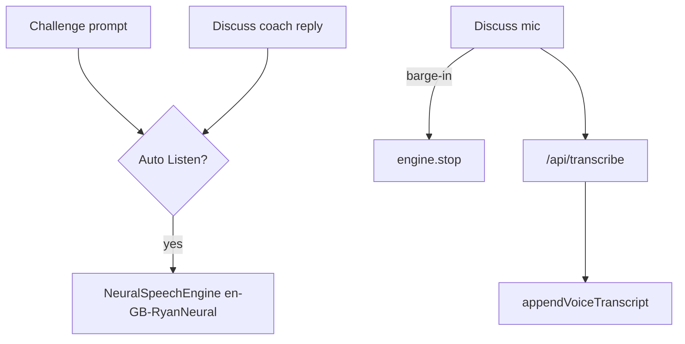

# Lab Discuss · Voice input + British Listen (all studios)

> **Subsystem document** — part of [Spark Design Docs](../DESIGN.md)  
> Status: **active** · 2026-08-15  
> Related: [lab-challenge-ted-parity.md](lab-challenge-ted-parity.md) · [ted-challenge-voice-input.md](ted-challenge-voice-input.md) · [ted-challenge-prompt-listen.md](ted-challenge-prompt-listen.md) · [voice-tts-stt.md](voice-tts-stt.md)

---

## Problem

1. **Discuss reply box** (TED + BBC / RSA / NatGeo) has no mic — essay/reasoning already supports `MicTranscribeButton`, but "Answer the teacher here…" is text-only.
2. **BBC / RSA / NatGeo** challenge prompts lack TED-parity **Listen / Auto Listen** with hard-locked British Ryan (`en-GB-RyanNeural`).
3. **AI coach turns** in Discuss have no Listen / auto-read — homepage history Listen uses the same neural TTS pattern.

## Approach

| Area | Choice |
|------|--------|
| Discuss STT | Reuse `MicTranscribeButton` + `appendVoiceTranscript`; `language="en"` (labs) / `auto`+`tone="onDark"` (TED) |
| Prompt TTS | Same as TED: `challengePromptSpeechText` → `getSharedSpeechEngine().speak` with `voiceId: "ryan"` + `voice: "en-GB-RyanNeural"` |
| Prefs | Reuse account-scoped `load/saveTedPromptListenEnabled` for all labs (one Auto Listen habit) |
| Coach TTS | Auto-play latest coach turn when it arrives (if Auto Listen on); per-bubble Listen/Stop; hard-lock Ryan |
| Barge-in | Mic `onRecordingStart` stops shared engine |
| Shared helper | `speakRyanBritish(text, opts)` in `ted-challenge.ts` (or thin `lab-voice.ts`) to avoid copy-paste speak options |



## Key files

| File | Role |
|------|------|
| `src/lib/entertain/ted-challenge.ts` | `speakRyanOptions` / thin helper; keep `challengePromptSpeechText` |
| `src/components/MediaLabChallengeView.tsx` | Prompt Listen + Auto Listen; mic barge-in |
| `src/components/LabDiscussDialogue.tsx` | Discuss mic + coach Listen/auto |
| `src/components/TedDiscussDialogue.tsx` | Same for TED dark canvas |
| `src/lib/entertain/lab-discuss-voice.test.ts` | Unit for speech-text / append (reuse existing if enough) |

## Risks

| Risk | Mitigation |
|------|------------|
| Shared engine fights Tutor on homepage | Labs are separate routes; stop on unmount |
| Autoplay without gesture | Trigger after Submit & discuss / Next (user gesture chain); manual Listen always works |
| Double audio (prompt + coach) | Stop before starting next speak; token guards |
| TED dark mic invisible | `tone="onDark"` in TedDiscussDialogue |

## Test design

### Unit

| ID | Case |
|----|------|
| LDV1 | `appendVoiceTranscript` still appends (regression) |
| LDV2 | `challengePromptSpeechText` includes numbered choices |
| LDV3 | Prefer existing TL*/TV* — no duplicate prefs keys |

### Integration / manual

| ID | Case |
|----|------|
| TM-D1 | BBC/RSA/NatGeo: prompt Auto Listen in Ryan British |
| TM-D2 | Discuss: mic appends into reply box |
| TM-D3 | Coach opener auto-reads; Listen/Stop on Spark bubble |
| TM-D4 | Mic during Listen stops TTS |
| TM-D5 | TED Discuss mic visible on dark canvas |

```bash
npm test -- src/lib/entertain/ted-challenge.test.ts
```
