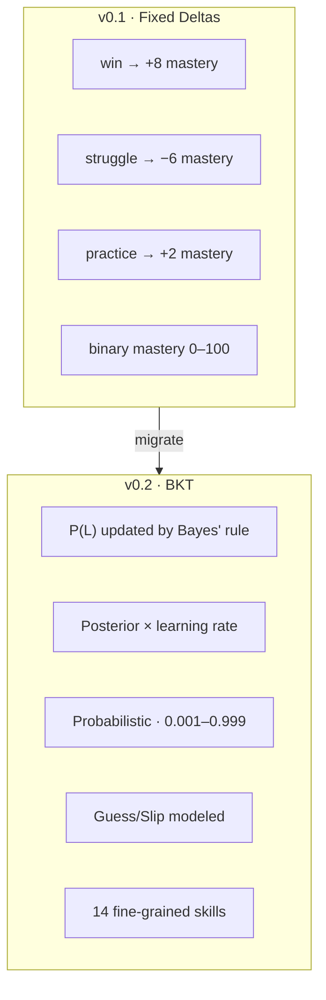
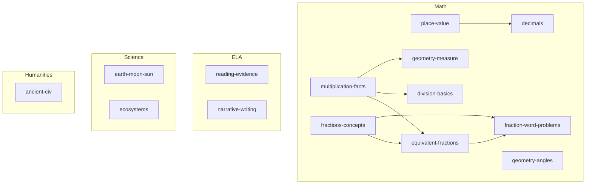
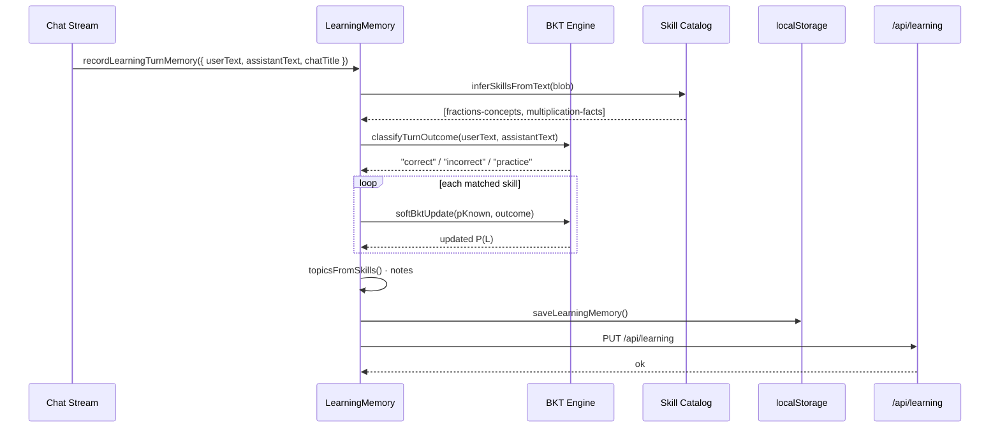
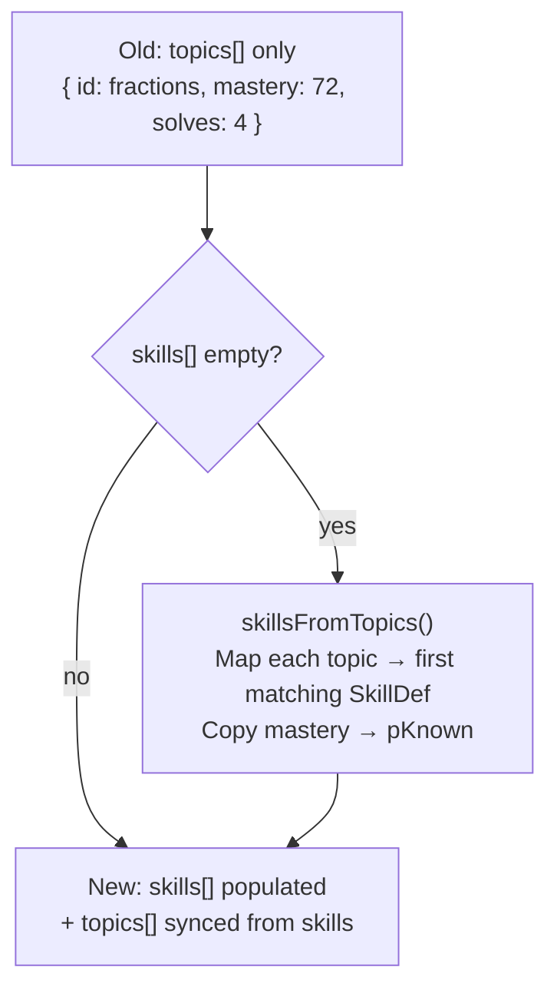

# Subsystem: Learning Memory & Bayesian Knowledge Tracing

> Parent: [Design Overview](/docs/DESIGN.md)

---

## 1. Responsibility

Track Ryan's skill mastery over time using Bayesian Knowledge Tracing (BKT), a probabilistic model from intelligent tutoring systems research (Corbett & Anderson, 1995). Feed skill strengths/weaknesses into every tutoring prompt.

---

## 2. Why BKT



**Tradeoffs evaluated:**

| Approach | Fit for Spark? |
|----------|---------------|
| Fixed deltas (old) | Too coarse; ignores probability dynamics |
| **BKT (new)** | **Fits single-learner, no training data, binary evidence** |
| Deep Knowledge Tracing | Needs large datasets |
| Item Response Theory | Assumes fixed-difficulty items |

---

## 3. BKT Model

### Parameters (tuned for G4)

| Param | Value | Meaning |
|-------|-------|---------|
| P(L₀) | 0.25 | Prior: 25% chance Ryan knows a new skill |
| P(T) | 0.18 | Learning rate per opportunity |
| P(S) | 0.10 | Slip: 10% mistake on known skill |
| P(G) | 0.20 | Guess: 20% correct on unknown skill |

### Update Equations

**Given** `pKnown = P(Lₜ)` and a correct observation:

```
P(Lₜ | correct) = pKnown × (1 − P(S)) / [pKnown × (1 − P(S)) + (1 − pKnown) × P(G)]
P(Lₜ₊₁) = posterior + (1 − posterior) × P(T)
```

**Given** `pKnown = P(Lₜ)` and an incorrect observation:

```
P(Lₜ | incorrect) = pKnown × P(S) / [pKnown × P(S) + (1 − pKnown) × (1 − P(G))]
P(Lₜ₊₁) = posterior + (1 − posterior) × P(T)
```

### Soft Outcomes

Conversations aren't binary quizzes. `softBktUpdate` handles three outcomes:

| Outcome | BKT Call | Weight |
|---------|----------|--------|
| `correct` (student says "got it") | `bktUpdate(true)` | Full |
| `incorrect` (student stuck) | `bktUpdate(false)` | Full |
| `practice` (neutral turn) | `bktUpdate(true, pLearn × 0.45)` | 45% of learn rate |

---

## 4. Skill Catalog



14 skills with soft prerequisite edges. When tutoring, weak prerequisites are flagged: `"division-basics is weak — check multiplication-facts first"`.

---

## 5. Data Structures

```typescript
SkillMastery = {
  id:          "fractions-concepts"
  label:       "fraction concepts"
  topicId:     "fractions"
  pKnown:      0.76                  // BKT P(L)
  mastery:     76                    // 0–100 display
  attempts:    6
  correct:     4
  incorrect:   2
  confidence?: 3                     // self-report 1–3
  lastSeen:    1785761010282
}

LearningMemory = {
  skills:          SkillMastery[]    // max 24
  topics:          TopicMastery[]    // legacy rollup (auto-synced)
  recentStruggles: string[]          // "Needed help with division basics"
  recentWins:      string[]          // "Progress on fraction concepts"
  updatedAt:       number
}
```

---

## 6. Update Pipeline



---

## 7. Migration from v0.1



`normalizeMemory` auto-detects legacy payloads and fills `skills[]`.

---

## 8. Prompt Integration

`learningMemoryPromptLines()` emits:

```
[Learning memory — skills / BKT — USE AS REFERENCE]
Model: each skill has P(known) updated from correct/incorrect.
Recent skills: fraction concepts (P≈76%, n=6), multiplication facts (P≈52%, n=6).
Strengths: fraction concepts ~76%; reading with evidence ~68%.
Focus: division basics ~32% — check prerequisites: multiplication facts.
When asking: tailor difficulty to skill map.
Self-assessment: ask confidence 1–3 after harder wins.
```

The `recall_learner_skills` tool lets the agent query skills mid-session (reads server JSON, returns strengths/weaknesses/recent).

---

## 9. Profile Sync

`syncProfileFromSkills()` auto-refreshes `StudentProfile.stronger` / `focusAreas` from BKT data after every chat turn. The `SkillsPanel` in the sidebar shows this live.

---

## 10. Edge Cases

| Case | Handling |
|------|----------|
| No skills matched | Tag as `general-practice` |
| Empty user text | No update (return prev) |
| Server offline | Save locally; push on next hydrate |
| JSON parse failure | `emptyLearningMemory()` |
| localStorage quota overflow | `catch` + ignore |

---

## References

- Corbett, A.T. & Anderson, J.R. (1995). "Knowledge tracing." *UMUAI*, 4(4).
- [Wikipedia: Bayesian knowledge tracing](https://en.wikipedia.org/wiki/Bayesian_knowledge_tracing)
- [pyBKT reference](https://github.com/CAHLR/pyBKT)

---

## Next: [Geometry & Diagrams](geometry-diagrams.md)
