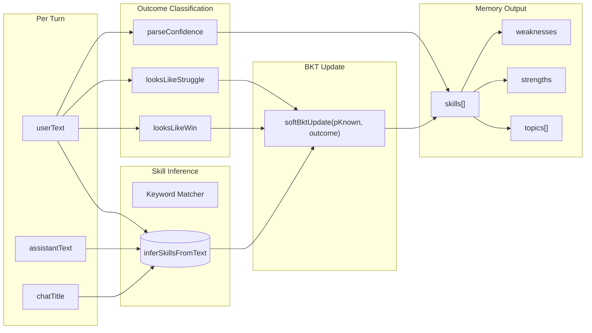
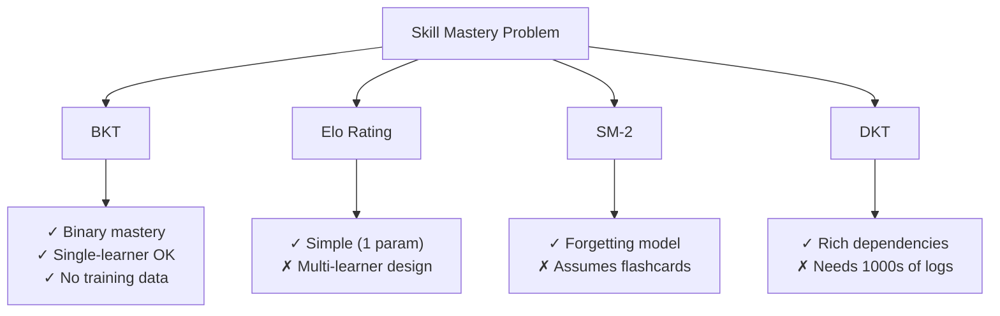
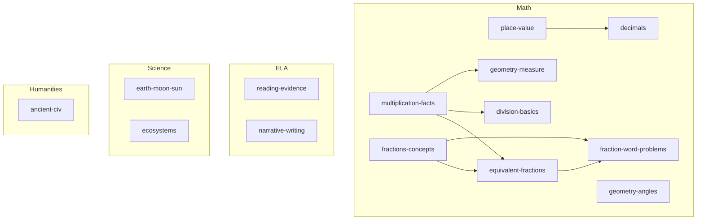

# 🧠 Learning Memory & Skill Mastery (BKT)

> **Subsystem document** — part of [Spark Design Docs](../DESIGN.md)

---

## 1. Overview

The Learning Memory module models **what Ryan knows** across G4 subjects using **Bayesian Knowledge Tracing (BKT)** with a 14-skill catalog aligned to **BASIS International School G4**, **Singapore Math P4**, and **Common Core G4** curricula. See [DESIGN.md § Curriculum Alignment](../DESIGN.md#-curriculum-alignment) for the full mapping.



## 2. Algorithm Selection: Why BKT



| Criteria | BKT | Elo | SM-2 | DKT |
|----------|-----|-----|------|-----|
| Single learner | ✅ | ❌ N>>1 | ✅ | ❌ needs training |
| No item bank | ✅ keyword | ❌ item diff | ❌ per-card | ❌ items |
| Probabilistic | ✅ P(known) | ⚠️ score | ⚠️ recall prob | ✅ |
| Forgetting | ⚠️ v0.3 | ❌ | ✅ built-in | ✅ |
| TS open-source ref | ✅ MasteryTrace | ❌ Python | ✅ sm2-ts | ❌ |

**Decision:** BKT canonical 4-parameter model (Corbett & Anderson 1995). Elo hybrid + SM-2 decay planned for v0.3.

## 3. BKT Equations

Parameters: P(L₀)=0.25, P(T)=0.18, P(S)=0.10, P(G)=0.20

$$P(L_{t+1}) = P(L_t \mid obs) + (1 - P(L_t \mid obs)) \cdot P(T)$$

Posterior given observation:

$$P(L_t \mid correct) = \frac{P(L_t) \cdot (1 - P(S))}{P(L_t) \cdot (1 - P(S)) + (1 - P(L_t)) \cdot P(G)}$$

$$P(L_t \mid incorrect) = \frac{P(L_t) \cdot P(S)}{P(L_t) \cdot P(S) + (1 - P(L_t)) \cdot (1 - P(G))}$$

## 4. Soft Outcome Extension

Spark conversations aren't binary quizzes. `softBktUpdate` uses a 3-way classifier:

| Signal | Outcome | BKT update |
|--------|---------|------------|
| User: "got it" / "�咗"; Assistant: "that's right" | `correct` | `bktUpdate(pL, true)` |
| User: "I don't know" / "stuck" / "唔�" | `incorrect` | `bktUpdate(pL, false)` |
| Neither win nor struggle | `practice` | 0.55·pL + 0.45·bktUpdate(pL, true, 0.45·pLearn) |

## 5. Skill Catalog (14 micro-skills)



## 6. Update Lifecycle

```
User sends message → Chat stream completes
  → recordLearningTurnMemory(prev, { userText, assistantText, chatTitle })
    → inferSkillsFromText (14 regex patterns)
    → classifyTurnOutcome (win / struggle / practice)
    → parseConfidence (self-report 1–3)
    → For each matched skill: softBktUpdate(pKnown, outcome)
    → topicsFromSkills() (backward compat)
    → localStorage.setItem
    → syncProfileFromSkills() (auto-refresh stronger/focusAreas)
    → PUT /api/learning (server sync)
```

## 7. Prompt Integration

`learningMemoryPromptLines` emits per skill into every chat turn:

```
[Learning memory — skills / BKT — USE AS REFERENCE]
Recent skills: fraction concepts (P≈76%), multiplication facts (P≈52%)…
Strengths: fraction concepts ~76%; reading with evidence ~68%.
Focus: division basics ~32% — check prerequisites first: multiplication facts
When asking a question: briefly tailor difficulty to the skill map.
```

Agent tool `recall_learner_skills` returns fresh server-side snapshot on demand.

## 8. UI — SkillsPanel

Sidebar shows live BKT skill map (strength ≥65% in teal; focus ≤50% in coral).

## 9. Open-Source References

1. [MasteryTrace](https://github.com/RudrenduPaul/MasteryTrace) — TypeScript BKT + IRT (MIT) — validates ~50-line TS core matches pyBKT
2. [pyBKT](https://github.com/CAHLR/pyBKT) (UC Berkeley) — Python/C++ BKT with forgetting variants
3. [bkt.tyche.institute](https://bkt.tyche.institute/) — Interactive study guide with TS reference
4. [x1ee7/sm2-spaced-repetition](https://github.com/x1ee7/sm2-spaced-repetition) — Zero-dep TypeScript SM-2
5. Pelánek, R. (2016). "Applications of the Elo Rating System in Adaptive Educational Systems." *Computers & Education*

## 10. Future Directions (v0.3+)

- **SM-2 decay**: Add per-skill ease factor + exponential forgetting curve (ref: sm2-spaced-repetition)
- **Elo hybrid**: Track per-turn difficulty; adjust BKT params dynamically (ref: Pelánek 2016)
- **ZPD sequencing**: P(solve) ≈ 0.7 scoring for next-skill recommendation (ref: BKT guide pipeline)
- **Confidence-weighted updates**: High confidence + wrong = bigger slip penalty
