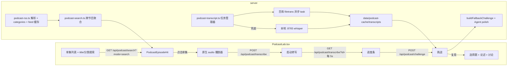

# Podcast Lab — audio → transcript → challenge

> **Subsystem document** — part of [Spark Design Docs](../DESIGN.md)
> Status: **active** · 2026-08-23
> Benchmark: TED Lab ([ted-challenge-hybrid-mcq.md](ted-challenge-hybrid-mcq.md) · [ted-challenge-inline-discuss.md](ted-challenge-inline-discuss.md))

---

## 1. 需求分析

### 1.1 目标

在 Studio 新增 **Podcast Lab**：音频版 TED Lab。Ryan 可以浏览精选英文播客单集，**先听（audio-only）**，然后系统把整集音频**转成文字**，再按年级/水平生成混合挑战（可选的选择题 + 必答论述题），提交后在 Lab 内做 Socratic 讨论、可保存到 My Creations，并写入学习记忆（Dashboard 归因）。

### 1.2 与 TED 的差异

| 维度 | TED Lab | Podcast Lab |
|---|---|---|
| 媒体 | 视频（官方 iframe embed） | **纯音频**（原生 `<audio>`） |
| 转写来源 | TED 官方字幕（`ted-transcript.ts`） | **音频真实转写**（本功能核心差异） |
| 内容目录 | TED.com 实时搜索 + 精选 40 集 | 跨节目聚合 **单集**（title/分类）搜索；节目名仅作次要元数据 |
| 挑战引擎 | `buildFallbackChallenge` + Cursor Agent polish | **完全复用**同一引擎 |
| 讨论 / 保存 / 学习记忆 | `LabDiscussDialogue` / creations / `recordStudioLearningTurn` | **完全复用** |

### 1.2b 搜索修复（episode-first）· 2026-08-23

**问题：** Browse/Search 列表绑在节目（show）名上（如 “TED Talks Daily”），学生需要按**具体单集 title** 与 **分类/主题** 发现内容，不是节目总名。

**方案：**
1. RSS 解析补 `categories`（`itunes:category` / `category` / `itunes:keywords`）。
2. 新增 `podcast-search.ts`：并行拉取目录内各节目 feed（磁盘缓存），聚合成单集命中；按 `q` 匹配 **episode.title / description / categories** 与 show.topics；topic chip 过滤 show.topics 或 episode.categories。
3. `GET /api/podcast/search?mode=search&q=&topic=` → `{ ok, episodes: PodcastEpisodeHit[] }`；`?show=` 仍返回单节目列表。
4. `PodcastLab` 默认 **单集列表**（主标题=单集 title，副行=节目名·时长·分类）；placeholder「Search episodes — title, topic…」。节目网格降为可选入口或移除主导航。

### 1.3 内容来源

精选 7 个节目（iTunes/Apple Podcast 目录验证，2026-08-23 实测）：

| 节目 | collectionId | feedUrl | 主题 |
|---|---|---|---|
| Freakonomics Radio | 354668519 | `https://feeds.simplecast.com/Y8lFbOT4` | 经济 / 社会 |
| Stuff You Should Know | 278981407 | omnycontent playlist RSS | 通识 / 科学 |
| TED Talks Daily | 160904630 | `https://feeds.acast.com/public/shows/67587e77c705e441797aff96` | 演讲 / 思想 |
| Radiolab | 152249110 | `https://feeds.simplecast.com/EmVW7VGp` | 科学 / 叙事 |
| The Rest Is History | 1537788786 | `https://feeds.megaphone.fm/GLT4787413333` | 历史 |
| Wow in the World | 1233834541 | `https://rss.art19.com/wow-in-the-world` | 儿童科学（补充） |
| But Why: A Podcast for Curious Kids | 1103320303 | `https://podcasts.vpr.net/but-why` | 儿童通识（补充） |

获取链路：`iTunes Search/Lookup API`（无鉴权，~20 req/min）拿 `feedUrl` → RSS 2.0 feed 拿单集与音频 `enclosure` 直链。feed 磁盘缓存避免重复抓取。

### 1.4 转写（核心）

| 优先级 | 引擎 | 说明 |
|---|---|---|
| 主 | **阿里云百炼 filetrans**（`paraformer-v2`，异步 task） | `POST /api/v1/services/audio/asr/transcription`（`X-DashScope-Async: enable`）→ 轮询 `GET /api/v1/tasks/{task_id}` → 下载 `results[].transcripts[].url`。支持小时级音频，`ALIYUN_DASHSCOPE_API_KEY` 已配置。 |
| 兜底 | **本地 spark-stt**（`:8765` faster-whisper + SenseVoice） | 下载音频 → multipart POST `/transcribe`。仅 4GB 内存 VPS，长音频慢但可用。 |

任务模型：内存 Map + 磁盘 job 文件（`data/podcast-cache/jobs/`），客户端 5s 轮询进度。转写文本缓存到 `data/podcast-cache/transcripts/`（7 天 TTL），挑战 API 直接复用。

### 1.5 非目标（明确不做）

- 不做播客订阅/播放列表管理。
- 不下载并保存音频文件到仓库（仅转写时临时下载）。
- 不做逐句字幕时间轴产品（转写只服务出题）。

---

## 2. 系统设计



### 2.1 文件布局

新建：

| 文件 | 职责 |
|---|---|
| `src/lib/entertain/podcast-catalog.ts` | 节目目录 + feed 解析（iTunes lookup/search + 硬编码 feedUrl） |
| `src/lib/entertain/podcast-rss.ts` | 无依赖 RSS 解析（regex）+ categories + 原始 feed 磁盘缓存 |
| `src/lib/entertain/podcast-search.ts` | 跨节目聚合单集搜索（title / categories / topics） |
| `src/lib/entertain/podcast-transcript.ts` | 转写任务管理器（百炼 filetrans 主 / 本地 whisper 兜底 / 磁盘缓存） |
| `src/lib/entertain/podcast-challenge.ts` | episode→talk 映射 + 播客版系统提示词 |
| `src/app/api/podcast/search/route.ts` | mode=search 单集命中 / ?show= 单节目列表 / 兼容目录 |
| `src/app/api/podcast/transcribe/route.ts` | POST 启动任务 / GET 查进度 |
| `src/app/api/podcast/challenge/route.ts` | 构建挑战（复用 TED 引擎） |
| `src/components/PodcastLab.tsx` | 三阶段 UI |
| `docs/subsystems/podcast-lab.md` · `scripts/smoke-podcast-api.ts` | 文档 / 冒烟 |

修改（类型与接线，TED 同级）：

| 文件 | 改动 |
|---|---|
| `src/lib/entertain/types.ts` | `GameId` += `podcast-lab` |
| `src/components/EntertainPage.tsx` | `STUDIO` 卡片 + 分发 + `TITLES` |
| `src/lib/entertain/lab-discuss.ts` | `LabDiscussId` += `podcast` |
| `src/components/MediaLabChallengeView.tsx` | `source` += `podcast` |
| `src/lib/entertain/studio-learning.ts` | `StudioLearningSource` += `podcast` |
| `src/lib/learning-memory.ts` | `LearningSource` += `podcast` |
| `src/lib/entertain/creations-store.ts` + `src/app/api/creations/route.ts` | `CreationType` += `podcast_challenge` |
| `src/lib/cross-lab.ts` | `LabId` += `podcast` |
| `.gitignore` | `/data/podcast-cache/`、`/data/podcast-audio/` |

### 2.2 关键类型

```ts
type PodcastShow = {
  id: string;                    // "freakonomics-radio"
  title: string;
  host: string;
  feedUrl: string;               // 硬编码，可被 iTunes 刷新覆盖
  collectionId?: number;         // iTunes lookup 兜底
  topics: PodcastTopic[];
  blurb: string;
  language?: string;             // "en"
  kidFriendly?: boolean;
};

type PodcastEpisode = {
  guid: string;                  // episode 稳定 id（RSS guid 或 title hash）
  title: string;
  description: string;           // HTML 已清理
  audioUrl: string;              // enclosure URL（http(s)）
  durationSec: number;           // itunes:duration（h/m/s 解析）
  pubDate: string;
  categories: string[];          // itunes:category / category / keywords
};

type PodcastEpisodeHit = PodcastEpisode & {
  showId: string;
  showTitle: string;
  showHost: string;
  topics: PodcastTopic[];        // 来自节目目录（分类 chip 主数据）
  kidFriendly?: boolean;
};

type PodcastTranscriptJob = {
  id: string;
  showId: string;
  episodeGuid: string;
  status: "queued" | "running" | "done" | "error";
  progress: number;              // 0–1（本地兜底时 0.1→1）
  transcript?: string;
  error?: string;
  engine: "bailian" | "local" | "cache";
  createdAt: number;
  updatedAt: number;
};
```

### 2.3 转写任务状态机

```
none → queued → running → done（transcript 写入缓存）
                 └── error（记录错误，客户端可重试）
```

- 启动：`requestPodcastTranscript(show, episode)` — 先查字幕缓存，命中直接 `done`；否则建 job、写磁盘、后台执行、立即返回 `{ok, job}`。
- 后台执行：`bailian` 优先；失败或无 `ALIYUN_DASHSCOPE_API_KEY` → 本地 whisper。
- 结果：抽取文本（百炼 `transcripts[].text` 或 `sentences[].text` 拼接），截断 `MAX_CHARS = 12_000` 与 TED 一致，写入 `data/podcast-cache/transcripts/<showId>_<hash>.txt`。

### 2.4 挑战 API

`POST /api/podcast/challenge` body：`{ show, episode, learner }`。

1. 解析 `episodeId` → 查缓存文本；未就绪 → `{ok:false, status:"transcript_pending"}` (409)。
2. `episodeToTalk()` → `TedTalk`；`buildFallbackChallenge(talk, text, learner)`。
3. `PODCAST_CHALLENGE_FORCE_FALLBACK=1` 或内存不足时跳过 Agent；否则 Cursor Agent polish（复用 `challengeSystemPrompt` 播客版）。

---

## 3. 测试设计

| 文件 | 覆盖 |
|---|---|
| `podcast-rss.test.ts` | 合法 RSS fixture 解析（title/CDATA/description/enclosure/duration/categories）；坏 feed / 缺 enclosure 容错 |
| `podcast-search.test.ts` | 跨节目聚合过滤（title/q/topic）；分页；坏 feed 跳过 |
| `podcast-catalog.test.ts` | show 查找；`resolveShowFeed`（硬编码 feed 优先；iTunes lookup mock；search mock）；feed 缓存 |
| `podcast-transcript.test.ts` | 缓存命中返回 done；状态机；百炼结果文本抽取（transcripts/sentences 两种形状）；本地兜底；job 持久化 |
| `src/app/api/podcast/search/route.test.ts` | mode=search 返回单集命中；?show= 单节目；无参目录兼容；坏 show → 404 |
| `src/app/api/podcast/challenge/route.test.ts` | transcript 未就绪 409；`PODCAST_CHALLENGE_FORCE_FALLBACK=1` 返回合法 challenge（≥4 items，含 literal/critique）；episodeToTalk 元数据 |
| `src/lib/entertain/podcast-challenge.test.ts` | episode→talk 映射；播客版 prompt 含节目/单集上下文 |
| `studio-learning` / `cross-lab` / `creations` | source `podcast` 前缀/seed/chatTitle、cross-lab 路由、`podcast_challenge` 类型 |

集成冒烟 `scripts/smoke-podcast-api.ts`：目录 → 单集 → （若可用）转写 → challenge 全链路；`curl` 健康检查兜底。

---

## 4. 发布与部署

按仓库惯例（`docs/TODO.md` P5/P6）：本地 commit → push `origin/develop` → merge develop→master → push 两分支 → `node scripts/smart-build.mjs` → `pm2 restart spark-tutor` → 健康检查 `GET :3000` = 200。
