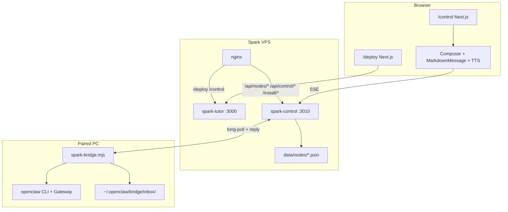

# Remote OpenClaw — Deploy, Control & Spark Bridge

> Updated 2026-08-20 · Bridge version **2026.8.20-5**

Spark lets a browser talk to a **paired home PC** running OpenClaw. The tutor site stays cloud-hosted; agent work (files, shell, WeChat, workbench) runs locally on macOS or Windows.

**Related:** [assistant-repos-reference.md](assistant-repos-reference.md) · [assistant/README.md](../../assistant/README.md)

---

## Goals

| Goal | How |
|------|-----|
| Pair a PC without SSH | One-time pair code from `/deploy` |
| Chat from anywhere | `/control` streams replies from the PC's OpenClaw agent |
| Same UX as Spark homepage | Composer (voice, camera, attachments), Markdown replies, Listen TTS |
| Upgrade in place | Online **Upgrade** pulls new bridge + assistant bundle from server |
| No legacy repo coupling | Unified `assistant/` module; archived `ai_assistant_mac` / `ai_assistant_win` |

---

## Architecture



### Process split

| Service | Port | Role |
|---------|------|------|
| `spark-tutor` (PM2) | 3000 | Next.js — `/control`, `/deploy` UI, `/api/transcribe`, `/api/tts` |
| `spark-control` (PM2) | 3010 | Node hub — node registry, long-poll, SSE chat/upgrade, `/install/*` static |
| nginx | 443 | Routes UI to `:3000`, node/control/install APIs to `:3010` |

nginx snippet (production):

- `/deploy`, `/control` → `spark_next` (:3000)
- `/api/nodes`, `/api/nodes/*`, `/api/control/*`, `/install/*` → `:3010`
- Long-poll timeout: `proxy_read_timeout 3600s`, `proxy_buffering off`

Next.js also implements the same node APIs under `src/app/api/nodes/*` for local dev; production nginx prefers `:3010` so bridge/install changes do not require a full Next rebuild.

---

## Repository layout

| Path | Purpose |
|------|---------|
| `assistant/` | Unified OpenClaw config, skills, workbench; `install.mjs` entry |
| `public/install/macos.sh` | macOS one-shot installer (pair → assistant → bridge → LaunchAgent) |
| `public/install/windows.ps1` | Windows one-shot installer (pair → assistant → bridge → schtasks) |
| `public/install/spark-bridge.mjs` | Outbound bridge (canonical; served at `/install/spark-bridge.mjs`) |
| `public/install/assistant.tar.gz` | Bundled `assistant/` for online upgrade |
| `public/install/spark-deploy.command` | macOS download-and-run wrapper (pair code in query) |
| `public/install/spark-deploy.bat` | Windows download-and-run wrapper |
| `bridge/control-server.mjs` | Standalone control plane (`SPARK_CONTROL_PORT`, default 3010) |
| `bridge/index.mjs` | Copy of bridge for dev; keep in sync with `public/install/spark-bridge.mjs` |
| `src/app/control/page.tsx` | Remote chat UI (Composer parity) |
| `src/app/deploy/page.tsx` | Pair codes, node list, aliases, one-click download, Upgrade |
| `src/lib/nodes/store.ts` | In-memory hub + disk merge (`data/nodes/`) |
| `src/lib/nodes/types.ts` | `NodeCommand`, `NodeReplyEvent`, attachments |
| `data/nodes/nodes.json` | Registered nodes (server-side) |
| `data/nodes/pairs.json` | Ephemeral pair codes |

---

## Pairing flow

1. Parent opens `/deploy`, enters admin token if `SPARK_ADMIN_TOKEN` is set.
2. **Generate pair code** → `POST /api/nodes/pair` (15 min TTL).
3. User downloads **Spark-Deploy-&lt;CODE&gt;.command** (macOS) or **.bat** (Windows), or runs the shown shell/PowerShell one-liner.
4. Installer:
   - `POST /api/nodes/install-ticket` — receives API keys for OpenClaw (from server env).
   - Downloads `assistant.tar.gz`, runs `node assistant/install.mjs`.
   - Installs `spark-bridge.mjs` and registers via `POST /api/nodes/register` with `SPARK_PAIR_CODE`.
   - Starts bridge as LaunchAgent (macOS) or scheduled task (Windows).
5. Node appears on `/deploy` and `/control` with online/offline status.

**macOS SSL:** stock curl often fails Let's Encrypt verify. Installers default to `curl -k` / `SPARK_INSECURE=1`; documented in `macos.sh` header.

---

## Spark Bridge protocol

Bridge runs on the PC (`~/.openclaw/bridge/state.json` holds `token`, `nodeId`).

| Step | Endpoint | Direction |
|------|----------|-----------|
| Heartbeat | `POST /api/nodes/heartbeat` | PC → server every 15s |
| Wait for work | `GET /api/nodes/poll?token=` | PC long-poll (server ~25s hold; **client aborts at 45s**) |
| Stream reply | `POST /api/nodes/reply` | PC → server (chunk / done / error) |

**Online TTL:** 180s (`ONLINE_MS`). A node is *online* when `now - lastSeen < 180s`.

**Commands** (`NodeCommand`):

```ts
| { requestId, type: "chat", message, attachments? }
| { requestId, type: "upgrade" }
```

Chat attachments (max 9, 80 MB each on server) are written to `~/.openclaw/bridge/inbox/`; paths are appended to the agent message so OpenClaw reads files from disk (avoids huge CLI args).

---

## OpenClaw CLI invocation

Correct form ([OpenClaw agent docs](https://docs.openclaw.ai/cli/agent)):

```bash
openclaw agent --agent main --message-file /path/to/msg.txt
```

**Never** use positional agent id (`openclaw agent main …`) — that yields:

`Too many arguments for this command. Try: openclaw agent main --help`

Bridge `runOpenClaw()` tries, in order:

1. `agent --agent main --message-file <tmp>`
2. `agent --agent main --message <string>`
3. `agent --agent main --local --message-file <tmp>`
4. `agent exec --message-file <tmp>`

Implementation details:

- `spawn("openclaw", args)` — **no** `shell: true`; message is one argv or a file.
- Debug lines (`[agents/…]`, `stopReason=`, `provider-transport-fetch`, …) stripped via `stripAgentDebug()` before user-visible text; full stderr goes to `bridge.log`.
- `openclawEnv()` extends `PATH` for LaunchAgent / schtasks (Homebrew, npm global, nvm).

Bump `SPARK_BRIDGE_VERSION` in `public/install/spark-bridge.mjs` and `CURRENT_BRIDGE_VERSION` in `store.ts` + `control-server.mjs` together; rebuild `assistant.tar.gz` if needed; `pm2 restart spark-control`.

---

## Control chat (browser → PC)

1. User selects node on `/control`, sends message via **Composer** (text, voice → `/api/transcribe`, camera, file attachments).
2. `POST /api/control/chat` (admin-gated) enqueues `chat` command for chosen online node.
3. Response: **SSE** — `status` → `delta` chunks → `done` or `error` (3 min timeout).
4. Assistant bubbles use **MarkdownMessage**; **Listen** uses shared TTS (`/api/tts`) like the homepage.

Admin auth (`SPARK_ADMIN_TOKEN`):

- Header `x-spark-admin`
- Query `?admin=`
- Cookie `spark_admin`
- If env unset, admin checks pass (dev only).

**Node list** (`GET /api/nodes`) is **public** — any visitor sees online/offline roster; pair, chat, alias, upgrade require admin.

---

## Deploy UI

| Feature | API / asset |
|---------|-------------|
| Generate pair code | `POST /api/nodes/pair` |
| List nodes + upgrade flag | `GET /api/nodes` |
| Set alias | `PATCH /api/nodes/:nodeId` |
| Download installer | `GET /install/spark-deploy.command?code=` or `.bat?code=` |
| Upgrade online node | `POST /api/control/upgrade` (SSE log) |

Upgrade on PC:

1. Download `/install/assistant.tar.gz` + `/install/spark-bridge.mjs`
2. Extract, run `node assistant/install.mjs`
3. Bridge replies `done`, restarts via `launchctl kickstart` or `start.cmd`

Nodes with bridge &lt; `2026.8.20-2` cannot online-upgrade; reinstall from `/deploy`.

---

## Unified assistant module

Replaces archived GitHub repos. Single tree under `assistant/`:

```
assistant/
├── install.mjs                 # Cross-platform entry (Node 22+)
├── openclaw-config/            # base.json + darwin/win32 overlays
│   └── workspace/skills/       # 15 skills (computer-use, cursor-code, …)
├── platforms/darwin|win32/     # LaunchAgent, venv, backup scripts
└── scripts/                    # merge-config.mjs, merge-skills.mjs
```

Platform skills ship `SKILL.md` + optional `darwin.md` / `win32.md` merged at install.

After editing `assistant/`:

```bash
cd codes/ryan_learning
tar czf public/install/assistant.tar.gz assistant
pm2 restart spark-control
```

---

## Operations checklist

```bash
# Verify served bridge version & CLI shape
curl -sS http://127.0.0.1:3010/install/spark-bridge.mjs | grep -E 'VERSION|--agent|message-file'

# Node roster
curl -sS http://127.0.0.1:3010/api/nodes

# Restart control plane after bridge/store changes
pm2 restart spark-control

# Restart Next after /control or /deploy UI changes
npm run build && pm2 restart spark-tutor
```

**Env (server):**

| Variable | Purpose |
|----------|---------|
| `SPARK_ADMIN_TOKEN` | Gate pair, chat, upgrade, alias |
| `SPARK_CONTROL_PORT` | Default 3010 |
| `DEEPSEEK_API_KEY`, `DASHSCOPE_API_KEY`, … | Passed to PC via install-ticket |

**Env (PC bridge):**

| Variable | Purpose |
|----------|---------|
| `SPARK_URL` | Spark origin (no trailing slash) |
| `SPARK_PAIR_CODE` | First-time register only |
| `SPARK_NODE_TOKEN` | Optional; usually in `state.json` |

---

## Troubleshooting

| Symptom | Likely cause | Fix |
|---------|--------------|-----|
| `Too many arguments… openclaw agent main` | Old bridge CLI | Upgrade to **2026.8.20-4+** from `/deploy` |
| Node offline but bridge running | Heartbeat blocked / wrong URL | Check `bridge.log`, firewall, `SPARK_URL` |
| `[agents/…]` in chat | Old bridge without log strip | Upgrade bridge |
| Upgrade downloads HTML | nginx `/install/` misroute | Confirm `location ^~ /install/` → :3010 |
| macOS curl fails on download | SSL / old CA store | Use `SPARK_INSECURE=1` or `-k` (installer default) |
| Chat timeout 3 min | Long agent run or gateway down | Check OpenClaw gateway; bridge falls back to `--local` |
| Online but `/control` times out | Poll hung after nginx 502 / half-open TCP | Bridge ≥ **2026.8.20-5** aborts poll at 45s and reconnects; restart `org.spark.bridge` if still stuck |

### Poll hang (fixed in 2026.8.20-5)

Heartbeat runs on a separate timer, so a node can stay **online** while `fetch(poll)` is stuck on a zombie TCP connection after nginx 502. Without a client timeout, new commands never enter the poll loop and `/control` hits the 3‑minute SSE watchdog.

Mitigation: `AbortSignal.timeout(45_000)` on poll; timeout/`TimeoutError` is silent and the loop retries after 3s.

---

## Version history (bridge)

| Version | Change |
|---------|--------|
| 2026.8.20-2 | Online upgrade command; install-ticket |
| 2026.8.20-3 | `--agent` / `--message-file` CLI fix (partial deploy) |
| 2026.8.20-4 | Canonical CLI + log stripping + attachment inbox |
| 2026.8.20-5 | Poll `AbortSignal.timeout(45s)` — survive nginx 502 / half-open TCP |
