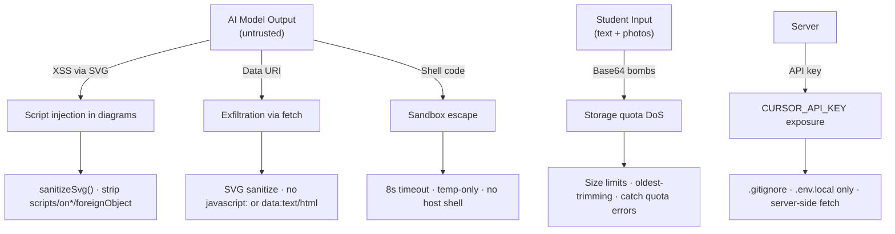

# Subsystem: Security & Sanitization

> Parent: [Design Overview](/docs/DESIGN.md)

---

## 1. Responsibility

Protect the student, the server, and the API key from injection, data leaks, and sandbox escapes.

---

## 2. Threat Model



---

## 3. SVG Sanitization

`sanitizeSvg()` strips:

```
<script>…</script>
<foreignObject>…</foreignObject>
on* attributes (onclick, onload, onerror, …)
javascript: URLs
data:text/html URIs
```

If the SVGs are still invalid after sanitize, they are dropped (show raw code block instead).

---

## 4. API Key Safety

- `CURSOR_API_KEY` lives in `.env.local` (in `.gitignore`)
- Read by Next.js server at build/runtime; never sent to the browser
- API routes that call Cursor SDK read it from `process.env`
- `scripts/ensure-env.mjs` validates key presence before start
- `scripts/unlock-secret.mjs` / `set-secret.mjs` handle encryption for CI

---

## 5. Tool Sandboxing

| Tool | Constraint |
|------|-----------|
| `run_python` | `spawn('python3', ['-c', code])` in temp dir; 8s timeout; max output 8000 chars; no file persistence |
| `run_js` | `spawn('node', ['--input-type=module', '-e', code])` in temp dir; 8s timeout; max output 8000 chars |
| `web_search` | Standard `fetch()` (http/https only); 10s timeout; DuckDuckGo → Google fallback |
| `fetch_page` | `fetch(url)` — http/https only; 10s timeout; max 6000 chars; HTML stripped |
| `draw_geometry` | Pure computation → SVG string; no shell or external calls |

No tools have arbitrary filesystem access, network access to localhost, or the ability to spawn sub-processes beyond the temp sandbox.

---

## 6. Input Sanitization

| Source | Sanitization |
|--------|-------------|
| User text | Trimmed; max length enforced by API route |
| Attachments | MIME type checked; binary blobs not interpreted |
| File names | Stripped to base name only; no path traversal |
| Chat history | Truncated to 500 chars per turn; max 8 turns |
| Learning memory JSON | `normalizeMemory` rejects invalid shapes; falls back to empty |

---

## 7. Data at Rest

| Store | Content | Risk | Mitigation |
|-------|---------|------|------------|
| `data/conversations/*.json` | Chat text + mediaIds | PII (student homework, name, school) | Server filesystem; no public route |
| `data/learning-memory.json` | Skill mastery + notes | Learner profile | Server filesystem; GET requires same-origin |
| `data/media/*` | Photo/PDF blobs | Student work content | Server filesystem; served only via `/api/media/{id}` |
| `localStorage` | Same as server + base64 photos | Local device access | Browser sandbox; cleared on logout |

---

## 8. CSRF / Request Safety

- All mutations are same-origin (browser `fetch` from the app)
- No cookies used; no CSRF token needed
- API does not accept `multipart/form-data` cross-origin
- `Content-Type: application/json` enforced for mutation endpoints

---

## 9. Edge Cases

| Case | Handling |
|------|----------|
| SVG with encoded script (`\x73cript`) | `sanitizeSvg` regex covers common escapes |
| Extremely large prompt | API rejects payload > 100KB |
| Rapid successive chat requests | `busy` flag prevents concurrent sends |
| Expired/revoked CURSOR_API_KEY | Agent returns error; shown as inline error message |
| Nginx misconfiguration (exposing .env) | `.env.local` outside web root; `location ~ /\.` blocked in nginx config |

---

## Next: [Synthesis](/docs/synthesis.md)
