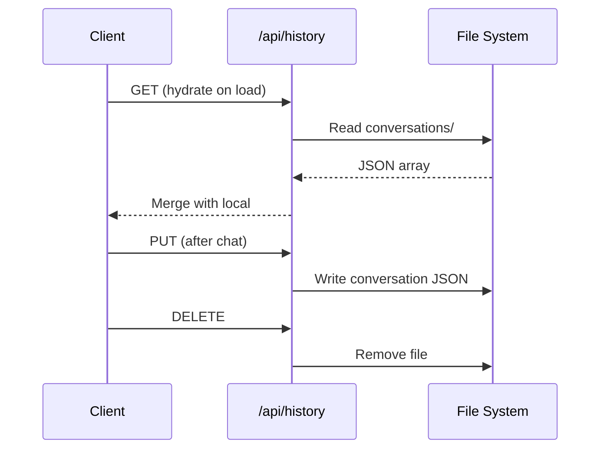

# 💾 History & Storage

> **Subsystem document** — part of [Spark Design Docs](../DESIGN.md)

---

## Storage Matrix

| Layer | Key | Content | Cap |
|-------|-----|---------|-----|
| localStorage | `spark.sessions` | Conversations | 100 convos |
| localStorage | `spark.learningMemory` | BKT skills / topics | 24 skills |
| localStorage | `spark.engagement` | Streaks / badges | N/A |
| localStorage | `spark.studentProfile.v2` | Ryan profile | N/A |
| localStorage | `spark.ttsVoice` | Voice preference | N/A |
| IndexedDB | `spark.photoVault` | Photo blobs | Browser quota |
| Server FS | `data/conversations/` | Per-convo JSON | 1000 msgs total |
| Server FS | `data/learning-memory.json` | Shared BKT state | N/A |
| Server FS | `data/media/` | Media blobs | N/A |

## Sync Flow

## Retention Rules

- Max 1000 messages total across all conversations
- Max 100 conversations
- Oldest pruned on overflow
- Photos: server strips base64, keeps mediaId; client restores from IndexedDB vault

## Files

| File | Role |
|------|------|
| `src/lib/storage.ts` | Client conversation store |
| `src/lib/history-store.ts` | Server conversation store |
| `src/lib/history-sync.ts` | Client ↔ server sync |
| `src/lib/media-store.ts` | Media blob management |
| `src/lib/photo-vault.ts` | IndexedDB photo cache |
| `src/api/history/route.ts` | History CRUD |
| `src/api/media/[mediaId]/route.ts` | Media blob serve |
