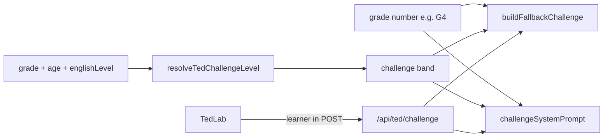

# TED Challenge · Adaptive Difficulty (grade-number + English level)

> **Subsystem document** — part of [Spark Design Docs](../DESIGN.md)  
> Status: **shipped** · 2026-08-11  
> Related: [entertainments.md](entertainments.md) §6.2 · [grade-agnostic-adaptive.md](grade-agnostic-adaptive.md) · [ted-challenge-voice-input.md](ted-challenge-voice-input.md)

---

## Problem

TED Lab Challenge prompts were hardcoded for **international-school G6–10** (“steelman”, rhetoric, long retell). For younger or ESL learners (e.g. Ryan, age 9 / **G4**), questions are too hard.

The first adaptive draft keyed defaults only off **`gradeBand`** (early / elementary / middle / high). That collapses **G3–G5 into one bucket**, so Ryan’s **G4** is not distinguishable from G3 or G5. Reading benchmarks (Lexile / fluency / “read to learn”) and Cambridge YLE steps all move **per grade year**, not per 3-year band.

## Approach

1. **Profile signals**
   - `grade` (1–12) — **primary difficulty grain** (G4 = day-1 baseline)
   - `age` (years) — soft ±1 nudge only
   - `englishLevel`: `emerging` | `developing` | `confident` | `advanced`
     - Parent-settable on `/account`
     - Default from **`englishLevelForGrade(grade)`**, not `gradeBand`
2. **Resolve** via `resolveTedChallengeLevel({ age, grade, englishLevel })`:
   - Start from explicit `englishLevel` or `englishLevelForGrade(grade)`
   - Soft age nudge vs typical age-for-grade (±1 step, capped)
   - Always keep **`grade`** on the learner payload so prompts can say “Grade 4 …” even when two grades share a band label
3. **Generate by band + grade cue** in `buildFallbackChallenge` + `challengeSystemPrompt`
   - Band chooses pedagogy family (no steelman on emerging)
   - **Grade number** chooses length / vocab / retell targets (G3 &lt; G4 &lt; G5 within elementary)
4. **Client → API**: `POST /api/ted/challenge` body `{ slug, learner: { age, grade, gradeBand, englishLevel } }`
5. **Soft feedback** word-count thresholds scale with band; G4 uses developing thresholds as baseline

### Default English level by **grade number** (G4 grain)

| Grade | Default `englishLevel` | Rationale |
|------:|------------------------|-----------|
| 1–2 | `emerging` | Pre-A1 / early A1; short literal |
| 3 | `emerging` | Still below G4 “read to learn” listening load |
| **4** | **`developing`** | **Ryan / BASIS G4 baseline (A2-ish)** |
| 5 | `developing` | Same band label, **harder grade cue** in prompts |
| 6–8 | `confident` | B1; structure + mild critique |
| 9–12 | `advanced` | B2+; steelman / rhetoric OK |

`gradeBand` remains for skill catalog / BKT / tutor language — **not** the TED default key.

### Band + grade pedagogy (listening)

| Band | CEFR-ish | Grade cue | Prompt shape |
|------|----------|-----------|--------------|
| `emerging` | Pre-A1–A1 | G1–3 | Short literal + simple retell; optional choices; no steelman |
| `developing` | A2 | **G4 baseline**; G5 = same band, longer answers | Main idea, beginning→end, gentle opinion; ~3-sentence retell at G4 |
| `confident` | B1 | G6–8 | Claim + structure bullets + mild critique |
| `advanced` | B2+ | G9–12 | Rigorous critique / steelman / rhetoric |



## Key files

| File | Role |
|------|------|
| `src/lib/student-profile.ts` | `EnglishLevel`, `englishLevelForGrade`, normalize + account UI |
| `src/components/AccountHome.tsx` | Age + English level editors |
| `src/lib/entertain/ted-challenge.ts` | Resolve level; banded + **grade-cued** fallback / system prompt |
| `src/app/api/ted/challenge/route.ts` | Accept `learner`; pass into builders |
| `src/components/TedLab.tsx` | Send profile learner; band-aware softFeedback |
| `src/lib/entertain/ted-challenge.test.ts` | Unit tests incl. G3 vs G4 vs G5 |

## Risks

| Risk | Mitigation |
|------|------------|
| Missing learner on old clients | Server defaults to **grade 4 / developing** (Ryan-safe) |
| Parents skip English level | Auto from **grade number**; age nudge only ±1 step |
| G4 vs G5 share `developing` label | Prompt builders always receive `grade` for length/vocab |
| LLM ignores band | Strong system-prompt constraints + fallback always banded |
| Breaking smoke scripts | Fallback path still ≥4 items; kinds remain valid |

## Test design

### Unit

| ID | Case |
|----|------|
| TD1 | grade **4** + unset english → `developing` |
| TD1b | grade **3** → `emerging`; grade **5** still `developing` but G5 prompt cue ≠ G4 |
| TD2 | englishLevel `advanced` overrides grade 3 |
| TD3 | Young age vs high grade softens one step |
| TD4 | `emerging` fallback has no “steelman” / rhetoric jargon |
| TD5 | `advanced` fallback still includes critique + retell |
| TD6 | System prompt mentions resolved band **and Grade N** |
| TD7 | G4 fallback wording is friendlier than G8 / advanced |

### Integration / manual

| ID | Case |
|----|------|
| TM-D1 | Account: set age + English level → Save → TED challenge wording matches |
| TM-D2 | Ryan (G4 / developing) → prompts friendlier than advanced / G10 account |
| TM-D3 | Force fallback (`TED_CHALLENGE_FORCE_FALLBACK=1`) still banded + grade-cued |
| TM-D4 | Same account englishLevel, change grade 3→4→5 → prompt difficulty steps up |

```bash
npm test -- src/lib/entertain/ted-challenge.test.ts src/lib/student-profile.test.ts
```
