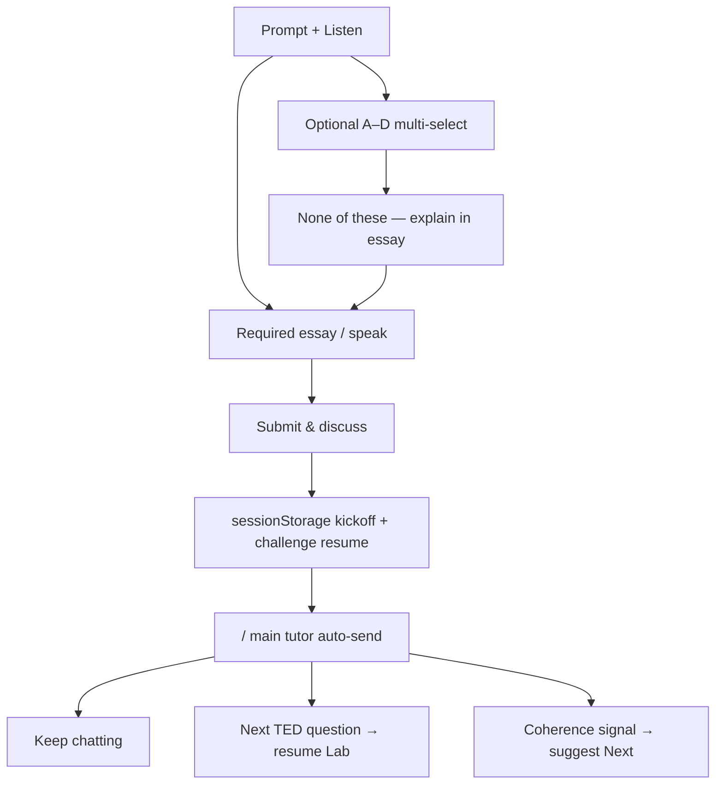

# TED Challenge · Hybrid MCQ + Essay → Tutor Q&A

> **Subsystem document** — part of [Spark Design Docs](../DESIGN.md)  
> Status: **active** · 2026-08-11 (v2 — optional MCQ + required essay → main tutor)  
> Related: [entertainments.md](entertainments.md) §6.2 · [ted-challenge-adaptive-difficulty.md](ted-challenge-adaptive-difficulty.md) · [idle-nudge / practice kickoff](../TODO.md)

---

## Problem

TED Challenge must train **selection + reasoning together**, then deepen thinking in the **main tutor chat** — not trap students behind two independent soft-checks before “Next”.

Product rules (parent clarified 2026-08-11):

1. **MCQ + 论述 on one prompt** — student argues from their choice(s).
2. **Selection optional** — if the viewpoint is not in A–D, skip selection and explain in the essay.
3. **Multi-select OK** — when several options fit, select them and spell out the logic in the essay.
4. **After Submit** → leave Studio and enter **homepage Q&A** so the AI teacher guides reflection.
5. Student may **continue chatting** or take the **next TED question**.
6. When the student’s logic is **self-consistent**, surface a **completion signal** suggesting the next question.

Earlier hybrid UX (independent Check selection / Check essay → Next only after both) conflicts with (2) and (4).

## Approach

### Data model (unchanged fields)

```ts
type ChallengeItem = {
  id: string;
  kind: ChallengeKind;
  prompt: string;
  rubricHint: string;
  choices: string[];          // target 4
  choiceMode: ChoiceMode;     // soft-score preference (UI allows multi always)
  correctChoices: number[];   // soft check only — never a hard gate
};
```

### Challenge UI (TedLab)



1. Options always **multi-capable**; copy: “Select any that apply (optional)”.
2. **None of these** clears selection — student must still write the essay.
3. Selection taps update **`selected[]` only** — never wipe the essay.
4. **Submit & discuss** requires essay ≥3 chars; selection **not** required.
5. Soft local feedback is optional/brief; **primary feedback is tutor dialogue**.
6. On submit: record learning turn + stash handoff → `window.location.href = "/"`.

### Handoff (sessionStorage)

| Key | Role |
|-----|------|
| `spark.tedChallengeKickoff.v1` | One-shot auto-send payload for TutorShell |
| `spark.tedChallengeResume.v1` | Challenge snapshot + `qi` so “Next question” restores Lab |

Kickoff message (user turn) includes talk title, prompt, selected letters (or “none — my own view”), essay, and Socratic instructions:

- Guide thinking; no spoilers / no “correct is B”.
- When reasoning is **self-consistent**, say clearly that thinking holds together and suggest the next TED question.
- Student may stay in chat or return to the Lab.

TutorShell:

1. On ready empty/active chat: `consumeTedChallengeKickoff()` → prefer **new session** → `handleSend`.
2. Keep a **return banner**: “Next TED question” | “Keep chatting” (dismiss).
3. `detectTedCoherenceSignal(assistantText)` strengthens banner copy when the model emits the completion cue.

Resume URL: `/entertain?hub=studio&game=ted-lab` — TedLab consumes resume stash (talk + challenge + `qi`).

### Soft score adjustments

- `scoreChoiceSelection` empty remains a score label, but **empty + essay is valid submit**.
- `buildChoiceSoftFeedback` empty copy becomes advisory (“No option selected — your essay should carry your view.”), not a lock-out.

## Key files

| File | Role |
|------|------|
| `src/lib/entertain/ted-challenge.ts` | Types, enrich, soft feedback, fallbacks |
| `src/lib/entertain/ted-challenge-handoff.ts` | Stash/consume kickoff + resume; kickoff message; coherence detect |
| `src/components/TedLab.tsx` | Optional MCQ + required essay + Submit & discuss + resume |
| `src/components/TutorShell.tsx` | Consume kickoff, auto-send, return banner |
| `src/lib/entertain/ted-challenge-handoff.test.ts` | Unit TH1–TH6 |

## Risks

| Risk | Mitigation |
|------|------------|
| Auto-send races before store ready | One-shot ref; only after `ready && sessionId` |
| Losing challenge after navigate | Resume stash holds serialized challenge + qi |
| AI never emits coherence cue | Banner always offers Next; cue only strengthens copy |
| Spoiling answers in tutor | Kickoff forbids revealing correct letters |
| Essay skipped with empty selection | Submit disabled until essay ≥3 |

## Test design

### Unit

| ID | Case |
|----|------|
| TH1 | `canSubmitHybrid` — essay required; empty selection OK |
| TH2 | `buildTedChallengeKickoffMessage` includes prompt, choices/none, essay, Socratic + coherence instruction |
| TH3 | stash/consume kickoff is one-shot |
| TH4 | stash/consume resume round-trips talkSlug + qi + items |
| TH5 | `detectTedCoherenceSignal` true on cue phrases; false on generic praise |
| TH6 | `buildChoiceSoftFeedback` empty is advisory (no “pick before locking”) |
| TMH* | Existing hybrid enrich/score/format tests still pass |

### Integration / manual

| ID | Case |
|----|------|
| TM-H6 | Skip selection + essay → Submit lands on `/` and auto-starts tutor turn |
| TM-H7 | Multi-select + essay → kickoff lists letters; tutor responds Socratically |
| TM-H8 | Banner “Next TED question” restores Lab at `qi+1` |
| TM-H9 | When tutor signals coherence, banner copy suggests Next |

```bash
npm test -- src/lib/entertain/ted-challenge.test.ts src/lib/entertain/ted-challenge-handoff.test.ts
```
