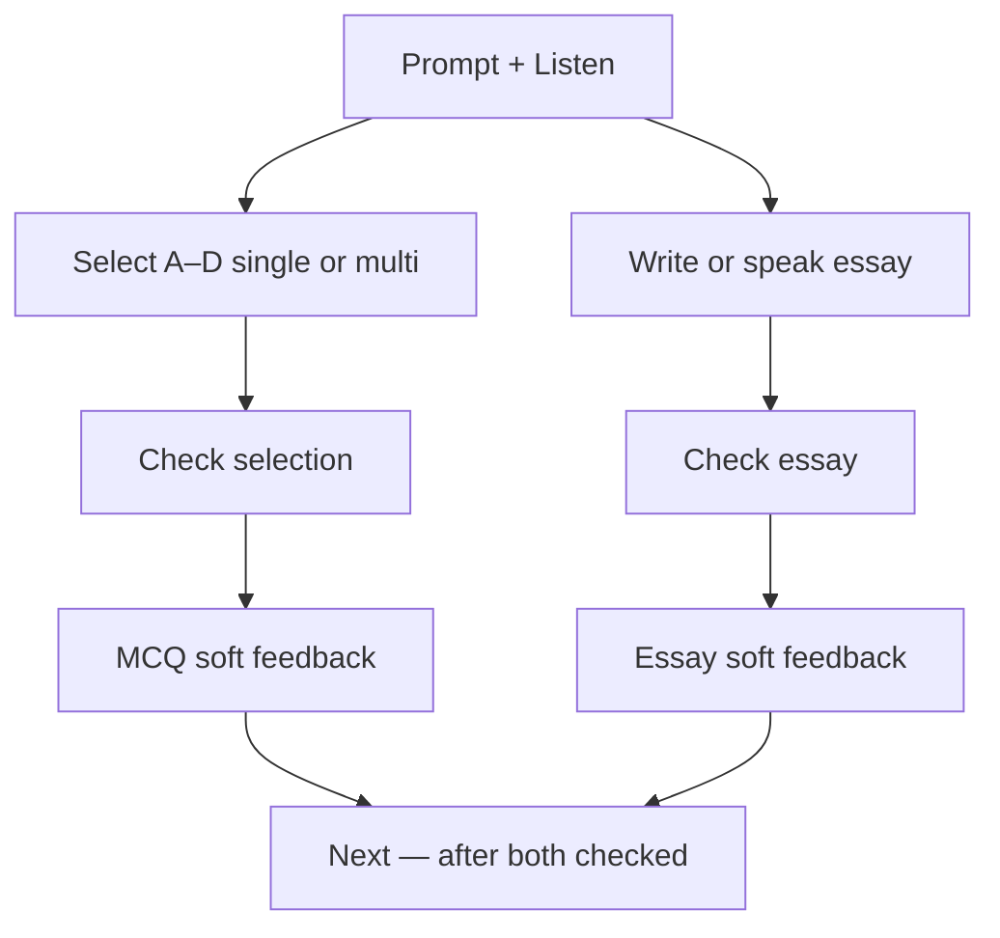

# TED Challenge · Hybrid MCQ + Essay (per item)

> **Subsystem document** — part of [Spark Design Docs](../DESIGN.md)  
> Status: **in progress** · 2026-08-11 (independent checks)  
> Related: [entertainments.md](entertainments.md) §6.2 · [ted-challenge-adaptive-difficulty.md](ted-challenge-adaptive-difficulty.md) · [ted-challenge-voice-input.md](ted-challenge-voice-input.md)

---

## Problem

TED Challenge items need both **objective selection** and **essay / 论述** on the same prompt. An earlier hybrid pass still had two UX bugs:

1. Choice taps wrote into the essay field (`setAnswer(choiceText)`), wiping typed text and never updating `selected[]`.
2. One shared **Check thinking** required selection **and** essay together — so students could not get MCQ feedback without finishing the essay (and vice versa).

Parents/teachers want **every** challenge question to exercise both skills **independently**:

1. **Objective selection** — ~4 options, single-select or multi-select → **Check selection**
2. **Essay / 论述** — short written (or spoken) justification → **Check essay**

Pedagogy: formative “pulse checks” (Edutopia / McTighe) work best as separate, ungraded feedback loops — MCQ for understand/apply, short essay for analyze/evaluate — not one fused gate.

## Approach

### Data model

```ts
type ChoiceMode = "single" | "multi";

type ChallengeItem = {
  id: string;
  kind: ChallengeKind;
  prompt: string;
  rubricHint: string;
  choices: string[];          // target 4
  choiceMode: ChoiceMode;     // radio vs checkbox
  correctChoices: number[];   // 0-based indices for soft check
};
```

- **Fallback + LLM** both emit hybrid fields on **every** item.
- `parseChallengeJson` + `enrichChallengeItem` normalize thin LLM output.
- Soft feedback is **split**:
  - `buildChoiceSoftFeedback(item, selected)` — exact / partial / miss / empty
  - `buildEssaySoftFeedback(item, essay, level)` — length / critique / retell cues
  - `buildHybridSoftFeedback` remains as a join for legacy / combined notes

### UX (TedLab Challenge)



1. Label: **Choose one** vs **Select all that apply**
2. Options A–D update **`selected[]` only** — never the essay textarea
3. **Check selection** enabled when ≥1 option selected; does **not** require essay
4. **Check essay** enabled when essay meets min length (≥3 chars); does **not** require selection
5. Each part locks after its own check; feedback panels are separate
6. **Next** unlocks only after **both** parts have been checked (any order)
7. Save / learning notes still record both: `Choices: A, C` + essay text

### Generation rules

| Band | MCQ flavor |
|------|------------|
| emerging | Concrete literal; mostly `single`; 1–2 `multi` OK |
| developing+ | Mix single (main idea / claim) and multi (structure beats / evidence types) |
| All | Exactly 4 choices; distractors plausible; do not reveal corrects in prompt |

## Key files

| File | Role |
|------|------|
| `src/lib/entertain/ted-challenge.ts` | Types, enrich, score, split soft feedback, fallbacks, system prompt |
| `src/components/TedLab.tsx` | Hybrid UI + independent Check selection / Check essay |
| `src/lib/entertain/ted-challenge.test.ts` | Unit TMH1–TMH8 |
| `src/lib/entertain/studio-contract.test.ts` | Expect hybrid choices on all items |

## Risks

| Risk | Mitigation |
|------|------------|
| LLM omits choices / correctKeys | `enrichChallengeItem` pads + defaults; API still has banded fallback |
| Revealing answers too early | Soft labels only; no “correct is B” in first feedback |
| Choice overwrites essay | Selection state is `selected[]`; essay is `answer` only |
| Fused Check gate | Independent buttons + separate feedback state |
| Long TTS of 4 choices | Keep `challengePromptSpeechText` numbered Choices suffix |
| Old saved creations | Notes format additive; no schema migration |

## Test design

### Unit

| ID | Case |
|----|------|
| TMH1 | Every fallback item (all bands) has 4 choices + `choiceMode` + non-empty `correctChoices` |
| TMH2 | `scoreChoiceSelection` exact / partial / miss |
| TMH3 | `enrichChallengeItem` pads &lt;4 choices; defaults mode |
| TMH4 | `parseChallengeJson` keeps hybrid fields |
| TMH5 | System prompt requires 4 choices + single\|multi on every item |
| TMH6 | `formatHybridAnswerNotes` serializes choices + essay |
| TMH7 | `buildChoiceSoftFeedback` works with empty essay (independent) |
| TMH8 | `buildEssaySoftFeedback` works with empty selection (independent) |

### Integration / manual

| ID | Case |
|----|------|
| TM-H1 | Live Challenge: each Q shows 4 options + essay |
| TM-H2 | Single-select toggles one; multi allows several |
| TM-H3 | Selecting option does **not** wipe typed essay |
| TM-H4 | Check selection works without essay; Check essay works without selection |
| TM-H5 | Next only after both checks; Save includes Choices + essay |

```bash
npm test -- src/lib/entertain/ted-challenge.test.ts src/lib/entertain/studio-contract.test.ts
```
