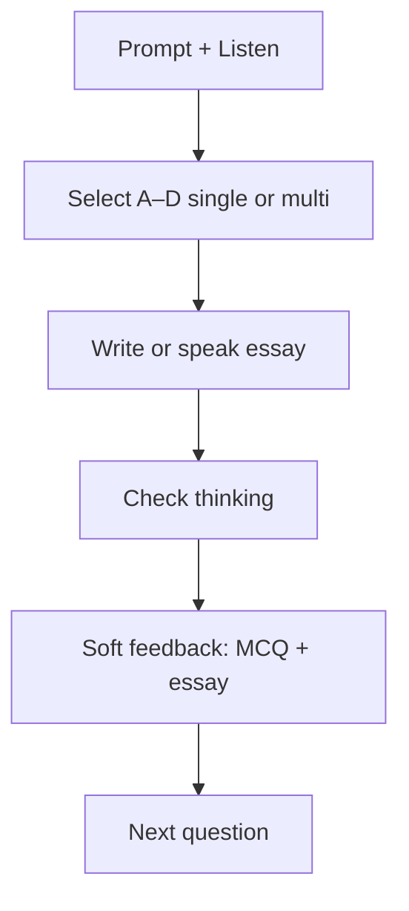

# TED Challenge · Hybrid MCQ + Essay (per item)

> **Subsystem document** — part of [Spark Design Docs](../DESIGN.md)  
> Status: **shipped** · 2026-08-11  
> Related: [entertainments.md](entertainments.md) §6.2 · [ted-challenge-adaptive-difficulty.md](ted-challenge-adaptive-difficulty.md) · [ted-challenge-voice-input.md](ted-challenge-voice-input.md)

---

## Problem

TED Challenge items were mostly **open-response only**. Optional `choices` existed only for emerging Q1, and tapping a choice **overwrote** the essay textarea — so students could not practice **reading-comprehension-style MCQ + written reasoning** on the same prompt.

Parents/teachers want **every** challenge question to exercise both:

1. **Objective selection** — ~4 options, single-select or multi-select  
2. **Essay / 论述** — short written (or spoken) justification

Pedagogy refs (Yale Poorvu / UW Teaching): mix MCQ (understand/apply) with short essay (analyze/evaluate) for holistic assessment; keep stems clear; options similar in length.

## Approach

### Data model

```ts
type ChoiceMode = "single" | "multi";

type ChallengeItem = {
  id: string;
  kind: ChallengeKind;
  prompt: string;
  rubricHint: string;
  choices: string[];          // target 4
  choiceMode: ChoiceMode;     // radio vs checkbox
  correctChoices: number[];   // 0-based indices for soft check
};
```

- **Fallback + LLM** both emit hybrid fields on **every** item.
- `parseChallengeJson` + `enrichChallengeItem` normalize thin LLM output (pad to 4 choices, default mode/corrects) so the UI never loses the MCQ row.
- Soft feedback stays Socratic: score selection as exact / partial / miss **without** dumping the answer key into the first line of feedback.

### UX (TedLab Challenge)



1. Label: **Choose one** vs **Select all that apply**
2. Options A–D; selection state is **separate** from the essay textarea (fix overwrite bug)
3. Submit requires ≥1 selected option **and** essay meeting band word threshold
4. Save / learning notes record both: `Choices: A, C` + essay text

### Generation rules

| Band | MCQ flavor |
|------|------------|
| emerging | Concrete literal; mostly `single`; 1–2 `multi` OK |
| developing+ | Mix single (main idea / claim) and multi (structure beats / evidence types) |
| All | Exactly 4 choices; distractors plausible; do not reveal corrects in prompt |

## Key files

| File | Role |
|------|------|
| `src/lib/entertain/ted-challenge.ts` | Types, enrich, score, fallbacks, system prompt |
| `src/components/TedLab.tsx` | Hybrid UI + submit/save serialization |
| `src/lib/entertain/ted-challenge.test.ts` | Unit TMH1–TMH6 |
| `src/lib/entertain/studio-contract.test.ts` | Expect hybrid choices on all items |

## Risks

| Risk | Mitigation |
|------|------------|
| LLM omits choices / correctKeys | `enrichChallengeItem` pads + defaults; API still has banded fallback |
| Revealing answers too early | Soft labels only; no “correct is B” in first feedback |
| Multi-select empty submit | Disable Check until selection + essay |
| Long TTS of 4 choices | Keep `challengePromptSpeechText` numbered Choices suffix |
| Old saved creations | Notes format additive; no schema migration |

## Test design

### Unit

| ID | Case |
|----|------|
| TMH1 | Every fallback item (all bands) has 4 choices + `choiceMode` + non-empty `correctChoices` |
| TMH2 | `scoreChoiceSelection` exact / partial / miss |
| TMH3 | `enrichChallengeItem` pads &lt;4 choices; defaults mode |
| TMH4 | `parseChallengeJson` keeps hybrid fields |
| TMH5 | System prompt requires 4 choices + single\|multi on every item |
| TMH6 | `formatHybridAnswerNotes` serializes choices + essay |

### Integration / manual

| ID | Case |
|----|------|
| TM-H1 | Live Challenge: each Q shows 4 options + essay |
| TM-H2 | Single-select toggles one; multi allows several |
| TM-H3 | Selecting option does **not** wipe typed essay |
| TM-H4 | Check blocked until both selection and essay |
| TM-H5 | Save to Creations includes Choices + essay |

```bash
npm test -- src/lib/entertain/ted-challenge.test.ts src/lib/entertain/studio-contract.test.ts
```
