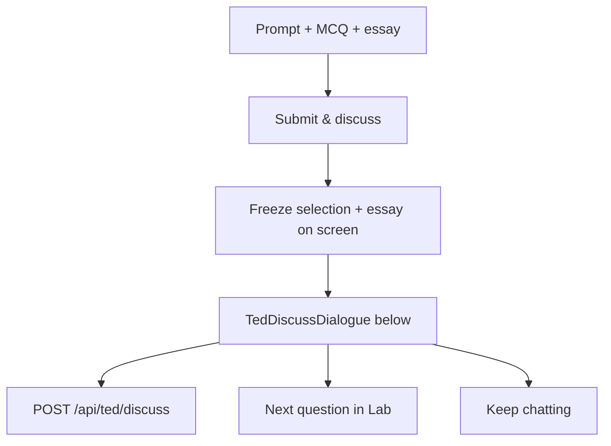

# TED Challenge · Inline Discuss (stay on Lab)

> **Subsystem document** — part of [Spark Design Docs](../DESIGN.md)  
> Status: **active** · 2026-08-11  
> Supersedes homepage redirect in [ted-challenge-hybrid-mcq.md](ted-challenge-hybrid-mcq.md) for Submit & discuss UX.

---

## Problem

Submit & discuss previously stashed a kickoff and navigated to `/` so TutorShell could auto-send. Students lost sight of the **prompt, options, and essay** while chatting; the jump felt abrupt.

## Approach

**Artifact + chat (same page):** keep TedLab challenge UI frozen after submit; open a **discuss panel below** the essay (WritingMentorDialogue pattern).



1. On submit: validate essay ≥3; record learning turn; **do not** `location.href = "/"`.
2. Seed discuss session from kickoff payload (talk, prompt, choices, selection, essay).
3. First AI turn opens Socratically (local fallback if agent fails).
4. Follow-ups via same API with history.
5. When `detectTedCoherenceSignal` fires, strengthen “Next question” CTA; Next advances `qi` in Lab.
6. Homepage TutorShell kickoff/resume remains **legacy** (sessionStorage helpers kept; Lab no longer navigates).

### API

`POST /api/ted/discuss`

```json
{
  "action": "open" | "reply",
  "context": { "talkTitle", "speaker", "kind", "prompt", "choices", "selected", "essay" },
  "studentReply?": "...",
  "history?": [{ "role": "coach"|"you", "text": "..." }]
}
```

Returns `{ ok, reply }`.

## Key files

| File | Role |
|------|------|
| `src/lib/entertain/ted-discuss.ts` | Opener/reply prompts + local fallback |
| `src/app/api/ted/discuss/route.ts` | Rate-limited agent discuss |
| `src/components/TedDiscussDialogue.tsx` | Inline chat UI |
| `src/components/TedLab.tsx` | Submit stays on page; mount panel |
| `src/lib/entertain/ted-challenge-handoff.ts` | Kickoff message / coherence (shared) |

## Risks

| Risk | Mitigation |
|------|------------|
| Agent timeout | Local Socratic fallback |
| Student edits essay mid-chat | Freeze fields while discuss open |
| Double submit | Gate on `discussOpen` / busy |

## Test design

### Unit
- TD1 — `buildTedDiscussOpenerLocal` references prompt + essay; no correct-letter spoilers
- TD2 — `buildTedDiscussReplyLocal` asks a follow-up; coherence cue when student affirms
- TH* — existing handoff tests still pass

### Manual
- Submit → stay on Lab; panel below; original MCQ+essay visible
- Chat then Next → next item without homepage hop
