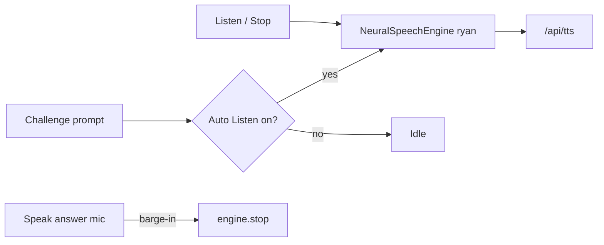

# TED Challenge · Prompt Listen (English TTS)

> **Subsystem document** — part of [Spark Design Docs](../DESIGN.md)  
> Status: **shipped** · 2026-08-11  
> Related: [voice-tts-stt.md](voice-tts-stt.md) · [ted-challenge-voice-input.md](ted-challenge-voice-input.md) · [listen-voice-sync-stop.md](listen-voice-sync-stop.md)

---

## Problem

TED Challenge prompts are English listening/reading questions. Students benefit from **hearing** the prompt (esp. phones), matching homepage history **Listen** — not the composer **Speak** toggle, and not the Challenge **Speak answer** mic row.

Prior request wording said “类似主页的 speak”; the intended control is homepage **Listen** (`speakOnce` / `NeuralSpeechEngine`).

## Approach

| Decision | Choice |
|----------|--------|
| Semantics | **Listen / Stop** on the prompt (ChatThread-style) |
| Auto | Default **on** — speak prompt when the question appears |
| Off | Account-scoped toggle stops auto + current TTS |
| Engine | Shared `getSharedSpeechEngine()` + English voice `ryan` |
| Gesture | Auto-play runs after Challenge start / Next (user clicks) so unlock works |
| Mic barge-in | Starting Speak-answer mic stops prompt Listen |
| Not this | Homepage Speak-on streaming; dialect voices for English prompts |



## Key files

| File | Role |
|------|------|
| `src/lib/entertain/ted-challenge.ts` | `load/saveTedPromptListenEnabled` (default on); `challengePromptSpeechText` (prompt + MCQ) |
| `src/components/TedLab.tsx` | Auto + Listen/Stop UI on challenge prompts |
| `src/components/MicTranscribeButton.tsx` | Optional `onRecordingStart` for barge-in |
| `src/lib/entertain/ted-challenge.test.ts` | Unit tests TL1–TL3, TS1–TS2 |

## Risks

| Risk | Mitigation |
|------|------------|
| Autoplay blocked without gesture | Trigger only after Ready / Next clicks; manual Listen still works |
| Confuse with Speak answer mic | Separate Listen row; keep Speak answer label for STT |
| Shared engine fights Tutor TTS | TED Lab is a separate route; stop on unmount / mic |

## Test design

### Unit

| ID | Case |
|----|------|
| TL1 | Default `loadTedPromptListenEnabled` → true |
| TL2 | `save…(false)` then load → false |
| TL3 | Account A off does not affect account B default |

### Manual

| ID | Case |
|----|------|
| TM-L1 | Enter Challenge → prompt auto-reads in English |
| TM-L2 | Toggle Auto Listen off → Next question silent; Listen button still works |
| TM-L3 | During Listen, Start mic → audio stops |
| TM-L4 | Listen / Stop labels (never Speak for prompt TTS) |

```bash
npm test -- src/lib/entertain/ted-challenge.test.ts
```
