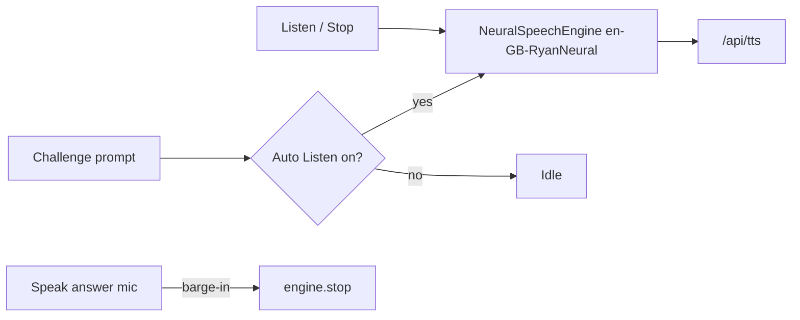

# TED Challenge · Prompt Listen (English TTS)

> **Subsystem document** — part of [Spark Design Docs](../DESIGN.md)  
> Status: **shipped** · 2026-08-11 (fix: Speak→Listen labels + Ryan hard-lock)  
> Related: [voice-tts-stt.md](voice-tts-stt.md) · [ted-challenge-voice-input.md](ted-challenge-voice-input.md) · [listen-voice-sync-stop.md](listen-voice-sync-stop.md)

---

## Problem

TED Challenge prompts are English listening/reading questions. Students benefit from **hearing** the prompt (esp. phones), matching homepage history **Listen** — not the composer **Speak** toggle, and not the Challenge **Speak answer** mic row.

Prior UI wrongly labeled the toggle **Speak on/off** / **Replay**. Also, `voiceId: "ryan"` alone still runs `resolveEdgeVoice`, which can switch to Cantonese/Mandarin when the prompt embeds non-English transcript hints — sounding “weird” vs homepage Ryan British English.

## Approach

| Decision | Choice |
|----------|--------|
| Semantics | **Listen / Stop** (ChatThread-style) + **Auto Listen** on/off |
| Auto | Default **on** — speak prompt when the question appears |
| Off | Account-scoped toggle stops auto + current TTS |
| Engine | Shared `getSharedSpeechEngine()` |
| Voice | Hard-lock `voice: "en-GB-RyanNeural"` (+ `voiceId: "ryan"`) so lang detection cannot override |
| Text | `challengePromptSpeechText` — prompt + optional numbered Choices |
| Persist | `spark.{acct}.tedPromptListen.v1` (legacy `tedChallengeSpeak` migrated) |
| Mic barge-in | Starting Speak-answer mic stops prompt Listen |
| Not this | Homepage Speak-on streaming; dialect voices for English prompts |



## Key files

| File | Role |
|------|------|
| `src/lib/entertain/ted-challenge.ts` | `load/saveTedPromptListenEnabled`; `challengePromptSpeechText` |
| `src/components/TedLab.tsx` | Auto Listen + Listen/Stop UI; Ryan hard-lock |
| `src/lib/speech-player.ts` | `voice` ShortName wins over `resolveEdgeVoice` |
| `src/components/MicTranscribeButton.tsx` | Optional `onRecordingStart` for barge-in |
| `src/lib/entertain/ted-challenge.test.ts` | Unit tests TL1–TL3, TS1–TS2 |
| `src/lib/speech-player.test.ts` | Unit: fixed `voice` not rewritten by lang detect |

## Risks

| Risk | Mitigation |
|------|------------|
| Autoplay blocked without gesture | Trigger after Ready / Next clicks; manual Listen still works |
| Confuse with Speak answer mic | Separate Listen row; keep Speak answer label for STT |
| Shared engine fights Tutor TTS | TED Lab is a separate route; stop on unmount / mic |
| Transcript hints in Chinese | Hard-lock Ryan edge voice — never dialect fallback |

## Test design

### Unit

| ID | Case |
|----|------|
| TL1 | Default `loadTedPromptListenEnabled` → true |
| TL2 | `save…(false)` then load → false |
| TL3 | Account A off does not affect account B default |
| TS1 | Prompt only → trimmed speech text |
| TS2 | Prompt + choices → numbered Choices suffix |
| TR1 | `resolveVoice` with `voice: en-GB-RyanNeural` + Chinese text → still Ryan |

### Manual

| ID | Case |
|----|------|
| TM-L1 | Enter Challenge → prompt auto-reads in **British Ryan** |
| TM-L2 | Auto Listen off → Next silent; Listen button still works |
| TM-L3 | During Listen, Start mic → audio stops |
| TM-L4 | Labels: Listen / Stop + Auto Listen (never Speak for prompt TTS) |

```bash
npm test -- src/lib/entertain/ted-challenge.test.ts src/lib/speech-player.test.ts
```
