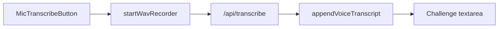

# TED Challenge · Voice Input

> **Subsystem document** — part of [Spark Design Docs](../DESIGN.md)  
> Status: **shipping** · 2026-08-11  
> Related: [entertainments.md](entertainments.md) §6.2 · [voice-tts-stt.md](voice-tts-stt.md)

---

## Problem

Studio TED Lab Challenge answers were **text-only**. Long critique / retell prompts are awkward to type on phones; students already use mic elsewhere (Tutor, Dictionary, Writing Studio).

## Approach

Reuse the shared **`MicTranscribeButton`** (16 kHz WAV → `POST /api/transcribe`) beside the Challenge textarea.

| Decision | Choice |
|----------|--------|
| STT stack | Existing Bailian / backup pipeline — **not** browser Web Speech API |
| UI | Compact mic next to answer field (same control as Writing Studio) |
| Language hint | `auto` default (TED prompts are English; bilingual answers OK) |
| Merge | Append transcript into current answer via `appendVoiceTranscript` |
| After "Check thinking" | Mic disabled while feedback is shown |



## Key files

| File | Role |
|------|------|
| `src/components/TedLab.tsx` | Wire mic + append into Challenge phase |
| `src/components/MicTranscribeButton.tsx` | Shared mic → STT (unchanged) |
| `src/lib/entertain/ted-challenge.ts` | `appendVoiceTranscript` helper |
| `src/lib/entertain/ted-challenge.test.ts` | Unit tests TV1–TV2 |

## Risks

| Risk | Mitigation |
|------|------------|
| HTTPS / mic permission | Same hints as MicTranscribeButton |
| Quiet / short clips | Existing silent + size guards |
| Overwrite typed draft | Append only, never replace |

## Test design

### Unit

| ID | Case |
|----|------|
| TV1 | Empty prev + transcript → transcript |
| TV2 | Non-empty prev + transcript → space-joined append |
| TV3 | Blank / whitespace transcript → prev unchanged |

### Integration / manual

| ID | Case |
|----|------|
| TM1 | Challenge phase: hold/tap mic → text appears in textarea |
| TM2 | Type then speak → both retained |
| TM3 | After Check thinking, mic disabled until Next |

```bash
npm test -- src/lib/entertain/ted-challenge.test.ts
```
