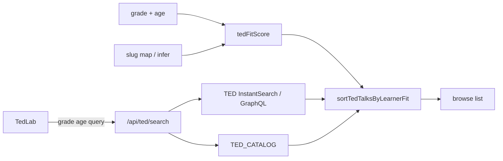

# TED Lab · Video list sorted by grade & age fit

> **Subsystem document** — part of [Spark Design Docs](../DESIGN.md)  
> Status: **shipped** · 2026-08-12  
> Related: [entertainments.md](entertainments.md) §6.2 · [ted-challenge-adaptive-difficulty.md](ted-challenge-adaptive-difficulty.md) · [grade-agnostic-adaptive.md](grade-agnostic-adaptive.md)

---

## Problem

TED Lab **challenge** already matches the active account’s **grade number + age + English level**. The **video list** does not: browse uses TED.com InstantSearch (newest / keyword relevance) and the curated fallback keeps author order (Ken Robinson first). A G4 / age-9 learner therefore sees 18–22 minute adult talks (Lewinsky, Kahneman, “psychopath test”) before short TED-Ed / classroom staples.

Teachers and Common Sense treat **TED-Ed** (~3–10 min, ~age 8+) differently from **TED stage talks** (often HS+). Kids get bored or distressed when the first screen is too long or too mature.

## Approach

1. **Audience metadata** (curated slugs) + **inference** (live hits): `gradeMin`–`gradeMax` and `maturity`: `all` | `caution` | `mature`.
2. **Fit score** `tedFitScore(talk, { grade, age })` — higher = better for this learner:
   - Effective grade = numeric grade, nudged ±1 if age is ≥2 years off `typicalAgeForGrade` (G + 5).
   - In recommended grade band → bonus; each year outside → penalty.
   - Duration vs grade: elementary prefers ≤8–12 min; long talks sink for G1–5.
   - `mature` heavy sink below G9; `caution` milder sink below G6–8.
   - TED-Ed / riddle / short-education heuristic boosts G≤8.
3. **Stable sort** `sortTedTalksByLearnerFit` — score desc, then shorter duration, then original index.
4. **Where it runs**
   - Curated filter + sort: `searchTedCatalogForLearner`
   - Live search / refresh: re-rank the returned page
   - Empty query page 0: **curated fit first**, then live hits (dedupe slug), so G4 opens on riddles / grit / Dweck, not TED newest
5. **API** `GET /api/ted/search?grade=&age=` from TedLab (same learner as challenge).
6. **UI** one caption: “Sorted for G4 · age 9”; optional `G3–8` chip from audience. No extra sort picker (product is adaptive, not a dashboard).



## Key files

| File | Role |
|------|------|
| `src/lib/entertain/ted-fit.ts` | Audience map, infer, score, sort, catalog-for-learner |
| `src/lib/entertain/ted-fit.test.ts` | TF1–TF8 unit tests |
| `src/lib/entertain/ted-search.ts` | Pass learner; empty-q merge; re-rank |
| `src/app/api/ted/search/route.ts` | `grade` / `age` query params |
| `src/components/TedLab.tsx` | Send learner; caption; dedupe append |
| `src/lib/entertain/ted-challenge.ts` | Reuse `typicalAgeForGrade` |

## Risks

| Risk | Mitigation |
|------|------------|
| Live TED has no age ratings | Infer from duration + keywords; curated map wins on known slugs |
| Empty browse used to feel “7000 live talks” | Keep live `nbHits`; page 0 is fit-first merge; Load more / Refresh still live |
| Over-hiding stretch talks | Sort only — never filter out; mature still reachable via search / later pages |
| Account switch leaves stale order | `runSearch` depends on grade/age |
| G4 default when grade missing | Same as challenge (`normalize` → 4) |

## Test design

### Unit

| ID | Case |
|----|------|
| TF1 | G4 / age 9: TED-Ed riddle + Dweck / Treasure / Pierson rank above Lewinsky + Ronson |
| TF2 | G11: mature / long talks are not forced to the bottom |
| TF3 | Age 7 vs G4 (young for grade) prefers even shorter / lower gradeMin talks |
| TF4 | `inferTedAudience` marks psychopath/shame titles `mature`; 4-min riddle stays `all` |
| TF5 | Sort is stable for equal scores (original order preserved) |
| TF6 | Empty-query merge: curated fit slug appears before an unmatched live hit |
| TF7 | `searchTedCatalogForLearner("", "science", G4)` all science + fit order |
| TF8 | Missing learner → behaves as G4 (Ryan-safe default) |

### Integration / manual

| ID | Case |
|----|------|
| TM-F1 | Ryan account: first row is short/classroom, not Lewinsky |
| TM-F2 | Switch to G10 account → list reorders without refresh button |
| TM-F3 | Type a query → live hits still appear, re-ranked |
| TM-F4 | Refresh batch still newest pool, then fit order within the batch |

```bash
npm test -- src/lib/entertain/ted-fit.test.ts src/lib/entertain/ted-search.test.ts src/lib/entertain/ted-catalog.test.ts src/app/api/ted/search/route.test.ts
```
