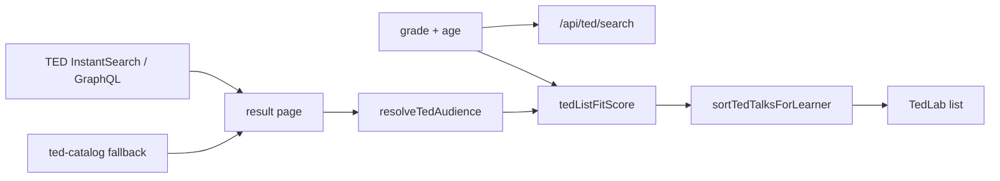

# TED Lab · List sort by grade / age fit

> **Superseded** by **[ted-lab-learner-fit-sort.md](ted-lab-learner-fit-sort.md)** (canonical).  
> Status: **redirect** · 2026-08-12

---

## Problem

TED Lab browse/search lists talks in **TED live order** (newest / keyword relevance) or **curated insertion order**. Challenge difficulty already uses **grade number + age + English level**, but a G4 student still sees 20-minute adult talks (Kahneman, Lewinsky, psychopath-test) before short classroom talks (Grit, TED-Ed riddles, Dweck).

TED InstantSearch / GraphQL expose **no official age rating**. Common Sense rates TED-Ed **8+** (tweens/teens). Teacher roundups (WeAreTeachers) split **K–5 vs 6–12** and repeatedly pick Grit, Ken Robinson, Cain, Urban for school use; “The danger of a single story” is a high-school pick.

## Approach

1. **Do not hide talks** — re-rank only. Paste-URL and Load more still work.
2. **Primary key = numeric grade (1–12)**; **age** is a soft nudge vs typical age-for-grade (`grade + 5`, so G4 ≈ 9).
3. **Audience range** per talk:
   - Curated slug table (`CURATED_TED_GRADE_RANGE`) for the local catalog + known live hits.
   - Heuristic for unknown live hits: duration bands + TED-Ed / kid / mature keyword cues.
4. **`tedListFitScore`** (0–100): in-range bonus (closer to midpoint = higher); out-of-range distance penalty (too-hard punished more than too-easy); mature penalty if grade ≤8 or age < 13; short talks boosted for ≤G5.
5. **`sortTedTalksForLearner`**: score desc → duration (shorter first if ≤G5) → slug.
6. **Wire**: `GET /api/ted/search?grade=&age=` sorts live pages, refresh batches, and curated fallback. TedLab sends active Studio account grade/age and re-sorts after “Load more” merge.
7. **UI**: status line “Sorted for Grade N · age A”; optional `G3–8` chip on each row from stamped `gradeMin`/`gradeMax`.

Missing grade/age → **G4 / age 9** (same Ryan-safe default as Challenge).



## Key files

| File | Role |
|------|------|
| `src/lib/entertain/ted-list-fit.ts` | Audience table, infer, score, sort |
| `src/lib/entertain/ted-list-fit.test.ts` | TL1–TL7 |
| `src/lib/entertain/ted-catalog.ts` | Optional `gradeMin` / `gradeMax` on `TedTalk` |
| `src/lib/entertain/ted-search.ts` | Sort live + fallback + refresh |
| `src/app/api/ted/search/route.ts` | Parse `grade` / `age` query |
| `src/components/TedLab.tsx` | Pass learner; hint + grade chip |

## Risks

| Risk | Mitigation |
|------|------------|
| Heuristic mis-tags a live talk | Curated slug wins; never filter out; keyword list conservative |
| Re-ranking a TED page ≠ global corpus rank | Accept page-local sort; Load more then re-sort merged list |
| Query relevance lost | TED already filtered the page; we only re-order hits |
| Mature content still reachable | Sort last for young learners; no COPPA claim |
| Pagination flicker | Stable slug tie-break |

## Test design

### Unit

| ID | Case |
|----|------|
| TL1 | G4: Grit / TED-Ed riddle / Dweck rank above Kahneman / Lewinsky |
| TL2 | G11: Kahneman / Harari rank above TED-Ed riddle |
| TL3 | Mature slug penalized when grade ≤6 or age < 13 |
| TL4 | Sort never drops talks; same set |
| TL5 | Unknown short live hit ranks higher than 20min hit for G3 |
| TL6 | Age 14 + grade 6 lifts a slightly-harder talk vs age 11 |
| TL7 | `typicalAgeForGrade(4) === 9` |

### Integration / manual

| ID | Case |
|----|------|
| TM-L1 | Ryan (G4) browse: short classroom talks near top |
| TM-L2 | Switch to G10 account → list reorders (harder / longer first-ish) |
| TM-L3 | Search “grit” still returns Grit; sort only among hits |
| TM-L4 | Load more: merged list still grade-sorted |
| TM-L5 | Network fail → curated fallback also grade-sorted |

```bash
npm test -- src/lib/entertain/ted-list-fit.test.ts src/lib/entertain/ted-search.test.ts src/lib/entertain/ted-catalog.test.ts
```
