# 🧪 Testing Design & Strategy

> **Subsystem document** — part of [Spark Design Docs](../DESIGN.md)

---

## 1. Testing Philosophy

> **For a 9-year-old user, a bug is not just a crash — it's a moment of confusion that breaks trust.**

Spark's testing strategy follows three principles:

1. **Pure logic is pure unit-tested** — BKT, prompt assembly, TTS text cleaning, SVG repair, skill inference: all run in vitest with zero external dependencies
2. **Integration boundaries have smoke verifiers** — Voice, STT, file upload, diagram rendering, chat streaming: each has a `verify-*.mjs` script that hits real services
3. **Regression tests for every production bug** — Each bug fix ships with a test that reproduces the exact failure (e.g., collapsed SVG streaming, TTS speaking diagram markup)

### Test Pyramid



## 2. Current Test Inventory

### 2.1 Unit Tests (23 files, ~155 blocks, all vitest)

All tests live in `src/lib/` alongside the modules they test.

| Category | Files | Coverage |
|----------|-------|----------|
| **Memory & BKT** | `bkt.test.ts` (10), `learning-memory.test.ts` (7), `skill-catalog.test.ts` (9) | BKT update (correct/incorrect/practice), mastery helpers, topic inference, skill confidence parsing, strengths/weaknesses, prompt rendering |
| **Voice & TTS** | `voices.test.ts` (15), `tts-text.test.ts` (16), `stt-lang.test.ts` (3), `media.test.ts` (6), `wav-recorder.test.ts` (4) | Voice normalization, language detection (zh→yue, es, en), TTS text cleaning (markdown, LaTeX, SVG silence), streaming sentence extraction, WAV encoding |
| **Agent & Prompt** | `prompts.test.ts` (8), `tutor-harness.test.ts` (7), `tutor-text-filter.test.ts` (7) | Prompt assembly (profile/memory/engagement/voice locking), Python/JS sandbox, meta-narration scrubbing, streaming delta filter |
| **Geometry & Diagrams** | `geometry-svg.test.ts` (11), `svg-persist-tts.test.ts` (5), `diagram-tts.test.ts` (2) | SVG sanitize/repair/encode, streaming collapse repair, production bug reproductions, diagram persistence in TTS |
| **Storage & History** | `storage.test.ts` (9), `history-store.test.ts` (4), `history-merge.test.ts` (5), `history-retention.test.ts` (7), `media-store.test.ts` (4) | Session IDs, message limits, server persistence (CRUD), merge logic, retention pruning, media cleanup |
| **Attachments & Upload** | `attachments.test.ts` (7), `extract-files.test.ts` (4) | MIME detection, data-URI stripping, attachment caps, file extraction, PDF text |
| **Profile & Session** | `student-profile.test.ts` (3), `session-store.test.ts` (3) | Default profile rendering, agent ID LRU store |

### 2.2 Integration Verification Scripts (7 files)

| Script | What It Verifies |
|--------|-----------------|
| `verify-voice.mjs` | STT/TTS backend health, TTS synthesis for all voices, long-reply chunking, WAV transcribe, race-condition fix |
| `verify-tts.mjs` | All 6 Edge voices via server + `/api/tts` + HTTPS, streaming sequential sentences, TTS unit tests, Unicode/punctuation, rapid-fire parallel TTS (5 concurrent) |
| `verify-stt.mjs` | STT health check (model strength, SenseVoice), TTS→WAV→STT round-trip for EN/ZH/Yue/ES, auto-detect via proxy |
| `verify-history.mjs` | Runs 4 vitest files (storage, retention, merge, history-store) as batch |
| `verify-upload.mjs` | Attachment helpers, file generation (PNG/PDF/text), multi-upload chat probes (3 rounds HTTP + HTTPS), pdftotext |
| `verify-system.mjs` | Setup/config health, voice health, models list, API validation, chat SSE (EN + ZH lock), home page, history CRUD, learning memory cross-session |
| `verify-diagrams.mjs` | Unit tests for svg-persist-tts + tts-text, diagram helpers, live chat SSE with `draw_geometry` tool, diagram presence + TTS silence |

### 2.3 Test Execution

```bash
# Unit tests only (~155 blocks, ~5s)
npm test

# Full suite (unit + 7 integration verifications, ~3min)
npm run verify:all
```

## 3. Test Gap Analysis

### 3.1 Critical Gaps (🔴 — No Coverage)

| Module | Path | Risk | Why Critical |
|--------|------|------|-------------|
| **Cursor Agent** | `cursor-agent.ts` | 🔴 | Core AI interaction layer — untested. If the SDK call fails, the user gets silence. |
| **Chat SSE Endpoint** | `app/api/chat/route.ts` | 🔴 | Main chat endpoint — only exercised by integration verifiers that depend on live Cursor Cloud. No isolated mock tests for prompt assembly, memory merge, error handling. |
| **Speech Player** | `speech-player.ts` | 🔴 | Browser-side TTS playback queue — untested. Mobile audio autoplay, abort/cancel, queue management all unverified. |
| **History Sync** | `history-sync.ts` | 🔴 | Multi-device sync logic — untested (only `history-merge` is tested). Sync failures could lose conversation history. |
| **UI Components** | All `.tsx` files | 🔴 | Zero React component tests. `TutorShell.tsx` (700 lines), `Composer.tsx`, `MarkdownMessage.tsx`, `DiagramBlock.tsx` — all untested. |

### 3.2 High-Risk Gaps (🟡 — Minimal Coverage)

| Module | Path | Current Coverage |
|--------|------|-----------------|
| **Engagement** | `engagement.ts` | 1 test in `student-profile.test.ts` — no own test file for streak logic, badge unlocking, daily reset |
| **Photo Vault** | `photo-vault.ts` | Untested — IndexedDB photo cache |
| **Image Processing** | `image-process.ts` | Untested — image resize/format pipeline |
| **File Payload** | `file-payload.ts` | Untested — file handling for uploads |
| **API Routes (8 total)** | All `src/app/api/**/route.ts` | Only indirect coverage via verify scripts; no route-level unit tests for error codes, validation, edge cases |

### 3.3 Coverage for Planned Features (v0.3+)

| Feature | Tests Needed |
|---------|-------------|
| SM-2 forgetting decay (`bkt.ts` + `learning-memory.ts`) | `bkt.test.ts`: decay curve correctness, ease-factor clamping, days-since-last-review weighting |
| ZPD scoring (`bkt.ts`) | `bkt.test.ts`: P(solve) computation, geo-mean joint, closeness to target=0.7 |
| Confidence-weighted BKT (`learning-memory.ts`) | `learning-memory.test.ts`: high-conf+wrong→large penalty, low-conf+correct→small gain |
| Elo-hybrid difficulty (`bkt.ts`) | `bkt.test.ts`: Elo update equation, dynamic K-value, difficulty→BKT param mapping |
| Singapore bar-model geometry (`geometry-svg.ts`) | `geometry-svg.test.ts`: horizontal/vertical bars, comparison models, part-whole, label positioning, overflow |
| Multi-lingual word-problem parsing (`skill-catalog.ts`) | `skill-catalog.test.ts`: EN+ZH mixed detection, language preservation, code-switching handling |
| Photo-first OCR workflow (`Composer.tsx` + `image-process.ts`) | Component test for camera → upload → chat flow; `image-process.test.ts` for resize/format; `photo-vault.test.ts` for IndexedDB read/write |
| Voice-only mode (`speech-player.ts` + `Composer.tsx`) | `speech-player.test.ts`: queue management, abort/cancel, autoplay on mobile, fallback on error |
| Progressive disclosure (`MarkdownMessage.tsx`) | Component test for click-to-reveal state transitions |
| PWA offline mode (`layout.tsx` + service worker) | E2E test: offline load, cached chat history, re-sync on reconnect |

## 4. Test Architecture by Layer

### 4.1 Unit Test Pattern

All unit tests follow this pattern:

```typescript
import { describe, it, expect } from 'vitest';

describe('moduleName', () => {
  describe('functionName', () => {
    it('does X given Y', () => {
      const result = functionName(y);
      expect(result).toEqual(x);
    });

    it('handles empty input gracefully', () => {
      expect(() => functionName('')).not.toThrow();
    });

    it('reproduces bug #123', () => {
      // Exact inputs from production failure
      const result = functionName(bugInput);
      expect(result).not.toContain('broken');
    });
  });
});
```

**Rules:**
- No mocking external services in unit tests — test pure logic only
- Always include an empty/null/undefined edge-case test
- Every production bug gets a named repro test (`reproduces collapsed SVG from streaming`)
- Use `describe` nesting: module → function → behavior

### 4.2 Integration Verification Pattern

```javascript
// scripts/verify-{subsystem}.mjs
import { strict as assert } from 'node:assert';

const BASE = 'http://127.0.0.1:3000';

async function run() {
  // 1. Health check
  const h = await fetch(`${BASE}/api/health`);
  assert.strictEqual(h.status, 200, 'health check');

  // 2. Core functionality
  const r = await fetch(`${BASE}/api/endpoint`, { method: 'POST', body: ... });
  assert.strictEqual(r.status, 200, 'endpoint returns 200');
  const data = await r.json();
  assert.ok(data.result, 'result is present');

  // 3. Edge case
  const e = await fetch(`${BASE}/api/endpoint`, { method: 'POST', body: '' });
  assert.strictEqual(e.status, 400, 'empty body returns 400');

  console.log('PASS  subsystem health');
  console.log('PASS  core functionality');
  console.log('PASS  edge case');
  console.log('\n=== ALL PASSED ===');
}

run().catch(e => { console.error('FAIL', e.message); process.exit(1); });
```

**Rules:**
- Each verify script is self-contained and idempotent
- Prints `PASS`/`FAIL` lines compatible with CI log scanners
- `=== ALL PASSED ===` final line signals completion

### 4.3 Future: Component Tests (React Testing Library)

For Phase 0 UI testing:

```typescript
// src/components/TutorShell.test.tsx (planned)
import { render, screen, fireEvent } from '@testing-library/react';
import { describe, it, expect } from 'vitest';

describe('TutorShell', () => {
  it('renders chat input on load', () => {
    render(<TutorShell />);
    expect(screen.getByPlaceholderText(/ask anything/i)).toBeInTheDocument();
  });

  it('sends message on Enter', async () => {
    const { getByPlaceholderText } = render(<TutorShell />);
    const input = getByPlaceholderText(/ask anything/i);
    fireEvent.change(input, { target: { value: 'Help with fractions' } });
    fireEvent.keyDown(input, { key: 'Enter' });
    // Assert message appears in chat
  });
});
```

### 4.4 Future: API Route Unit Tests

```typescript
// src/app/api/chat/route.test.ts (planned)
import { describe, it, expect, vi } from 'vitest';

describe('POST /api/chat', () => {
  it('returns 400 with missing learningMemory', async () => {
    const req = new Request('http://localhost/api/chat', {
      method: 'POST',
      body: JSON.stringify({ text: 'hello' }),
    });
    const res = await POST(req);
    expect(res.status).toBe(400);
  });
});
```

## 5. Regression Test Catalog (Production Bugs)

Every production bug discovered in Spark gets a dedicated test. This catalog is maintained to prevent regressions:

| Bug | Test Location | Symptom | Fix |
|-----|--------------|---------|-----|
| Collapsed SVG from streaming | `geometry-svg.test.ts: "repairs space-collapsed SVG from production"` | `svg<svgxmlns=...viewBox="00320240"` rendered as text | `repairCollapsedSvg()` regex chain |
| TTS reading SVG markup | `tts-text.test.ts: "clean speech drops SVG"` | Voice: "svg xmlns equals http colon slash slash..." | `cleanTutorSpeechText()` strips all diagram content |
| Percent-encoded SVG not rendering | `geometry-svg.test.ts: "repairs percent-encoded data-uri"` | `%3Csvg%20xmlns%3D...` rendered as text | `reencodeDiagramDataUris()` → base64 |
| Diagram stripped in `preferCompleteTutorText` | `geometry-svg.test.ts: "keeps data-uri images"` | Diagrams lost during text selection | `preferCompleteTutorText` preserves data URIs |
| Cantonese detected as Mandarin | `voices.test.ts: "detect Mandarin → Yue"` | Voice spoke 普通话 instead of 粤语 | `detectSpeechLang` defaults Chinese to `yue` |
| `softBktUpdate` mastery ceiling | `bkt.test.ts: "slip does not crash when fully mastered"` | P(known) dipped below expected floor after slip on mastered skill | Adjusted expectation + clamping at 0.001 |

## 6. CI Pipeline (Planned)

```yaml
# .github/workflows/ci.yml (planned)
name: CI
on: [push, pull_request]
jobs:
  unit:
    runs-on: ubuntu-latest
    steps:
      - uses: actions/checkout@v4
      - uses: actions/setup-node@v4
      - run: npm ci
      - run: npm test

  build:
    runs-on: ubuntu-latest
    steps:
      - uses: actions/checkout@v4
      - uses: actions/setup-node@v4
      - run: npm ci
      - run: npm run build

  integration:
    needs: build
    runs-on: [self-hosted, spark]
    steps:
      - uses: actions/checkout@v4
      - run: npm run verify:all
```

## 7. Test Coverage Targets

| Layer | Current | Target v0.3 | Target v1.0 |
|-------|---------|------------|-------------|
| `src/lib/*.ts` (pure logic) | ~85% | 90% | 95% |
| `src/app/api/**/route.ts` (API) | ~30% (integration only) | 60% | 80% |
| `src/components/*.tsx` (UI) | 0% | 40% | 70% |
| Integration verifiers | 7 scripts | 10 scripts | 12 scripts |
| CI pipeline | None | GitHub Actions | GitHub Actions + self-hosted |
