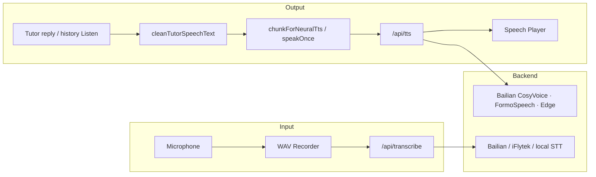

# 🎙️ Voice, TTS & STT

> **Subsystem document** — part of [Spark Design Docs](../DESIGN.md)  
> Status: **shipped** · updated 2026-08-10

---

## Architecture



## Voice Inventory (UI labels)

Picker labels show **language only** — no engine names (avoids wrap / noise).

| Voice ID | UI label | Speech lang | TTS routing (internal) |
|----------|----------|-------------|------------------------|
| `auto` | Auto (粤语优先) | auto | edge by detected lang |
| `ryan` / `ava` | Ryan / Ava (English) | en | edge |
| `yunxi` | Yunxi (Mandarin) | zh | edge |
| `wanLung` | WanLung (Cantonese) | yue | edge |
| `alvaro` / `jorge` | Álvaro / Jorge (Spanish) | es | edge |
| `henri` | Henri (French) | fr | edge |
| `osman` | Osman (Bahasa Melayu) | ms | edge |
| `teochew` | Hokkien (闽南话) | teo | Bailian CosyVoice (edge fallback) |
| `hakka` | Hakka (客家话) | hak | FormoSpeech |
| `shanghainese` | Shanghainese (上海话) | sha | edge Cantonese + `normalizeForTTS` |

## History message replay (one-click Listen)

Finished **assistant** bubbles show a **Listen / Stop** control under the message (`ChatThread`).

| Piece | Behavior |
|-------|----------|
| `SpeakStreamApi.speakOnce(text, voiceId)` | Replays cleaned text with the **current account’s** voice (works even if auto-Speak is off) |
| `TutorShell.speakingMessageId` | Highlights the active Listen button; Stop clears it |
| Streaming bubble | No Listen until the reply finishes |
| Voice prefs | `loadVoiceId` / `saveVoiceId` are **account-scoped** (`VoiceControls` must receive `accountId`) — see [listen-voice-sync-stop.md](listen-voice-sync-stop.md) |
| teo TTS | Bailian only; **no Cantonese edge fallback** (503 if unavailable) |

## Translate to English

Same row as Listen: **EN English** → `POST /api/translate-en` → Google gtx (`sl=auto`) after `cleanTutorSpeechText`. Shows a compact English panel under the bubble (toggle Hide). Already-English text is returned as-is without MT.
| Stop | `NeuralSpeechEngine.stop()` aborts in-flight `/api/tts` and clears `audio.src` |

## Language Detection

`detectSpeechLang()`:
- CJK ≥ 4 + Han ≥ Latin → **粤语** (family default)
- Spanish markers (`¿¡ñ`) → Español
- Otherwise → English

## TTS Text Cleaning

`cleanTutorSpeechText()` / streaming `pullSpeakableFromBuffer()`:

- Strips ```svg / ```mermaid fences, bare `<svg>`, data-URIs, mid-stream CSS leftovers
- Diagram masks use a private-use char (`\uE000`), **not spaces** — soft-breaks must not cut inside SVG `<style>` (regression: speaking `font-family` / `@keyframes`)
- `/api/tts` also runs `cleanTutorSpeechText` at entry (belt & suspenders)
- LaTeX → speech: `\frac{1}{2}` → "1 over 2", `x^2` → "x squared"
- Removes markdown chrome; joins CJK without Latin spaces

## Streaming TTS

`chunkForNeuralTts()` splits at sentence boundaries. `pullSpeakableFromBuffer()` yields speakable phrases while streaming and **never** soft-breaks into a complete or incomplete diagram payload.

## Test design

| ID | Case |
|----|------|
| V-L1 | Voice labels for teo/hak/sha contain language name, not `TTS` / `FormoSpeech` / `百炼` |
| V-L2 | `speakOnce` API exists on `SpeakStreamApi` |
| V-S1 | Streaming buffer with fenced SVG + `<style>` never speaks `font-family` / `@keyframes` |
| V-S2 | Full session with ```svg cleans to prose only via `cleanTutorSpeechText` |

## Files

| File | Role |
|------|------|
| `src/lib/tts-text.ts` | Speech cleaning, chunking, streaming buffer |
| `src/lib/tts-text.test.ts` / `diagram-tts.test.ts` | Cleaning + no-speak-diagram regressions |
| `src/lib/voices.ts` | Voice definitions (short UI labels) |
| `src/lib/speech-player.ts` | TTS queue; re-cleans in `enqueueChunk` |
| `src/app/api/tts/route.ts` | TTS proxy (dialect + edge) |
| `src/components/VoiceControls.tsx` | Mic / Speak / picker + `speakOnce` |
| `src/components/ChatThread.tsx` | History **Listen / Stop** |
| `src/components/TutorShell.tsx` | Wires `speakingMessageId` ↔ speak API |

## UI chrome vs tutoring language

Voice **picker labels and hints** stay short and language-first. TTS preview strings and agent reply language remain multilingual; Cantonese stays the Chinese family default.
