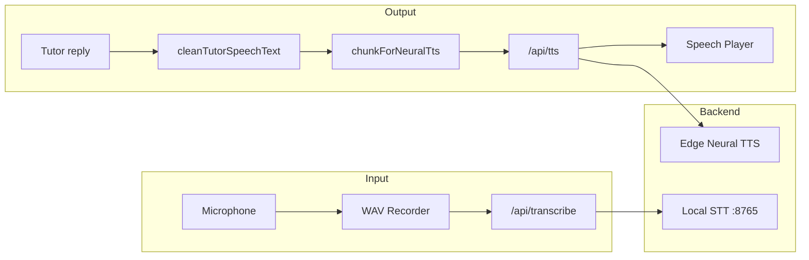

# 🎙️ Voice, TTS & STT

> **Subsystem document** — part of [Spark Design Docs](../DESIGN.md)

---

## Architecture

## Voice Inventory

| Voice ID | Language | Neural Voice ID |
|----------|----------|----------------|
| `ava` | English (US) | `en-US-AvaNeural` |
| `ryan` | English (GB) | `en-GB-RyanNeural` |
| `yunxi` | 普通话 | `zh-CN-YunxiNeural` |
| `wanLung` | 粤语 | `zh-HK-WanLungNeural` |
| `alvaro` | Español (ES) | `es-ES-AlvaroNeural` |
| `jorge` | Español (MX) | `es-MX-JorgeNeural` |

## Language Detection

`detectSpeechLang()`:
- CJK ≥ 4 + Han ≥ Latin → **粤语** (family default)
- Spanish markers (`¿¡ñ`) → Español
- Otherwise → English

## TTS Text Cleaning

`cleanTutorSpeechText()`:
- Strips diagrams and data-URI junk
- LaTeX → speech: `\frac{1}{2}` → "1 over 2", `x^2` → "x squared", `\sqrt{2}` → "square root of 2"
- Removes markdown chrome, code fences, blockquote formatting
- Collapses whitespace, joins CJK without Latin spaces

## Streaming TTS

`chunkForNeuralTts()` splits at sentence boundaries (max 280 chars). `pullSpeakableFromBuffer()` yields complete sentences early while streaming — no waiting for the full reply.

## Files

| File | Role |
|------|------|
| `src/lib/tts-text.ts` | Speech cleaning, chunking, streaming buffer |
| `src/lib/tts-text.test.ts` | 11 tests |
| `src/lib/voices.ts` | Voice definitions, lang detection, TTS resolution |
| `src/lib/voices.test.ts` | Voice / language tests |
| `src/lib/speech-player.ts` | Mobile-first TTS queue with abort/cancel |
| `src/lib/wav-recorder.ts` | Browser mic → WAV encoder |
| `src/api/tts/route.ts` | TTS proxy → Edge Neural |
| `src/api/transcribe/route.ts` | STT endpoint → local service |
| `scripts/stt_server.py` | faster-whisper + SenseVoice server |
| `src/components/VoiceControls.tsx` | Mic / Speak / voice picker UI — layout in [ui-composer.md](ui-composer.md) |

## UI chrome vs tutoring language

Voice **picker labels and hints** are English ([ui-composer.md](ui-composer.md) §6). TTS preview strings and agent reply language remain multilingual; Cantonese stays the Chinese family default.
