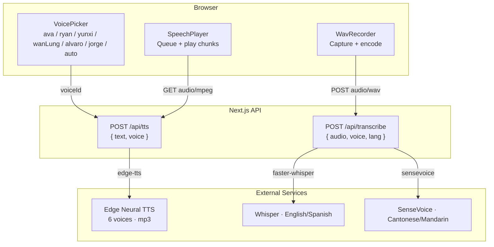
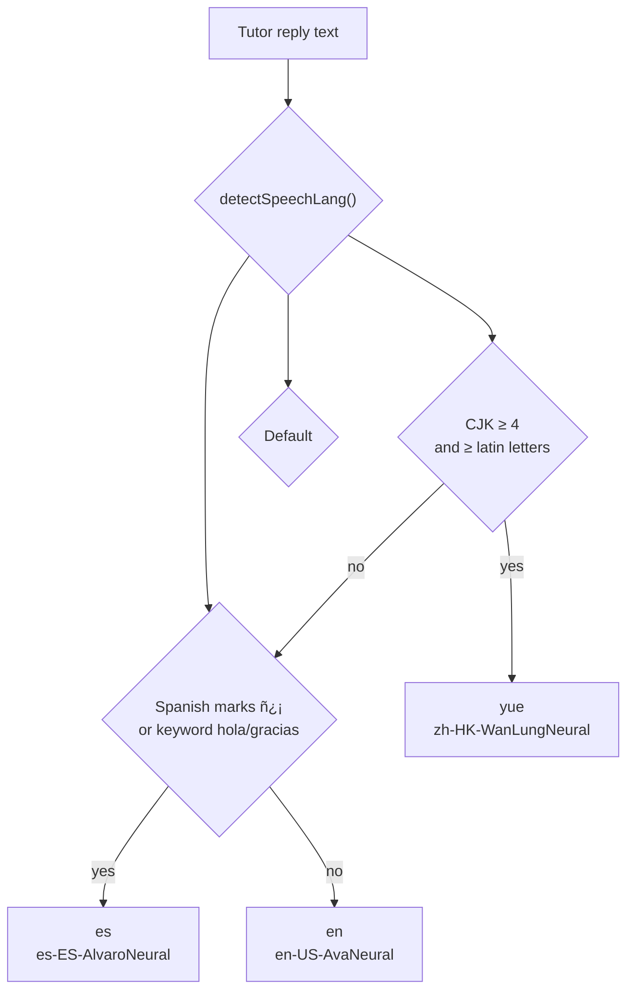
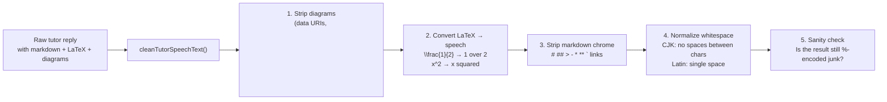
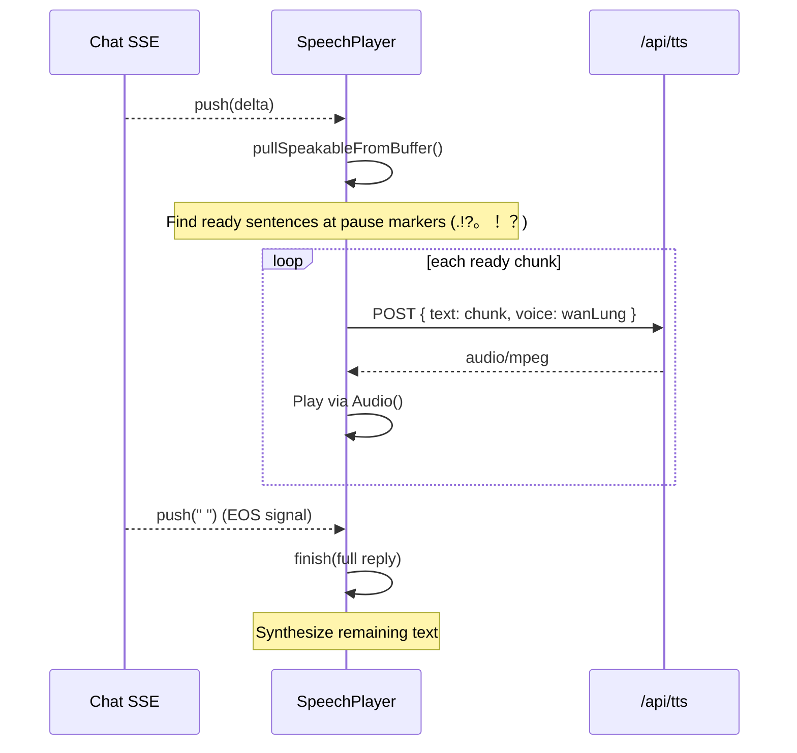
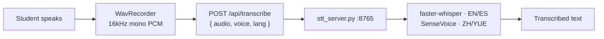

# Subsystem: Voice & TTS/STT

> Parent: [Design Overview](/docs/DESIGN.md)

---

## 1. Responsibility

Convert tutor text to spoken audio (TTS) and student speech to text (STT), with automatic language switching.

---

## 2. Voice Architecture

---

## 3. Language Detection

**Key rule:** All Chinese defaults to **粤语**. Mandarin only when the student explicitly picks the **云希** voice, or when the replyLanguage is set to `zh`.

---

## 4. TTS Text Cleaning

**LaTeX → Speech conversions:**

| LaTeX | Speech |
|-------|--------|
| `\frac{a}{b}` | a over b |
| `\sqrt{x}` | square root of x |
| `x^2` | x squared |
| `x^3` | x cubed |
| `\pm` | plus or minus |
| `\angle` | angle |
| `\triangle` | triangle |

---

## 5. Streaming Speech

Chunks are kept ≤ 280 chars for fast synthesis. Boundaries respect sentence punctuation (`.`, `!`, `?`, `。`, `！`, `？`).

---

## 6. Voice Picker

| Voice ID | Label | Edge Voice | Language |
|----------|-------|------------|----------|
| `auto` | Auto · 自适应 | Detected | Auto-detect |
| `ava` | Ava · English | en-US-AvaNeural | en |
| `ryan` | Ryan · British | en-GB-RyanNeural | en |
| `yunxi` | 云希 · 普通话 | zh-CN-YunxiNeural | zh |
| `wanLung` | WanLung · 粤语 | zh-HK-WanLungNeural | yue |
| `alvaro` | Álvaro · Español | es-ES-AlvaroNeural | es |
| `jorge` | Jorge · Mexicano | es-MX-JorgeNeural | es |

Legacy female voice IDs (`xiaoxiao`, `hiuMaan`, `elvira`, `dalia`) are auto-mapped to their male equivalents.

---

## 7. STT

The local STT backend auto-picks the engine based on the voice/language preference sent from the frontend.

---

## 8. Edge Cases

| Case | Handling |
|------|----------|
| TTS returns empty audio | `SpeechPlayer` skips; TTS returns 422 |
| STT silence | Returns `"Didn't catch speech"` + 422 |
| Quick sequential TTS calls | `SpeechPlayer` queues; concurrent Audio() instances allowed |
| Fixed EN voice + Chinese text | `resolveEdgeVoice` auto-switches to Cantonese |
| "Speak" toggle disabled mid-stream | `wantSpeakRef` aborts `push()` / `finish()` |
| Empty cleaned text | `cleanTutorSpeechText` returns `""` |

---

## Next: [History & Storage](history-storage.md)
