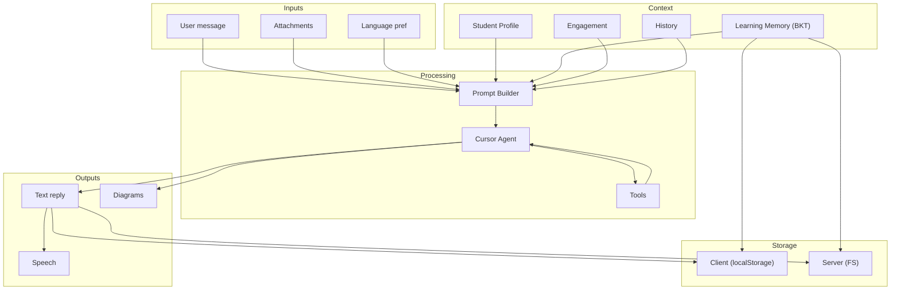

# 🔗 Synthesis: Cross-Cutting Design Rationale

> **总** — read after [DESIGN.md](DESIGN.md) and subsystem docs

---

## Why This Architecture

Spark is designed for a **single learner** (Ryan, age 9) with **no training data**, running on a **single server**. These constraints drove every architectural decision.

### Single-Learner → BKT, Not DKT or Elo

Deep Knowledge Tracing needs thousands of student logs to train neural networks. The Elo rating system was designed for ranking multiple players — it has no meaningful interpretation of "mastery" for a single person.

BKT models **mastery as a latent binary variable** updated by observations. This maps naturally to tutoring: "did Ryan understand fractions today?" The 4 parameters (pInit, pLearn, pSlip, pGuess) are interpretable by parents and teachers.

### Free-Form Tutoring → Soft Outcome Layer

Standard BKT assumes binary quiz items (correct/incorrect). Spark conversations are free-form Socratic dialogues. We bridge this gap with `softBktUpdate`: a 3-way outcome classifier (win/struggle/practice) that maps conversational signals to BKT observations.

### Streaming SSE → Repair + Sanitize + Base64

Models can emit malformed SVG in streaming mode (spaces collapse, tags glue). Our pipeline:
1. Repairs structural damage
2. Sanitizes dangerous content
3. Converts to base64 data URIs
4. Renders as `` outside markdown parsers

This three-layer defense ensures diagrams always render, even from broken streams.

### Cantonese Default → Language Detection Heuristics

Ryan's family speaks 粤语. `detectSpeechLang` uses CJK density + 粤语-specific character signals (`嘅`, `唔`, `係`) to default to Cantonese. The Yunxi (云希) voice is the only path to 普通话 — preserving the family default.

### TypeScript-Only → No Python Runtime

Every subsystem (BKT, SVG, prompts, harness, storage, sync, STT proxy) is TypeScript. The only Python is the local STT server (`scripts/stt_server.py`). This keeps deployment a single `npm run build` with no pip/conda dependency chains.

## Data Flow Summary

## Test Coverage

| Layer | Tests | Files |
|-------|-------|-------|
| Unit (Vitest) | 161 tests | 23 files |
| System verify | 8 scripts | `verify:*` |
| Build check | `next build` | CI |

Full suite: `npm run verify:all` (unit + history/upload/tts/stt/voice/diagrams/system).

## Key Files to Understand First

For new contributors, read in this order:

1. `src/lib/bkt.ts` — Bayesian knowledge tracing core (50 lines)
2. `src/lib/skill-catalog.ts` — Skill definitions (150 lines)
3. `src/lib/learning-memory.ts` — Memory lifecycle (400 lines)
4. `src/lib/prompts.ts` — Prompt assembly (270 lines)
5. `src/lib/geometry-svg.ts` — SVG pipeline (500 lines)
6. `src/components/TutorShell.tsx` — Main orchestrator (700 lines)

## Design Principles

1. **No early answers** — Socratic hint ladder before solution
2. **Explain your reasoning** — L1.5 asks WHY before right/wrong
3. **Second chances** — L2.5 allows self-correction
4. **粤语 first** — Cantonese default, 普通话 only on explicit voice choice
5. **Diagrams always render** — Triple defense repair pipeline
6. **TTS never reads markup** — `cleanTutorSpeechText` strips everything non-speech
7. **Client-first, server-safe** — localStorage primary, server for cross-device sync
8. **No Python in production path** — TypeScript-only (except optional STT server)
