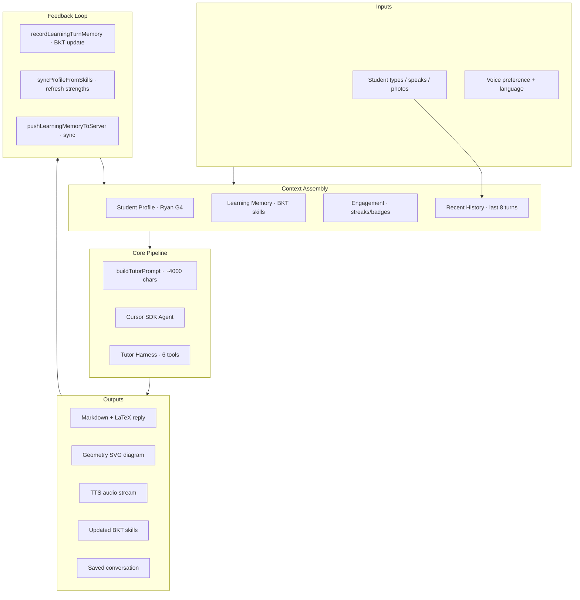
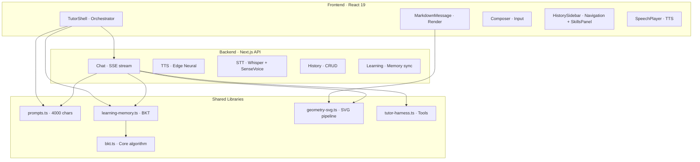
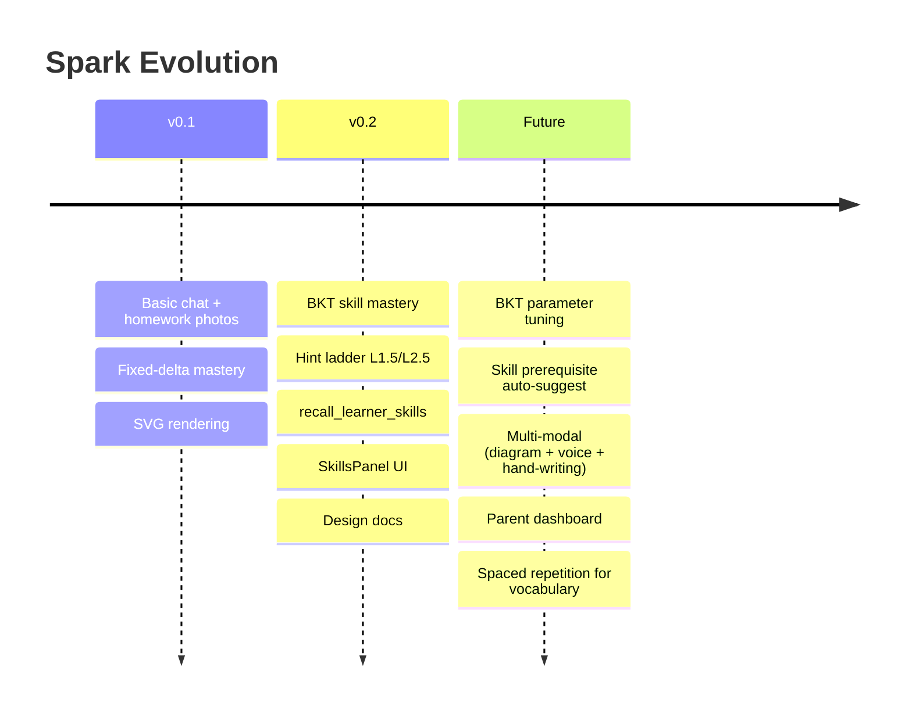

# Spark AI Tutor — Design Synthesis

> Parent: [Design Overview](/docs/DESIGN.md)  
> After: [Agent](subsystems/agent-prompt.md) · [Memory](subsystems/learning-memory.md) · [Diagrams](subsystems/geometry-diagrams.md) · [Voice](subsystems/voice-tts.md) · [History](subsystems/history-storage.md) · [Security](subsystems/security.md)

---

## Cross-Cutting Data Flow

---

## Interaction Matrix

| | Agent | Memory | Diagrams | Voice | History | Security |
|---|-------|--------|----------|-------|---------|----------|
| **Agent** | — | Reads BKT skills via `recall_learner_skills` | Calls `draw_geometry` tool | Prompt includes TTS audience hint | Reads history for context | Uses sanitized inputs |
| **Memory** | Reads before prompt; writes after turn | — | — | — | Stores to JSON file | Validates on normalize |
| **Diagrams** | Agent emits SVG | — | — | Stripped from TTS text | Saved in message content | Sanitized for XSS |
| **Voice** | Prompt includes "short for phone + TTS" | — | SVG stripped | — | — | — |
| **History** | Prompt includes last 8 turns | — | — | — | — | Truncation caps |
| **Security** | Sanitizes model output | Normalizes inputs | SVG sanitize | — | — | — |

---

## Key Design Principles

| Principle | Implementation |
|-----------|---------------|
| **No final answers first** | Hint ladder L0 → L3 + L1.5/L2.5 in every prompt |
| **Probabilistic mastery** | BKT replaces fixed deltas; guess/slip modeled |
| **Single learner** | No auth; every prompt is for Ryan |
| **Degrade gracefully** | SVG repair → fallback code block; TTS → skip empty; sync → local-only offline |
| **Local-first** | Browser storage primary; server is cache + cross-device sync |
| **Mobile-friendly** | Short replies, TTS-first, no WebGL dependencies |
| **Observe, don't narrate** | Tool calls are silent; status filtered from student view |

---

## Component Ownership

---

## Performance & Scalability

| Metric | Current | Ceiling | Notes |
|--------|---------|---------|-------|
| Prompt size | ~4000 chars | ~8000 chars (SDK) | Headroom for more context |
| Chat stream latency | ~2-5s first token | <1s TTFB | Depends on Cursor model |
| TTS chunk latency | ~500ms per 280-char chunk | — | Edge CDN proximity |
| Messages total | ~200 (dev) | 1000 | Oldest-trim after cap |
| SVG diagrams per reply | 1-2 | 5 | Each ~8KB base64 |
| BKT skills | 14 defined | 50+ | Skill catalog extensible |
| Browser storage | ~2MB (typical) | 5MB (localStorage limit) | Photo vault in IndexedDB |

---

## Known Limitations

| Limitation | Impact | Mitigation |
|------------|--------|------------|
| Single voice per reply | If reply mixes EN + ZH, only one voice used | Rare; accepted tradeoff |
| Mermaid on mobile WebViews | Older WebKit lacks full SVG support | Fallback to raw code block |
| BKT parameters static | Not tuned from real data | Conservative defaults; G4-appropriate |
| No undo for skill updates | Wrong turn outcome skews mastery | Merge prefers higher mastery; low impact |
| TTS reads LaTeX as audio (e.g. "square root of 2") | Sometimes reads both LaTeX + speech version | Prompt asks AI to include plain-word alongside LaTeX |
| Server sync is eventual | Offline turns update local only; merge on next online | Merge logic handles conflicts |

---

## Evolution Path

---

## Summary

Spark's design centers on a single constraint: **Ryan must think before the tutor answers**. Every subsystem — the hint ladder, the BKT skill model, the geometry tool, the voice pipeline — serves that goal. The architecture is local-first, probabilistically grounded, and mobile-tolerant. With the v0.2 BKT integration, it now tracks not just what topics Ryan has seen, but how likely he is to _know_ each skill — and uses that to adapt every interaction.
