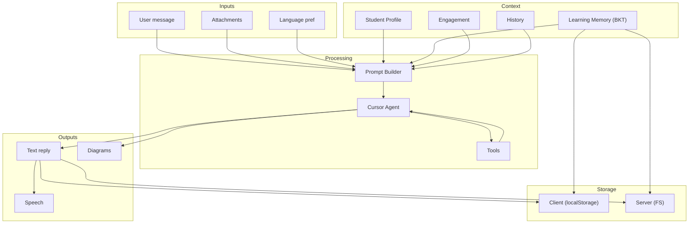

# 🔗 Synthesis: Cross-Cutting Design Rationale

> **总** — read after [DESIGN.md](DESIGN.md) and subsystem docs

---

## Why This Architecture

Spark is designed for a **single learner** (Ryan, age 9) with **no training data**, running on a **single server**. These constraints drove every architectural decision.

### Single-Learner → BKT, Not DKT or Elo

Deep Knowledge Tracing needs thousands of student logs to train neural networks. The Elo rating system was designed for ranking multiple players — it has no meaningful interpretation of "mastery" for a single person.

BKT models **mastery as a latent binary variable** updated by observations. This maps naturally to tutoring: "did Ryan understand fractions today?" The 4 parameters (pInit, pLearn, pSlip, pGuess) are interpretable by parents and teachers.

### Free-Form Tutoring → Soft Outcome Layer

Standard BKT assumes binary quiz items (correct/incorrect). Spark conversations are free-form Socratic dialogues. We bridge this gap with `softBktUpdate`: a 3-way outcome classifier (win/struggle/practice) that maps conversational signals to BKT observations.

### Streaming SSE → Repair + Sanitize + Base64

Models can emit malformed SVG in streaming mode (spaces collapse, tags glue). Our pipeline:
1. Repairs structural damage
2. Sanitizes dangerous content
3. Converts to base64 data URIs
4. Renders as `` outside markdown parsers

This three-layer defense ensures diagrams always render, even from broken streams.

### Cantonese Default → Language Detection Heuristics

Ryan's family speaks 粤语. `detectSpeechLang` uses CJK density + 粤语-specific character signals (`嘅`, `唔`, `係`) to default to Cantonese. The Yunxi (云希) voice is the only path to 普通话 — preserving the family default.

### TypeScript-Only → No Python Runtime

Every subsystem (BKT, SVG, prompts, harness, storage, sync, STT proxy) is TypeScript. The only Python is the local STT server (`scripts/stt_server.py`). This keeps deployment a single `npm run build` with no pip/conda dependency chains.

## Data Flow Summary



## Test Coverage

| Layer | Tests | Files |
|-------|-------|-------|
| Unit (Vitest) | 161 tests | 23 files |
| System verify | 8 scripts | `verify:*` |
| Build check | `next build` | CI |

Full suite: `npm run verify:all` (unit + history/upload/tts/stt/voice/diagrams/system).

## Key Files to Understand First

For new contributors, read in this order:

1. `src/lib/bkt.ts` — Bayesian knowledge tracing core (50 lines)
2. `src/lib/skill-catalog.ts` — Skill definitions (150 lines)
3. `src/lib/learning-memory.ts` — Memory lifecycle (400 lines)
4. `src/lib/prompts.ts` — Prompt assembly (270 lines)
5. `src/lib/geometry-svg.ts` — SVG pipeline (500 lines)
6. `src/components/TutorShell.tsx` — Main orchestrator (700 lines)

## Design Philosophy: Minimum Cognitive Load for a 9-Year-Old

> **最高原则：界面简单易用，小学生 0 基础上手。对话是重点，极简风格。**

### The "Physical Tutor" Test

Every UI element must pass: **"Would a physical tutor sitting next to Ryan have this?"**

| Element | Passes? | If not, why it's still there |
|---------|---------|------------------------------|
| Chat messages | ✅ | That's the tutor talking |
| One input box | ✅ | That's Ryan answering |
| Voice button | ✅ | Speech is natural |
| History sidebar | ⚠️ | Minimized by default — only when explicitly opened |
| Skill panel | ❌ | Hidden behind sidebar toggle; BKT data is for the *agent*, not the child |
| Settings gear | ❌ | Voice selector only; no other settings exist |

### What "极简" Means in Practice

```
Screen layout (phone ~390px — iPhone / Huawei):

┌──────────────────────────────┐
│  ☰  Spark · Ryan         🔊  │  ← header: menu + speak toggle
│                              │
│  ┌──────────────────────────┐│
│  │  "Let's try fractions!   ││  ← chat: large type, math,
│  │   What's 1/2 + 1/4?"     ││     diagrams as 
│  └──────────────────────────┘│
│                              │
│  ┌──────────────────────────┐│
│  │  Ask anything about      ││
│  │  your homework…          ││
│  │  📎  📷 Photo  🎤  🔊  ➤ ││  ← one toolbar row (EN chrome)
│  └──────────────────────────┘│  ← voice picker collapsed on phone
│                              │
└──────────────────────────────┘
```

Cross-device composer (PC / iPad / iPhone / Huawei): **[subsystems/ui-composer.md](subsystems/ui-composer.md)**.

### Design Decisions Driven by "0 基础"

| Decision | Rationale |
|----------|-----------|
| No login | URL is the session — a child should never see a login screen |
| No tutorial | Placeholder text in the input box IS the instruction: "Ask anything about your homework" |
| No progress bars | Progress is for parents/teachers, not for the child during a session; BKT data is for the *agent* |
| No feature flags or badges | A 9-year-old should never wonder "what does this icon mean?" |
| No multi-step workflows | Every feature accessible in 1 action (click mic = record; click camera = upload photo; type = ask) |
| White space, not information density | Cognitive bandwidth should be on the *problem*, not the *interface* |
| Text-first, icons-second | Short English labels when space allows; on phone, icons + `title`/`aria-label` OK if hit target ≥44px |
| English chrome | UI labels stay English; tutoring speech/text may follow student language (Cantonese default) |
| One toolbar row | Composer actions must not wrap — progressive disclosure for voice language on narrow screens |

### Design Principles (Tutoring)

1. **No early answers** — Socratic hint ladder before solution
2. **Explain your reasoning** — L1.5 asks WHY before right/wrong
3. **Second chances** — L2.5 allows self-correction
4. **粤语 first** — Cantonese default, 普通话 only on explicit voice choice

### Design Principles (Engineering)

5. **Diagrams always render** — Triple defense repair pipeline
6. **TTS never reads markup** — `cleanTutorSpeechText` strips everything non-speech
7. **Client-first, server-safe** — localStorage primary, server for cross-device sync
8. **No Python in production path** — TypeScript-only (except optional STT server)
9. **Photo-first workflow** — Inspired by 豆包爱学: Ryan snaps a worksheet photo and asks for help — the agent uses image + text together. Camera chrome is English (`Photo` / `Snap homework`); see [ui-composer.md](subsystems/ui-composer.md).
